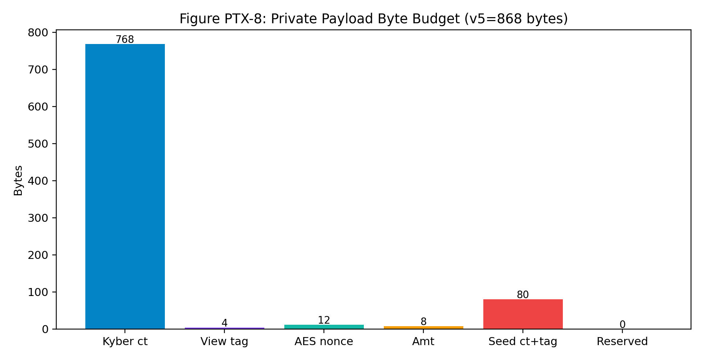
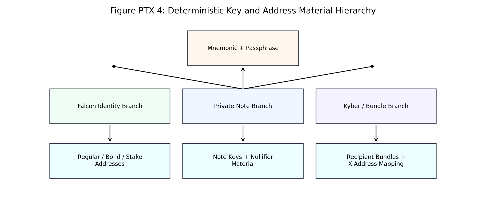
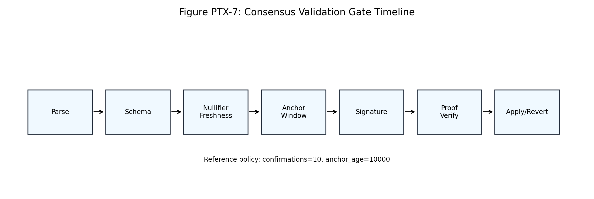
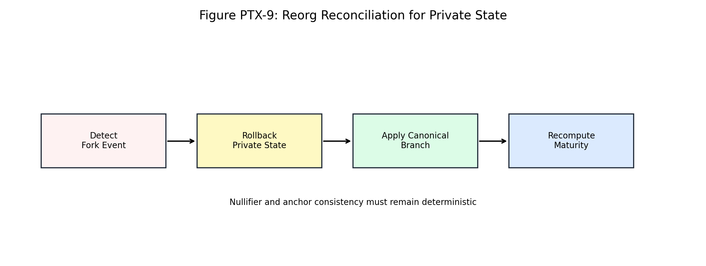

# PrivateTx v3

Technical Whitepaper - Platinum Shield Integration

Date: 2026-04-10
Document class: formal technical whitepaper
Audience: protocol engineers, cryptography reviewers, infrastructure operators, and technical auditors

## Table of Contents

- [1. Scope, Audience, and Document Contract](#1-scope-audience-and-document-contract)
- [2. Architecture Context and Design Goals](#2-architecture-context-and-design-goals)
- [3. Production Baseline and Consensus Invariants](#3-production-baseline-and-consensus-invariants)
- [4. Data Model, Wire Format, and Payload Contracts](#4-data-model-wire-format-and-payload-contracts)
- [5. Deterministic Key Hierarchy and Recipient Binding](#5-deterministic-key-hierarchy-and-recipient-binding)
- [6. Validation Plane Deep Dive](#6-validation-plane-deep-dive)
- [7. Merkle Anchors, Nullifiers, and Reorg Reconciliation](#7-merkle-anchors-nullifiers-and-reorg-reconciliation)
- [8. Mempool, Miner, and Block Assembly Semantics](#8-mempool-miner-and-block-assembly-semantics)
- [9. STARK Statement, Verification, and Fail-Closed Policy](#9-stark-statement-verification-and-fail-closed-policy)
- [10. Storage, State Transitions, and Recovery Guarantees](#10-storage-state-transitions-and-recovery-guarantees)
- [11. API/RPC Integration and Wallet Behavior](#11-apirpc-integration-and-wallet-behavior)
- [12. Performance Envelope and Resource Budgeting](#12-performance-envelope-and-resource-budgeting)
- [13. Emissions Coupling and Economic Interpretation](#13-emissions-coupling-and-economic-interpretation)
- [14. Deployment Controls and Runtime Integrity](#14-deployment-controls-and-runtime-integrity)
- [15. Governance, Test Strategy, and Release Cadence](#15-governance-test-strategy-and-release-cadence)
- [16. Extended Technical Incident Capsules](#16-extended-technical-incident-capsules)
- [17. Cross-Reference Matrix](#17-cross-reference-matrix)
- [18. Footnotes and Source Notes](#18-footnotes-and-source-notes)
- [19. FAQ](#19-faq)

## 1. Scope, Audience, and Document Contract

This document is the formal technical whitepaper for PrivateTx v3 on Atho. It replaces migration-style source aggregation with a structured engineering narrative that can be read from cover to FAQ without losing code traceability. The scope includes transaction semantics, proof gates, storage transitions, runtime controls, emissions interaction, and release governance for the private layer. The writing model is intentionally deterministic: every major claim either maps to an active code path, an active constant, or a published operational control[^1][^12].

The intended readers are reviewers who need more than a feature summary. Protocol engineers need explicit invariants, cryptography auditors need statement boundaries and failure behavior, and operators need deployment and rollback expectations. The paper therefore uses sectioned topics, explicit terminology, figure callouts, and footnotes. The objective is not marketing language; the objective is to make implementation, validation, and incident response auditable as one continuous system rather than as disconnected documents.

The document contract is straightforward. First, the whitepaper mirrors active production policy values, including confirmations, fee floor, payload bounds, and anchor windows. Second, private-path behavior is described as consensus-path behavior, not optional decoration. Third, every section is written to support diff-based review, so readers can compare this revision to code and to previous documentation snapshots without relying on unstated assumptions. This contract is what makes the document usable for technical diligence and release sign-off.

## 2. Architecture Context and Design Goals

PrivateTx v3 exists inside a mixed public/private UTXO environment. Public transactions keep the conventional transparency properties, while private transactions introduce note commitments, nullifiers, anchors, encrypted payloads, and block-level proof gates. Consensus validators process both lanes under one acceptance path. The private lane is not an off-chain extension; it is validated in-band with block acceptance and state transitions. That architecture decision is what allows private features to be optional for users but non-optional for validators whenever private activity is present[^2][^4].

The design goals are practical and measurable. First, preserve deterministic validation under adversarial input. Second, hide private transfer amounts and recipient identity links on-chain while preserving replay resistance. Third, ensure private-path failures fail closed and remain diagnosable. Fourth, keep wallet recovery deterministic through seeded key derivation and recipient bundle consistency checks. Fifth, keep production operations safe through pinned binaries, bounded payloads, and explicit timeout constraints around proving/verifying pipelines. These goals are technical constraints, not aspirational themes.

The end-to-end posture is shown below. The flowchart illustrates that private activity traverses wallet construction, mempool policy checks, miner transformation, block proof gating, and final consensus acceptance. Any hard failure at those gates is expected behavior. The architecture intentionally prefers deterministic rejection over permissive acceptance because consensus safety has higher priority than convenience in private-state handling.

## 3. Production Baseline and Consensus Invariants

A whitepaper is only technically useful if it captures the active baseline. The table below records the constants that materially affect private transaction lifecycle, admission behavior, and operator expectations. These values are sourced from live constants and checked by invariant guards in the runtime constant module. Keeping this baseline synchronized prevents stale narratives from leaking into operational decision-making and investor interpretation[^1][^16].

| Parameter | Production Value |
| --- | --- |
| Target block time | `120s` |
| Standard tx confirmations | `10` |
| Private tx confirmations | `10` |
| Coinbase maturity | `150` |
| Fee floor | `350 atoms/vB` |
| Minimum transaction fee | `100000 atoms` |
| Private Merkle depth | `20` |
| Max private anchor age | `10000 blocks` |
| Private payload (v4/v5/max) | `860/868/905 bytes` |
| Private proof max size | `200000 bytes` |
| Falcon private note signature size | `666 bytes` |
| Falcon private note public key size | `897 bytes` |
| BPoW bond requirement | `25 ATHO` |
| BPoW bond activation confirmations | `25` |
| Tail start height | `8,000,000` |
| Tail reward | `0.1953125 ATHO/block` |
| Fee pool routing pre/post tail | `40% / 55%` |
| Post-tail fee pool miner/stake buckets | `25% / 30%` |
| Base supply target | `100,000,000 ATHO` |
| Hard max supply | `150,000,000 ATHO` |

Under this baseline, the private layer assumes a `120`-second cadence, `10` private confirmations for practical finality interpretation, and `10000` blocks for anchor recency checks. The current annual tail issuance implied by active constants is approximately `51,328.125 ATHO/year` before fee burn and pool routing effects. These values directly shape how private throughput, fee floors, and long-run scarcity are interpreted by technical and non-technical stakeholders.

## 4. Data Model, Wire Format, and Payload Contracts

PrivateTx v3 defines private inputs and outputs with fixed-size and bounded-size fields. Consensus stability requires strict binary parsing and canonical serialization order. Key byte surfaces include commit (`32`), nullifier (`32`), anchor (`32`), leaf index (`8`), note public key (`897`), and Falcon signature (`666`). Payload bounds are enforced across versions, with v4 and v5 envelopes preserving compatibility while still enforcing minimum/maximum limits. These limits are consensus and resource controls at the same time; they reduce parser ambiguity and narrow DoS amplification surfaces.

Private outputs are transformed across lifecycle stages: mempool forms carry plaintext amount fields for policy arithmetic and UX handling, while block forms carry commitment-oriented representations for on-chain privacy and proof consistency. This transformation is deterministic and must not alter semantic transaction identity beyond expected witness transformations. Nodes that process admission and block variants therefore share canonical encoding contracts and explicit conversion boundaries. The conversion path is validated in test vectors and enforced in parser gates to prevent silent drift.

Payload budget decisions are technical tradeoffs, not cosmetic formatting choices. The encrypted payload packs Kyber ciphertext, view tag, nonce, amount metadata, and seed recovery material. The byte budget chart below captures the current v5 profile used for policy checks and sizing calculations.

## 5. Deterministic Key Hierarchy and Recipient Binding

PrivateTx v3 uses deterministic key derivation to avoid wallet-state ambiguity and to keep receive/spend behavior reproducible across environments. The hierarchy starts from mnemonic + passphrase and branches into Falcon identity material, note-key material, and recipient bundle material. Domain-separated derivation labels prevent cross-context key reuse and reduce replay risk between address roles. Determinism here is not optional quality; it is a hard requirement for wallet recovery, scan reproducibility, and note ownership verification[^7][^8][^9].

Recipient binding adds a second safety layer. Output construction binds recipient bundle hash and x-address metadata so that wallet scanning can verify that decrypted content maps to expected recipient identity context. This prevents silent misdelivery classes and gives auditors a deterministic relationship between sender-side construction and receiver-side recovery logic. Because private payloads are encrypted, metadata integrity and domain separation become the main defense against cross-context confusion bugs.

In operational terms, this hierarchy allows key-manager tooling to run deterministic readiness audits before private note activity is enabled. These audits should be release-gate checks, because key material drift can invalidate assumptions across wallet receive, wallet spend, and incident response workflows. The same hierarchy also supports conservative migration logic for legacy material where deterministic lineage is incomplete. Whitepaper-level clarity on this point matters because it ties user safety directly to reproducible key derivation guarantees.

## 6. Validation Plane Deep Dive

This section decomposes the validation plane into concrete components and invariant boundaries. Each subsection maps to active files and release-grade controls. The purpose is to show that private transaction validation is engineered as an ordered gate pipeline, not as a single monolithic validator call.

### 6.1 Canonical Transaction Parsing and Codec Discipline

Canonical Transaction Parsing and Codec Discipline is implemented across `Src/Transactions/tx.py`, `Src/Transactions/txbinary.py`, `Src/Transactions/private_layer.py`, and its behavior is treated as consensus-critical whenever a transaction carries private inputs or outputs. The implementation assumes deterministic serialization and deterministic preimage construction so that every verifier observes the same statement surface before proof validation[^1]. In operational terms, this means schema checks, witness bounds, and network-domain constraints execute before acceptance logic, and the parser cannot attempt a best-effort fallback. The invariant set for this subsection is explicit: private fields parse in deterministic order; version checks match product-v1 policy; witness/data boundaries remain canonical. If one verifier accepts a malformed field while another rejects it, the network can fork; this is why the path is fail-closed by design and not policy-softened for convenience.

The main failure modes observed for this component are schema drift between mempool and block forms; partial field acceptance under malformed payloads; non-canonical reserialization. Each one is addressed with hard controls in the runtime path: strict version gating with deterministic aliases; fixed byte-size checks for core fields; reject-on-first-violation parser behavior. For example, the active payload envelope (`860-905` bytes) rejects undersized or oversized encrypted payloads before deeper cryptographic work begins, and private signatures are bounded at `666` bytes. These hard limits are not cosmetic; they are part of resource governance, parser safety, and replay resistance. When validators enforce these controls at admission and block phases, private activity remains predictable under load and auditable during incident review.

Testing for this component follows a strict adversarial pattern rather than happy-path-only checks. Required vectors include malformed binary payloads, deterministic re-serialization, stale anchors, invalid domain IDs, and nullifier collisions under mempool pressure[^3]. The expected result for each negative vector is deterministic rejection with no ambiguous warning mode. The control plane must also expose enough log context to reproduce rejections across environments, because cross-node reproducibility is mandatory for a consensus layer. The baseline test matrix used here is round-trip binary vectors; version-activation boundary tests; malformed-field fuzz vectors, with every release expected to run full regression before changing acceptance semantics.

Control checklist:
- strict version gating with deterministic aliases
- fixed byte-size checks for core fields
- reject-on-first-violation parser behavior

Verification checklist:
- round-trip binary vectors
- version-activation boundary tests
- malformed-field fuzz vectors

### 6.2 Nullifier Freshness and Conflict Semantics

Nullifier Freshness and Conflict Semantics is implemented across `Src/Main/txveri.py`, `Src/Storage/private_notes_store.py`, `Src/Storage/mempool.py`, and its behavior is treated as consensus-critical whenever a transaction carries private inputs or outputs. The implementation assumes deterministic serialization and deterministic preimage construction so that every verifier observes the same statement surface before proof validation[^1]. In operational terms, this means schema checks, witness bounds, and network-domain constraints execute before acceptance logic, and the parser cannot attempt a best-effort fallback. The invariant set for this subsection is explicit: spent nullifier cannot be reused; pending nullifier conflicts are deterministic; block connect/disconnect updates remain reversible. If one verifier accepts a malformed field while another rejects it, the network can fork; this is why the path is fail-closed by design and not policy-softened for convenience.

The main failure modes observed for this component are mempool race conflicts; reorg-induced stale pending state; double-spend replay attempts. Each one is addressed with hard controls in the runtime path: confirmed nullifier table enforcement; pending-nullifier mempool set checks; reorg-aware state reconciliation hooks. For example, the active payload envelope (`860-905` bytes) rejects undersized or oversized encrypted payloads before deeper cryptographic work begins, and private signatures are bounded at `666` bytes. These hard limits are not cosmetic; they are part of resource governance, parser safety, and replay resistance. When validators enforce these controls at admission and block phases, private activity remains predictable under load and auditable during incident review.

Testing for this component follows a strict adversarial pattern rather than happy-path-only checks. Required vectors include malformed binary payloads, deterministic re-serialization, stale anchors, invalid domain IDs, and nullifier collisions under mempool pressure[^3]. The expected result for each negative vector is deterministic rejection with no ambiguous warning mode. The control plane must also expose enough log context to reproduce rejections across environments, because cross-node reproducibility is mandatory for a consensus layer. The baseline test matrix used here is competing spend vectors; reorg rollback cases; high-churn mempool replay suites, with every release expected to run full regression before changing acceptance semantics.

Control checklist:
- confirmed nullifier table enforcement
- pending-nullifier mempool set checks
- reorg-aware state reconciliation hooks

Verification checklist:
- competing spend vectors
- reorg rollback cases
- high-churn mempool replay suites

### 6.3 Anchor Window and Merkle Path Validation

Anchor Window and Merkle Path Validation is implemented across `Src/Transactions/private_layer.py`, `Src/Main/consensus.py`, `Src/Storage/private_notes_store.py`, and its behavior is treated as consensus-critical whenever a transaction carries private inputs or outputs. The implementation assumes deterministic serialization and deterministic preimage construction so that every verifier observes the same statement surface before proof validation[^1]. In operational terms, this means schema checks, witness bounds, and network-domain constraints execute before acceptance logic, and the parser cannot attempt a best-effort fallback. The invariant set for this subsection is explicit: anchor must be in canonical allowed window; path depth equals configured Merkle depth; leaf/index alignment is deterministic. If one verifier accepts a malformed field while another rejects it, the network can fork; this is why the path is fail-closed by design and not policy-softened for convenience.

The main failure modes observed for this component are stale anchor exploitation; proof path length abuse; state drift between root history and validator expectations. Each one is addressed with hard controls in the runtime path: max anchor age checks; depth-checked merkle path parser; historical root retention policy. For example, the active payload envelope (`860-905` bytes) rejects undersized or oversized encrypted payloads before deeper cryptographic work begins, and private signatures are bounded at `666` bytes. These hard limits are not cosmetic; they are part of resource governance, parser safety, and replay resistance. When validators enforce these controls at admission and block phases, private activity remains predictable under load and auditable during incident review.

Testing for this component follows a strict adversarial pattern rather than happy-path-only checks. Required vectors include malformed binary payloads, deterministic re-serialization, stale anchors, invalid domain IDs, and nullifier collisions under mempool pressure[^3]. The expected result for each negative vector is deterministic rejection with no ambiguous warning mode. The control plane must also expose enough log context to reproduce rejections across environments, because cross-node reproducibility is mandatory for a consensus layer. The baseline test matrix used here is stale-anchor rejection vectors; malformed merkle path vectors; anchor history pruning tests, with every release expected to run full regression before changing acceptance semantics.

Control checklist:
- max anchor age checks
- depth-checked merkle path parser
- historical root retention policy

Verification checklist:
- stale-anchor rejection vectors
- malformed merkle path vectors
- anchor history pruning tests

### 6.4 Private Signature Preimage and Domain Separation

Private Signature Preimage and Domain Separation is implemented across `Src/Transactions/private_layer.py`, `Src/Accounts/falconcli.py`, `Src/Main/txveri.py`, and its behavior is treated as consensus-critical whenever a transaction carries private inputs or outputs. The implementation assumes deterministic serialization and deterministic preimage construction so that every verifier observes the same statement surface before proof validation[^1]. In operational terms, this means schema checks, witness bounds, and network-domain constraints execute before acceptance logic, and the parser cannot attempt a best-effort fallback. The invariant set for this subsection is explicit: signing preimage excludes mutable witness fields; network-domain bytes are always bound; signature length and bounds checks are strict. If one verifier accepts a malformed field while another rejects it, the network can fork; this is why the path is fail-closed by design and not policy-softened for convenience.

The main failure modes observed for this component are cross-network replay; signature zeroing mismatch; non-deterministic preimage ordering. Each one is addressed with hard controls in the runtime path: txid_without_signatures style preimage handling; domain-separated network IDs; bounded Falcon signature validation. For example, the active payload envelope (`860-905` bytes) rejects undersized or oversized encrypted payloads before deeper cryptographic work begins, and private signatures are bounded at `666` bytes. These hard limits are not cosmetic; they are part of resource governance, parser safety, and replay resistance. When validators enforce these controls at admission and block phases, private activity remains predictable under load and auditable during incident review.

Testing for this component follows a strict adversarial pattern rather than happy-path-only checks. Required vectors include malformed binary payloads, deterministic re-serialization, stale anchors, invalid domain IDs, and nullifier collisions under mempool pressure[^3]. The expected result for each negative vector is deterministic rejection with no ambiguous warning mode. The control plane must also expose enough log context to reproduce rejections across environments, because cross-node reproducibility is mandatory for a consensus layer. The baseline test matrix used here is cross-network replay vectors; signature mutation rejection tests; canonical preimage regression tests, with every release expected to run full regression before changing acceptance semantics.

Control checklist:
- txid_without_signatures style preimage handling
- domain-separated network IDs
- bounded Falcon signature validation

Verification checklist:
- cross-network replay vectors
- signature mutation rejection tests
- canonical preimage regression tests

### 6.5 Mempool Admission and Fee-Policy Coupling

Mempool Admission and Fee-Policy Coupling is implemented across `Src/Main/txveri.py`, `Src/Transactions/fee.py`, `Src/Storage/mempool.py`, and its behavior is treated as consensus-critical whenever a transaction carries private inputs or outputs. The implementation assumes deterministic serialization and deterministic preimage construction so that every verifier observes the same statement surface before proof validation[^1]. In operational terms, this means schema checks, witness bounds, and network-domain constraints execute before acceptance logic, and the parser cannot attempt a best-effort fallback. The invariant set for this subsection is explicit: fee floor is enforced in atom integer math; size-based policy checks are deterministic; replacement thresholds are explicit. If one verifier accepts a malformed field while another rejects it, the network can fork; this is why the path is fail-closed by design and not policy-softened for convenience.

The main failure modes observed for this component are policy bypass under oversized private payloads; underpriced congestion events; inconsistent replacement logic. Each one is addressed with hard controls in the runtime path: minimum fee + feerate floor checks; bounded transaction size policies; replacement delta checks. For example, the active payload envelope (`860-905` bytes) rejects undersized or oversized encrypted payloads before deeper cryptographic work begins, and private signatures are bounded at `666` bytes. These hard limits are not cosmetic; they are part of resource governance, parser safety, and replay resistance. When validators enforce these controls at admission and block phases, private activity remains predictable under load and auditable during incident review.

Testing for this component follows a strict adversarial pattern rather than happy-path-only checks. Required vectors include malformed binary payloads, deterministic re-serialization, stale anchors, invalid domain IDs, and nullifier collisions under mempool pressure[^3]. The expected result for each negative vector is deterministic rejection with no ambiguous warning mode. The control plane must also expose enough log context to reproduce rejections across environments, because cross-node reproducibility is mandatory for a consensus layer. The baseline test matrix used here is fee-floor regression vectors; oversized payload rejection tests; replacement conflict suites, with every release expected to run full regression before changing acceptance semantics.

Control checklist:
- minimum fee + feerate floor checks
- bounded transaction size policies
- replacement delta checks

Verification checklist:
- fee-floor regression vectors
- oversized payload rejection tests
- replacement conflict suites

### 6.6 Block Acceptance Gates and Apply/Revert Symmetry

Block Acceptance Gates and Apply/Revert Symmetry is implemented across `Src/Main/blockveri.py`, `Src/Main/consensus.py`, `Src/Storage/private_notes_store.py`, and its behavior is treated as consensus-critical whenever a transaction carries private inputs or outputs. The implementation assumes deterministic serialization and deterministic preimage construction so that every verifier observes the same statement surface before proof validation[^1]. In operational terms, this means schema checks, witness bounds, and network-domain constraints execute before acceptance logic, and the parser cannot attempt a best-effort fallback. The invariant set for this subsection is explicit: all private checks finish before final acceptance; apply/revert paths are state-symmetric; proof verification is fail-closed. If one verifier accepts a malformed field while another rejects it, the network can fork; this is why the path is fail-closed by design and not policy-softened for convenience.

The main failure modes observed for this component are acceptance before full verification; asymmetric rollback behavior; state corruption after reorg. Each one is addressed with hard controls in the runtime path: ordered gate pipeline; atomic private state updates; reject blocks on any proof/runtime violation. For example, the active payload envelope (`860-905` bytes) rejects undersized or oversized encrypted payloads before deeper cryptographic work begins, and private signatures are bounded at `666` bytes. These hard limits are not cosmetic; they are part of resource governance, parser safety, and replay resistance. When validators enforce these controls at admission and block phases, private activity remains predictable under load and auditable during incident review.

Testing for this component follows a strict adversarial pattern rather than happy-path-only checks. Required vectors include malformed binary payloads, deterministic re-serialization, stale anchors, invalid domain IDs, and nullifier collisions under mempool pressure[^3]. The expected result for each negative vector is deterministic rejection with no ambiguous warning mode. The control plane must also expose enough log context to reproduce rejections across environments, because cross-node reproducibility is mandatory for a consensus layer. The baseline test matrix used here is tampered-block proof rejection; apply/revert equivalence tests; long-range reorg suites, with every release expected to run full regression before changing acceptance semantics.

Control checklist:
- ordered gate pipeline
- atomic private state updates
- reject blocks on any proof/runtime violation

Verification checklist:
- tampered-block proof rejection
- apply/revert equivalence tests
- long-range reorg suites

## 7. Merkle Anchors, Nullifiers, and Reorg Reconciliation

Private note commitments live in a deterministic Merkle structure with explicit depth and historical-root handling. Every private spend references an anchor and merkle path that must validate against retained canonical roots. The validator cannot rely on best-effort anchor interpretation; it must run bounded recency checks and deterministic path reconstruction. This creates a stable contract for private spend validity across normal operation and across branch transitions.

Nullifier enforcement and anchor enforcement are intentionally coupled. A nullifier proves one-time spend semantics, while anchor/path checks prove note-membership context. If either side is weakened, replay and state-confusion risk increases. For that reason, mempool and block-level checks share the same conceptual gates even if runtime details differ. The lifecycle chart below and the reorg reconciliation flow show why maturity interpretation and note spendability must recompute on canonical chain changes.

In production operations, this section implies two concrete obligations. First, private root history storage cannot be treated as optional metadata; it is a verifier dependency. Second, reorg handlers must update private notes, nullifiers, anchor windows, and maturity cues atomically with block disconnect/connect events. Any partial update model can produce temporary acceptance divergence between nodes. Whitepaper-level emphasis here reflects a real consensus risk boundary, not a theoretical edge case.

## 8. Mempool, Miner, and Block Assembly Semantics

Private transaction behavior spans three distinct execution contexts: mempool admission, miner candidate assembly, and final block verification. Each context performs different checks but must maintain one deterministic semantics chain. Admission focuses on structural and policy validity, miner assembly performs deterministic private-output transformation and proof preparation, and block validation enforces full proof-gated acceptance. Designing these as separate but aligned phases allows scaling and operational observability without opening consistency gaps.

The miner path is particularly sensitive because it bridges user-facing plaintext intent and on-chain commitment form. Candidate assembly preserves canonical ordering, computes commitment-oriented forms, and forwards statement data to proving backends. This handoff is where hidden-supply accounting, payload commitments, and proof witness boundaries become concrete. Any non-deterministic transformation in this step can invalidate proofs or create node disagreement on block content.

## 9. STARK Statement, Verification, and Fail-Closed Policy

PrivateTx v3 treats block-level proving as a consensus gate, not a performance hint. The statement binds private amount consistency and expected transition constraints under deterministic public inputs and witness data. Validators execute verification after structural checks and before final acceptance. If verification fails, the block is rejected. Placeholder acceptance is disabled by policy for production networks, and proof size is bounded (`200,000` bytes) to prevent unbounded resource amplification. This fail-closed behavior is required for safe private-state evolution[^10][^11].

Statement engineering should be interpreted as a contract boundary between miner and validator. The miner must provide proof artifacts consistent with canonical transaction ordering and expected block-level private fields. The validator must verify those artifacts under deterministic runtime constraints, including timeout policy and binary integrity controls. Together, these controls convert a complex cryptographic feature into auditable operational behavior. The proof gate diagram captures that contract at a high level.

## 10. Storage, State Transitions, and Recovery Guarantees

Private state persistence is separated from generic UTXO storage to keep note, nullifier, and anchor data structures explicit and auditable. This separation improves deterministic apply/revert logic and reduces accidental coupling between public and private workflows. At block connect time, private outputs become persisted note state and private inputs consume corresponding entries through nullifier updates. At block disconnect time, those transitions reverse in canonical order. The quality bar is symmetry: applying then reverting must restore exactly the prior state under deterministic replay.

Recovery guarantees depend on checkpointing and replay discipline. Crash recovery should never assume partial private-state writes are valid; it should rebuild from canonical chain history or atomic checkpoints. Operators should treat private-state integrity checks as first-class diagnostics, especially after unclean shutdowns or version upgrades. From a whitepaper perspective, this section is where consensus correctness and SRE practice intersect: reliable private consensus depends on boring, deterministic storage behavior as much as it depends on cryptographic proofs.

## 11. API/RPC Integration and Wallet Behavior

Wallet and API surfaces expose private-layer capabilities to users, but they must not bypass consensus assumptions. Create/receive/spend APIs should preserve deterministic field constraints, recipient binding checks, and payload-size policy. Wallet scanning should use fast prefilters (such as view tags) to keep performance predictable while still validating decrypted payload consistency against stored metadata and bundle context. This layered model allows responsive UX without sacrificing correctness.

From an integration perspective, the key operational rule is that client convenience cannot weaken node validation. APIs may derive convenience fields (such as recipient x-address from recipient bundle) to reduce caller error, but validator paths must still enforce canonical relationships. Audit logs should capture enough context to reconstruct private flow decisions while never leaking sensitive payload internals. This keeps observability useful to operators and auditors without violating privacy objectives.

## 12. Performance Envelope and Resource Budgeting

Private transactions are intentionally heavier than public transactions because they include encrypted payloads, expanded witness material, and proof-related validation work. Production planning therefore needs explicit throughput envelopes rather than optimistic single-number TPS claims. The capacity curve below illustrates how effective throughput decreases as private-heavy transaction share increases in a fixed block budget. This behavior is expected and should be communicated clearly to operators and investors alike.

Resource budgeting includes CPU time for cryptographic checks, memory for pending private state and proof material, and network bandwidth for larger witness-bearing blocks. Bounded payload and proof sizes are therefore governance controls, not arbitrary limits. They keep worst-case behavior predictable and provide clear rejection conditions when inputs exceed policy. In long-run reliability terms, bounded resources plus fail-closed gates provide far better safety than permissive acceptance with deferred error handling.

## 13. Emissions Coupling and Economic Interpretation

PrivateTx v3 does not redefine Atho's monetary policy; it operates inside existing issuance, fee-floor, burn, and pool-routing rules. The private layer changes transaction cost structure and throughput mix, which in turn influences practical utilization and fee-flow dynamics, but it does not alter hard-cap logic or supply-floor controls. This distinction is crucial for investor communication: privacy mechanics affect operational economics and network usage composition, while consensus monetary bounds remain governed by constants and burn logic in the core system[^15].

Current production policy implies a tail reward of approximately `0.1953125 ATHO/block`, fee floor `350` atoms/vB, and post-tail fee-pool routing of `55`%. Under heavy private usage, per-transaction byte footprint increases and throughput decreases, which can increase fee competition without changing underlying issuance formulas. Whitepaper readers should therefore interpret private economics as a utilization-and-cost profile issue, not a cap-change issue. The interaction is material for planning but bounded by deterministic monetary controls.

## 14. Deployment Controls and Runtime Integrity

Production private-flow safety depends on deployment discipline. The proving/verifying runtime uses external binaries and bridge scripts; these must be hash-pinned and environment-governed to prevent accidental drift or tampering. Pin enforcement, timeout bounds, and fail-closed behavior are baseline controls rather than optional hardening features. In practice, these controls reduce the chance that one environment silently accepts behavior another environment rejects.

Runtime integrity also includes operator-visible diagnostics. When proof verification fails, the system should emit precise error classes that map to deterministic rejection reasons. When binary metadata is missing or stale, startup should fail clearly in strict modes. These controls are what convert cryptographic architecture into operationally trustworthy software. The threat-control matrix below summarizes why control coverage must include cryptography, parser behavior, and binary provenance together.

## 15. Governance, Test Strategy, and Release Cadence

A whitepaper-level architecture still fails in production if release governance is weak. PrivateTx v3 requires phase-gated delivery: constant changes, parser/schema changes, validation changes, proving runtime changes, and wallet/API changes should not be merged as one opaque event. Each phase needs dedicated vectors and rollback planning. This keeps regression isolation tractable and allows reviewers to approve consensus-affecting changes with clear scope boundaries.

Test strategy should include unit vectors, randomized mutation tests, mempool conflict stress, proof-verification failure paths, and long reorg simulation. Release cadence should require synchronized updates to docs, constants, and operator runbooks so policy communication remains aligned with active code. This avoids the exact failure mode where a chain is technically stable but operationally misunderstood. The source-consolidation figure summarizes the intended documentation and code traceability flow.

## 16. Extended Technical Incident Capsules

### 16.1 Anchor Recency Drift Under Reorg Pressure (Consensus Safety Lens)

This capsule models a realistic failure mode around anchor-window enforcement across rollback and reconnect with explicit consensus-order guarantees: stale anchors accepted by one node class while rejected by another while one validator implementation diverges on ordering. The incident model assumes mixed public/private blocks and production-level mempool pressure, with private confirmations fixed at `10` and coinbase maturity at `150`. Under that profile, a local acceptance bug can propagate quickly if it is not constrained by deterministic invariants. The first engineering objective is therefore to convert ambiguous state transitions into explicit pass/fail gates before any irreversible apply step is executed.

The direct impact profile is cross-node disagreement on private input validity and delayed block propagation; chain-level acceptance disagreement risk. In private transaction systems, impact is rarely isolated to one user-facing failure; it normally combines resource amplification, observability blind spots, and state inconsistency risk. Prevention controls for this capsule are canonical root history retention, explicit age checks, deterministic rollback ordering; deterministic gate ordering with invariant assertions. Those controls must be active at parse time, admission time, and block-validation time, not just one of those stages, because attackers probe whichever stage is softest. When the controls are active, invalid objects are rejected early and expensive proving/verification work is reserved for valid candidates only.

Response design is freeze private admission, replay canonical branch, verify root history checkpoints; halt acceptance path, replay deterministic vectors, and compare verdict traces. A robust response includes deterministic rollback boundaries, private-state reconciliation, and explicit operator playbooks that map to code paths rather than generic guidance. Evidence expected from this path is anchor-age diagnostics, root-history hash snapshots, deterministic replay logs; cross-node verdict diffs and deterministic replay transcripts. Collecting that evidence on every failure lets teams prove that rejection behavior is stable across node versions and across hardware classes, which is a core whitepaper requirement for production-grade systems[^11]. This capsule therefore doubles as both a reliability test and a governance artifact for release readiness decisions.

### 16.2 Anchor Recency Drift Under Reorg Pressure (Operational SRE Lens)

This capsule models a realistic failure mode around anchor-window enforcement across rollback and reconnect with runtime observability and recovery procedures: stale anchors accepted by one node class while rejected by another while operators receive ambiguous errors under stress. The incident model assumes mixed public/private blocks and production-level mempool pressure, with private confirmations fixed at `10` and coinbase maturity at `150`. Under that profile, a local acceptance bug can propagate quickly if it is not constrained by deterministic invariants. The first engineering objective is therefore to convert ambiguous state transitions into explicit pass/fail gates before any irreversible apply step is executed.

The direct impact profile is cross-node disagreement on private input validity and delayed block propagation; slow incident triage and delayed service restoration. In private transaction systems, impact is rarely isolated to one user-facing failure; it normally combines resource amplification, observability blind spots, and state inconsistency risk. Prevention controls for this capsule are canonical root history retention, explicit age checks, deterministic rollback ordering; structured error classes and state checkpointing. Those controls must be active at parse time, admission time, and block-validation time, not just one of those stages, because attackers probe whichever stage is softest. When the controls are active, invalid objects are rejected early and expensive proving/verification work is reserved for valid candidates only.

Response design is freeze private admission, replay canonical branch, verify root history checkpoints; switch to safe mode, collect bounded diagnostics, and execute rollback playbook. A robust response includes deterministic rollback boundaries, private-state reconciliation, and explicit operator playbooks that map to code paths rather than generic guidance. Evidence expected from this path is anchor-age diagnostics, root-history hash snapshots, deterministic replay logs; incident timeline, checkpoint integrity proofs, and rollback hash outputs. Collecting that evidence on every failure lets teams prove that rejection behavior is stable across node versions and across hardware classes, which is a core whitepaper requirement for production-grade systems[^11]. This capsule therefore doubles as both a reliability test and a governance artifact for release readiness decisions.

### 16.3 Anchor Recency Drift Under Reorg Pressure (Adversarial Testing Lens)

This capsule models a realistic failure mode around anchor-window enforcement across rollback and reconnect with mutation and fuzz resistance boundaries: stale anchors accepted by one node class while rejected by another while edge-case malformed objects bypass one stage of validation. The incident model assumes mixed public/private blocks and production-level mempool pressure, with private confirmations fixed at `10` and coinbase maturity at `150`. Under that profile, a local acceptance bug can propagate quickly if it is not constrained by deterministic invariants. The first engineering objective is therefore to convert ambiguous state transitions into explicit pass/fail gates before any irreversible apply step is executed.

The direct impact profile is cross-node disagreement on private input validity and delayed block propagation; resource amplification and hidden acceptance drift. In private transaction systems, impact is rarely isolated to one user-facing failure; it normally combines resource amplification, observability blind spots, and state inconsistency risk. Prevention controls for this capsule are canonical root history retention, explicit age checks, deterministic rollback ordering; stage-specific fuzz harnesses and deterministic reject reason mapping. Those controls must be active at parse time, admission time, and block-validation time, not just one of those stages, because attackers probe whichever stage is softest. When the controls are active, invalid objects are rejected early and expensive proving/verification work is reserved for valid candidates only.

Response design is freeze private admission, replay canonical branch, verify root history checkpoints; replay mutation corpus against candidate build and gate on mismatch. A robust response includes deterministic rollback boundaries, private-state reconciliation, and explicit operator playbooks that map to code paths rather than generic guidance. Evidence expected from this path is anchor-age diagnostics, root-history hash snapshots, deterministic replay logs; mutation corpus reports, reject-code distributions, and CPU cost traces. Collecting that evidence on every failure lets teams prove that rejection behavior is stable across node versions and across hardware classes, which is a core whitepaper requirement for production-grade systems[^11]. This capsule therefore doubles as both a reliability test and a governance artifact for release readiness decisions.

### 16.4 Anchor Recency Drift Under Reorg Pressure (Release Governance Lens)

This capsule models a realistic failure mode around anchor-window enforcement across rollback and reconnect with phase-gated deployment and compatibility checks: stale anchors accepted by one node class while rejected by another while mixed-version rollout exposes undocumented behavior shifts. The incident model assumes mixed public/private blocks and production-level mempool pressure, with private confirmations fixed at `10` and coinbase maturity at `150`. Under that profile, a local acceptance bug can propagate quickly if it is not constrained by deterministic invariants. The first engineering objective is therefore to convert ambiguous state transitions into explicit pass/fail gates before any irreversible apply step is executed.

The direct impact profile is cross-node disagreement on private input validity and delayed block propagation; staged rollout instability and governance uncertainty. In private transaction systems, impact is rarely isolated to one user-facing failure; it normally combines resource amplification, observability blind spots, and state inconsistency risk. Prevention controls for this capsule are canonical root history retention, explicit age checks, deterministic rollback ordering; version-activation matrices and synchronized docs/constants reviews. Those controls must be active at parse time, admission time, and block-validation time, not just one of those stages, because attackers probe whichever stage is softest. When the controls are active, invalid objects are rejected early and expensive proving/verification work is reserved for valid candidates only.

Response design is freeze private admission, replay canonical branch, verify root history checkpoints; pause rollout, publish compatibility diff, and rerun gated release checklist. A robust response includes deterministic rollback boundaries, private-state reconciliation, and explicit operator playbooks that map to code paths rather than generic guidance. Evidence expected from this path is anchor-age diagnostics, root-history hash snapshots, deterministic replay logs; release-candidate diff logs, compatibility matrices, and sign-off artifacts. Collecting that evidence on every failure lets teams prove that rejection behavior is stable across node versions and across hardware classes, which is a core whitepaper requirement for production-grade systems[^11]. This capsule therefore doubles as both a reliability test and a governance artifact for release readiness decisions.

### 16.5 Anchor Recency Drift Under Reorg Pressure (Product Reliability Lens)

This capsule models a realistic failure mode around anchor-window enforcement across rollback and reconnect with wallet/API user-facing consistency expectations: stale anchors accepted by one node class while rejected by another while client behavior appears inconsistent across edge cases. The incident model assumes mixed public/private blocks and production-level mempool pressure, with private confirmations fixed at `10` and coinbase maturity at `150`. Under that profile, a local acceptance bug can propagate quickly if it is not constrained by deterministic invariants. The first engineering objective is therefore to convert ambiguous state transitions into explicit pass/fail gates before any irreversible apply step is executed.

The direct impact profile is cross-node disagreement on private input validity and delayed block propagation; trust erosion and support burden growth. In private transaction systems, impact is rarely isolated to one user-facing failure; it normally combines resource amplification, observability blind spots, and state inconsistency risk. Prevention controls for this capsule are canonical root history retention, explicit age checks, deterministic rollback ordering; strict API contracts and deterministic client validation hints. Those controls must be active at parse time, admission time, and block-validation time, not just one of those stages, because attackers probe whichever stage is softest. When the controls are active, invalid objects are rejected early and expensive proving/verification work is reserved for valid candidates only.

Response design is freeze private admission, replay canonical branch, verify root history checkpoints; isolate impacted paths, publish deterministic workaround guidance, and patch safely. A robust response includes deterministic rollback boundaries, private-state reconciliation, and explicit operator playbooks that map to code paths rather than generic guidance. Evidence expected from this path is anchor-age diagnostics, root-history hash snapshots, deterministic replay logs; support-case taxonomy, API contract test results, and post-fix behavior audits. Collecting that evidence on every failure lets teams prove that rejection behavior is stable across node versions and across hardware classes, which is a core whitepaper requirement for production-grade systems[^11]. This capsule therefore doubles as both a reliability test and a governance artifact for release readiness decisions.

### 16.6 Pending Nullifier Storm (Consensus Safety Lens)

This capsule models a realistic failure mode around mempool pending-nullifier conflict controls with explicit consensus-order guarantees: high-rate competing spends attempting policy race wins while one validator implementation diverges on ordering. The incident model assumes mixed public/private blocks and production-level mempool pressure, with private confirmations fixed at `10` and coinbase maturity at `150`. Under that profile, a local acceptance bug can propagate quickly if it is not constrained by deterministic invariants. The first engineering objective is therefore to convert ambiguous state transitions into explicit pass/fail gates before any irreversible apply step is executed.

The direct impact profile is mempool resource burn and delayed honest admission; chain-level acceptance disagreement risk. In private transaction systems, impact is rarely isolated to one user-facing failure; it normally combines resource amplification, observability blind spots, and state inconsistency risk. Prevention controls for this capsule are pending + confirmed nullifier maps with strict conflict denial; deterministic gate ordering with invariant assertions. Those controls must be active at parse time, admission time, and block-validation time, not just one of those stages, because attackers probe whichever stage is softest. When the controls are active, invalid objects are rejected early and expensive proving/verification work is reserved for valid candidates only.

Response design is evict conflicting candidates deterministically and re-evaluate queued transactions; halt acceptance path, replay deterministic vectors, and compare verdict traces. A robust response includes deterministic rollback boundaries, private-state reconciliation, and explicit operator playbooks that map to code paths rather than generic guidance. Evidence expected from this path is pending-nullifier metrics, conflict counters, deterministic reject reason IDs; cross-node verdict diffs and deterministic replay transcripts. Collecting that evidence on every failure lets teams prove that rejection behavior is stable across node versions and across hardware classes, which is a core whitepaper requirement for production-grade systems[^11]. This capsule therefore doubles as both a reliability test and a governance artifact for release readiness decisions.

### 16.7 Pending Nullifier Storm (Operational SRE Lens)

This capsule models a realistic failure mode around mempool pending-nullifier conflict controls with runtime observability and recovery procedures: high-rate competing spends attempting policy race wins while operators receive ambiguous errors under stress. The incident model assumes mixed public/private blocks and production-level mempool pressure, with private confirmations fixed at `10` and coinbase maturity at `150`. Under that profile, a local acceptance bug can propagate quickly if it is not constrained by deterministic invariants. The first engineering objective is therefore to convert ambiguous state transitions into explicit pass/fail gates before any irreversible apply step is executed.

The direct impact profile is mempool resource burn and delayed honest admission; slow incident triage and delayed service restoration. In private transaction systems, impact is rarely isolated to one user-facing failure; it normally combines resource amplification, observability blind spots, and state inconsistency risk. Prevention controls for this capsule are pending + confirmed nullifier maps with strict conflict denial; structured error classes and state checkpointing. Those controls must be active at parse time, admission time, and block-validation time, not just one of those stages, because attackers probe whichever stage is softest. When the controls are active, invalid objects are rejected early and expensive proving/verification work is reserved for valid candidates only.

Response design is evict conflicting candidates deterministically and re-evaluate queued transactions; switch to safe mode, collect bounded diagnostics, and execute rollback playbook. A robust response includes deterministic rollback boundaries, private-state reconciliation, and explicit operator playbooks that map to code paths rather than generic guidance. Evidence expected from this path is pending-nullifier metrics, conflict counters, deterministic reject reason IDs; incident timeline, checkpoint integrity proofs, and rollback hash outputs. Collecting that evidence on every failure lets teams prove that rejection behavior is stable across node versions and across hardware classes, which is a core whitepaper requirement for production-grade systems[^11]. This capsule therefore doubles as both a reliability test and a governance artifact for release readiness decisions.

### 16.8 Pending Nullifier Storm (Adversarial Testing Lens)

This capsule models a realistic failure mode around mempool pending-nullifier conflict controls with mutation and fuzz resistance boundaries: high-rate competing spends attempting policy race wins while edge-case malformed objects bypass one stage of validation. The incident model assumes mixed public/private blocks and production-level mempool pressure, with private confirmations fixed at `10` and coinbase maturity at `150`. Under that profile, a local acceptance bug can propagate quickly if it is not constrained by deterministic invariants. The first engineering objective is therefore to convert ambiguous state transitions into explicit pass/fail gates before any irreversible apply step is executed.

The direct impact profile is mempool resource burn and delayed honest admission; resource amplification and hidden acceptance drift. In private transaction systems, impact is rarely isolated to one user-facing failure; it normally combines resource amplification, observability blind spots, and state inconsistency risk. Prevention controls for this capsule are pending + confirmed nullifier maps with strict conflict denial; stage-specific fuzz harnesses and deterministic reject reason mapping. Those controls must be active at parse time, admission time, and block-validation time, not just one of those stages, because attackers probe whichever stage is softest. When the controls are active, invalid objects are rejected early and expensive proving/verification work is reserved for valid candidates only.

Response design is evict conflicting candidates deterministically and re-evaluate queued transactions; replay mutation corpus against candidate build and gate on mismatch. A robust response includes deterministic rollback boundaries, private-state reconciliation, and explicit operator playbooks that map to code paths rather than generic guidance. Evidence expected from this path is pending-nullifier metrics, conflict counters, deterministic reject reason IDs; mutation corpus reports, reject-code distributions, and CPU cost traces. Collecting that evidence on every failure lets teams prove that rejection behavior is stable across node versions and across hardware classes, which is a core whitepaper requirement for production-grade systems[^11]. This capsule therefore doubles as both a reliability test and a governance artifact for release readiness decisions.

### 16.9 Pending Nullifier Storm (Release Governance Lens)

This capsule models a realistic failure mode around mempool pending-nullifier conflict controls with phase-gated deployment and compatibility checks: high-rate competing spends attempting policy race wins while mixed-version rollout exposes undocumented behavior shifts. The incident model assumes mixed public/private blocks and production-level mempool pressure, with private confirmations fixed at `10` and coinbase maturity at `150`. Under that profile, a local acceptance bug can propagate quickly if it is not constrained by deterministic invariants. The first engineering objective is therefore to convert ambiguous state transitions into explicit pass/fail gates before any irreversible apply step is executed.

The direct impact profile is mempool resource burn and delayed honest admission; staged rollout instability and governance uncertainty. In private transaction systems, impact is rarely isolated to one user-facing failure; it normally combines resource amplification, observability blind spots, and state inconsistency risk. Prevention controls for this capsule are pending + confirmed nullifier maps with strict conflict denial; version-activation matrices and synchronized docs/constants reviews. Those controls must be active at parse time, admission time, and block-validation time, not just one of those stages, because attackers probe whichever stage is softest. When the controls are active, invalid objects are rejected early and expensive proving/verification work is reserved for valid candidates only.

Response design is evict conflicting candidates deterministically and re-evaluate queued transactions; pause rollout, publish compatibility diff, and rerun gated release checklist. A robust response includes deterministic rollback boundaries, private-state reconciliation, and explicit operator playbooks that map to code paths rather than generic guidance. Evidence expected from this path is pending-nullifier metrics, conflict counters, deterministic reject reason IDs; release-candidate diff logs, compatibility matrices, and sign-off artifacts. Collecting that evidence on every failure lets teams prove that rejection behavior is stable across node versions and across hardware classes, which is a core whitepaper requirement for production-grade systems[^11]. This capsule therefore doubles as both a reliability test and a governance artifact for release readiness decisions.

### 16.10 Pending Nullifier Storm (Product Reliability Lens)

This capsule models a realistic failure mode around mempool pending-nullifier conflict controls with wallet/API user-facing consistency expectations: high-rate competing spends attempting policy race wins while client behavior appears inconsistent across edge cases. The incident model assumes mixed public/private blocks and production-level mempool pressure, with private confirmations fixed at `10` and coinbase maturity at `150`. Under that profile, a local acceptance bug can propagate quickly if it is not constrained by deterministic invariants. The first engineering objective is therefore to convert ambiguous state transitions into explicit pass/fail gates before any irreversible apply step is executed.

The direct impact profile is mempool resource burn and delayed honest admission; trust erosion and support burden growth. In private transaction systems, impact is rarely isolated to one user-facing failure; it normally combines resource amplification, observability blind spots, and state inconsistency risk. Prevention controls for this capsule are pending + confirmed nullifier maps with strict conflict denial; strict API contracts and deterministic client validation hints. Those controls must be active at parse time, admission time, and block-validation time, not just one of those stages, because attackers probe whichever stage is softest. When the controls are active, invalid objects are rejected early and expensive proving/verification work is reserved for valid candidates only.

Response design is evict conflicting candidates deterministically and re-evaluate queued transactions; isolate impacted paths, publish deterministic workaround guidance, and patch safely. A robust response includes deterministic rollback boundaries, private-state reconciliation, and explicit operator playbooks that map to code paths rather than generic guidance. Evidence expected from this path is pending-nullifier metrics, conflict counters, deterministic reject reason IDs; support-case taxonomy, API contract test results, and post-fix behavior audits. Collecting that evidence on every failure lets teams prove that rejection behavior is stable across node versions and across hardware classes, which is a core whitepaper requirement for production-grade systems[^11]. This capsule therefore doubles as both a reliability test and a governance artifact for release readiness decisions.

### 16.11 Proof Backend Timeout Saturation (Consensus Safety Lens)

This capsule models a realistic failure mode around prover/verifier bridge orchestration with explicit consensus-order guarantees: timeout cascades causing ambiguous candidate block states while one validator implementation diverges on ordering. The incident model assumes mixed public/private blocks and production-level mempool pressure, with private confirmations fixed at `10` and coinbase maturity at `150`. Under that profile, a local acceptance bug can propagate quickly if it is not constrained by deterministic invariants. The first engineering objective is therefore to convert ambiguous state transitions into explicit pass/fail gates before any irreversible apply step is executed.

The direct impact profile is stalled block assembly and inconsistent operator interpretation; chain-level acceptance disagreement risk. In private transaction systems, impact is rarely isolated to one user-facing failure; it normally combines resource amplification, observability blind spots, and state inconsistency risk. Prevention controls for this capsule are bounded timeouts, strict fail-closed return codes, pinned binary selection; deterministic gate ordering with invariant assertions. Those controls must be active at parse time, admission time, and block-validation time, not just one of those stages, because attackers probe whichever stage is softest. When the controls are active, invalid objects are rejected early and expensive proving/verification work is reserved for valid candidates only.

Response design is drop timed-out candidate, rotate worker, enforce cooldown before retry; halt acceptance path, replay deterministic vectors, and compare verdict traces. A robust response includes deterministic rollback boundaries, private-state reconciliation, and explicit operator playbooks that map to code paths rather than generic guidance. Evidence expected from this path is timeout histograms, backend exit codes, pin-hash verification traces; cross-node verdict diffs and deterministic replay transcripts. Collecting that evidence on every failure lets teams prove that rejection behavior is stable across node versions and across hardware classes, which is a core whitepaper requirement for production-grade systems[^11]. This capsule therefore doubles as both a reliability test and a governance artifact for release readiness decisions.

### 16.12 Proof Backend Timeout Saturation (Operational SRE Lens)

This capsule models a realistic failure mode around prover/verifier bridge orchestration with runtime observability and recovery procedures: timeout cascades causing ambiguous candidate block states while operators receive ambiguous errors under stress. The incident model assumes mixed public/private blocks and production-level mempool pressure, with private confirmations fixed at `10` and coinbase maturity at `150`. Under that profile, a local acceptance bug can propagate quickly if it is not constrained by deterministic invariants. The first engineering objective is therefore to convert ambiguous state transitions into explicit pass/fail gates before any irreversible apply step is executed.

The direct impact profile is stalled block assembly and inconsistent operator interpretation; slow incident triage and delayed service restoration. In private transaction systems, impact is rarely isolated to one user-facing failure; it normally combines resource amplification, observability blind spots, and state inconsistency risk. Prevention controls for this capsule are bounded timeouts, strict fail-closed return codes, pinned binary selection; structured error classes and state checkpointing. Those controls must be active at parse time, admission time, and block-validation time, not just one of those stages, because attackers probe whichever stage is softest. When the controls are active, invalid objects are rejected early and expensive proving/verification work is reserved for valid candidates only.

Response design is drop timed-out candidate, rotate worker, enforce cooldown before retry; switch to safe mode, collect bounded diagnostics, and execute rollback playbook. A robust response includes deterministic rollback boundaries, private-state reconciliation, and explicit operator playbooks that map to code paths rather than generic guidance. Evidence expected from this path is timeout histograms, backend exit codes, pin-hash verification traces; incident timeline, checkpoint integrity proofs, and rollback hash outputs. Collecting that evidence on every failure lets teams prove that rejection behavior is stable across node versions and across hardware classes, which is a core whitepaper requirement for production-grade systems[^11]. This capsule therefore doubles as both a reliability test and a governance artifact for release readiness decisions.

### 16.13 Proof Backend Timeout Saturation (Adversarial Testing Lens)

This capsule models a realistic failure mode around prover/verifier bridge orchestration with mutation and fuzz resistance boundaries: timeout cascades causing ambiguous candidate block states while edge-case malformed objects bypass one stage of validation. The incident model assumes mixed public/private blocks and production-level mempool pressure, with private confirmations fixed at `10` and coinbase maturity at `150`. Under that profile, a local acceptance bug can propagate quickly if it is not constrained by deterministic invariants. The first engineering objective is therefore to convert ambiguous state transitions into explicit pass/fail gates before any irreversible apply step is executed.

The direct impact profile is stalled block assembly and inconsistent operator interpretation; resource amplification and hidden acceptance drift. In private transaction systems, impact is rarely isolated to one user-facing failure; it normally combines resource amplification, observability blind spots, and state inconsistency risk. Prevention controls for this capsule are bounded timeouts, strict fail-closed return codes, pinned binary selection; stage-specific fuzz harnesses and deterministic reject reason mapping. Those controls must be active at parse time, admission time, and block-validation time, not just one of those stages, because attackers probe whichever stage is softest. When the controls are active, invalid objects are rejected early and expensive proving/verification work is reserved for valid candidates only.

Response design is drop timed-out candidate, rotate worker, enforce cooldown before retry; replay mutation corpus against candidate build and gate on mismatch. A robust response includes deterministic rollback boundaries, private-state reconciliation, and explicit operator playbooks that map to code paths rather than generic guidance. Evidence expected from this path is timeout histograms, backend exit codes, pin-hash verification traces; mutation corpus reports, reject-code distributions, and CPU cost traces. Collecting that evidence on every failure lets teams prove that rejection behavior is stable across node versions and across hardware classes, which is a core whitepaper requirement for production-grade systems[^11]. This capsule therefore doubles as both a reliability test and a governance artifact for release readiness decisions.

### 16.14 Proof Backend Timeout Saturation (Release Governance Lens)

This capsule models a realistic failure mode around prover/verifier bridge orchestration with phase-gated deployment and compatibility checks: timeout cascades causing ambiguous candidate block states while mixed-version rollout exposes undocumented behavior shifts. The incident model assumes mixed public/private blocks and production-level mempool pressure, with private confirmations fixed at `10` and coinbase maturity at `150`. Under that profile, a local acceptance bug can propagate quickly if it is not constrained by deterministic invariants. The first engineering objective is therefore to convert ambiguous state transitions into explicit pass/fail gates before any irreversible apply step is executed.

The direct impact profile is stalled block assembly and inconsistent operator interpretation; staged rollout instability and governance uncertainty. In private transaction systems, impact is rarely isolated to one user-facing failure; it normally combines resource amplification, observability blind spots, and state inconsistency risk. Prevention controls for this capsule are bounded timeouts, strict fail-closed return codes, pinned binary selection; version-activation matrices and synchronized docs/constants reviews. Those controls must be active at parse time, admission time, and block-validation time, not just one of those stages, because attackers probe whichever stage is softest. When the controls are active, invalid objects are rejected early and expensive proving/verification work is reserved for valid candidates only.

Response design is drop timed-out candidate, rotate worker, enforce cooldown before retry; pause rollout, publish compatibility diff, and rerun gated release checklist. A robust response includes deterministic rollback boundaries, private-state reconciliation, and explicit operator playbooks that map to code paths rather than generic guidance. Evidence expected from this path is timeout histograms, backend exit codes, pin-hash verification traces; release-candidate diff logs, compatibility matrices, and sign-off artifacts. Collecting that evidence on every failure lets teams prove that rejection behavior is stable across node versions and across hardware classes, which is a core whitepaper requirement for production-grade systems[^11]. This capsule therefore doubles as both a reliability test and a governance artifact for release readiness decisions.

### 16.15 Proof Backend Timeout Saturation (Product Reliability Lens)

This capsule models a realistic failure mode around prover/verifier bridge orchestration with wallet/API user-facing consistency expectations: timeout cascades causing ambiguous candidate block states while client behavior appears inconsistent across edge cases. The incident model assumes mixed public/private blocks and production-level mempool pressure, with private confirmations fixed at `10` and coinbase maturity at `150`. Under that profile, a local acceptance bug can propagate quickly if it is not constrained by deterministic invariants. The first engineering objective is therefore to convert ambiguous state transitions into explicit pass/fail gates before any irreversible apply step is executed.

The direct impact profile is stalled block assembly and inconsistent operator interpretation; trust erosion and support burden growth. In private transaction systems, impact is rarely isolated to one user-facing failure; it normally combines resource amplification, observability blind spots, and state inconsistency risk. Prevention controls for this capsule are bounded timeouts, strict fail-closed return codes, pinned binary selection; strict API contracts and deterministic client validation hints. Those controls must be active at parse time, admission time, and block-validation time, not just one of those stages, because attackers probe whichever stage is softest. When the controls are active, invalid objects are rejected early and expensive proving/verification work is reserved for valid candidates only.

Response design is drop timed-out candidate, rotate worker, enforce cooldown before retry; isolate impacted paths, publish deterministic workaround guidance, and patch safely. A robust response includes deterministic rollback boundaries, private-state reconciliation, and explicit operator playbooks that map to code paths rather than generic guidance. Evidence expected from this path is timeout histograms, backend exit codes, pin-hash verification traces; support-case taxonomy, API contract test results, and post-fix behavior audits. Collecting that evidence on every failure lets teams prove that rejection behavior is stable across node versions and across hardware classes, which is a core whitepaper requirement for production-grade systems[^11]. This capsule therefore doubles as both a reliability test and a governance artifact for release readiness decisions.

### 16.16 Payload Envelope Inflation Attempt (Consensus Safety Lens)

This capsule models a realistic failure mode around payload-size parser and fee-policy boundary with explicit consensus-order guarantees: oversized encrypted payloads designed for parser or relay pressure while one validator implementation diverges on ordering. The incident model assumes mixed public/private blocks and production-level mempool pressure, with private confirmations fixed at `10` and coinbase maturity at `150`. Under that profile, a local acceptance bug can propagate quickly if it is not constrained by deterministic invariants. The first engineering objective is therefore to convert ambiguous state transitions into explicit pass/fail gates before any irreversible apply step is executed.

The direct impact profile is mempool amplification and potential parser divergence; chain-level acceptance disagreement risk. In private transaction systems, impact is rarely isolated to one user-facing failure; it normally combines resource amplification, observability blind spots, and state inconsistency risk. Prevention controls for this capsule are hard max payload bound and canonical encoding checks; deterministic gate ordering with invariant assertions. Those controls must be active at parse time, admission time, and block-validation time, not just one of those stages, because attackers probe whichever stage is softest. When the controls are active, invalid objects are rejected early and expensive proving/verification work is reserved for valid candidates only.

Response design is reject candidate, record envelope mismatch telemetry, keep relay budget stable; halt acceptance path, replay deterministic vectors, and compare verdict traces. A robust response includes deterministic rollback boundaries, private-state reconciliation, and explicit operator playbooks that map to code paths rather than generic guidance. Evidence expected from this path is payload-size distribution, reject ratios, relay-byte pressure metrics; cross-node verdict diffs and deterministic replay transcripts. Collecting that evidence on every failure lets teams prove that rejection behavior is stable across node versions and across hardware classes, which is a core whitepaper requirement for production-grade systems[^11]. This capsule therefore doubles as both a reliability test and a governance artifact for release readiness decisions.

### 16.17 Payload Envelope Inflation Attempt (Operational SRE Lens)

This capsule models a realistic failure mode around payload-size parser and fee-policy boundary with runtime observability and recovery procedures: oversized encrypted payloads designed for parser or relay pressure while operators receive ambiguous errors under stress. The incident model assumes mixed public/private blocks and production-level mempool pressure, with private confirmations fixed at `10` and coinbase maturity at `150`. Under that profile, a local acceptance bug can propagate quickly if it is not constrained by deterministic invariants. The first engineering objective is therefore to convert ambiguous state transitions into explicit pass/fail gates before any irreversible apply step is executed.

The direct impact profile is mempool amplification and potential parser divergence; slow incident triage and delayed service restoration. In private transaction systems, impact is rarely isolated to one user-facing failure; it normally combines resource amplification, observability blind spots, and state inconsistency risk. Prevention controls for this capsule are hard max payload bound and canonical encoding checks; structured error classes and state checkpointing. Those controls must be active at parse time, admission time, and block-validation time, not just one of those stages, because attackers probe whichever stage is softest. When the controls are active, invalid objects are rejected early and expensive proving/verification work is reserved for valid candidates only.

Response design is reject candidate, record envelope mismatch telemetry, keep relay budget stable; switch to safe mode, collect bounded diagnostics, and execute rollback playbook. A robust response includes deterministic rollback boundaries, private-state reconciliation, and explicit operator playbooks that map to code paths rather than generic guidance. Evidence expected from this path is payload-size distribution, reject ratios, relay-byte pressure metrics; incident timeline, checkpoint integrity proofs, and rollback hash outputs. Collecting that evidence on every failure lets teams prove that rejection behavior is stable across node versions and across hardware classes, which is a core whitepaper requirement for production-grade systems[^11]. This capsule therefore doubles as both a reliability test and a governance artifact for release readiness decisions.

### 16.18 Payload Envelope Inflation Attempt (Adversarial Testing Lens)

This capsule models a realistic failure mode around payload-size parser and fee-policy boundary with mutation and fuzz resistance boundaries: oversized encrypted payloads designed for parser or relay pressure while edge-case malformed objects bypass one stage of validation. The incident model assumes mixed public/private blocks and production-level mempool pressure, with private confirmations fixed at `10` and coinbase maturity at `150`. Under that profile, a local acceptance bug can propagate quickly if it is not constrained by deterministic invariants. The first engineering objective is therefore to convert ambiguous state transitions into explicit pass/fail gates before any irreversible apply step is executed.

The direct impact profile is mempool amplification and potential parser divergence; resource amplification and hidden acceptance drift. In private transaction systems, impact is rarely isolated to one user-facing failure; it normally combines resource amplification, observability blind spots, and state inconsistency risk. Prevention controls for this capsule are hard max payload bound and canonical encoding checks; stage-specific fuzz harnesses and deterministic reject reason mapping. Those controls must be active at parse time, admission time, and block-validation time, not just one of those stages, because attackers probe whichever stage is softest. When the controls are active, invalid objects are rejected early and expensive proving/verification work is reserved for valid candidates only.

Response design is reject candidate, record envelope mismatch telemetry, keep relay budget stable; replay mutation corpus against candidate build and gate on mismatch. A robust response includes deterministic rollback boundaries, private-state reconciliation, and explicit operator playbooks that map to code paths rather than generic guidance. Evidence expected from this path is payload-size distribution, reject ratios, relay-byte pressure metrics; mutation corpus reports, reject-code distributions, and CPU cost traces. Collecting that evidence on every failure lets teams prove that rejection behavior is stable across node versions and across hardware classes, which is a core whitepaper requirement for production-grade systems[^11]. This capsule therefore doubles as both a reliability test and a governance artifact for release readiness decisions.

### 16.19 Payload Envelope Inflation Attempt (Release Governance Lens)

This capsule models a realistic failure mode around payload-size parser and fee-policy boundary with phase-gated deployment and compatibility checks: oversized encrypted payloads designed for parser or relay pressure while mixed-version rollout exposes undocumented behavior shifts. The incident model assumes mixed public/private blocks and production-level mempool pressure, with private confirmations fixed at `10` and coinbase maturity at `150`. Under that profile, a local acceptance bug can propagate quickly if it is not constrained by deterministic invariants. The first engineering objective is therefore to convert ambiguous state transitions into explicit pass/fail gates before any irreversible apply step is executed.

The direct impact profile is mempool amplification and potential parser divergence; staged rollout instability and governance uncertainty. In private transaction systems, impact is rarely isolated to one user-facing failure; it normally combines resource amplification, observability blind spots, and state inconsistency risk. Prevention controls for this capsule are hard max payload bound and canonical encoding checks; version-activation matrices and synchronized docs/constants reviews. Those controls must be active at parse time, admission time, and block-validation time, not just one of those stages, because attackers probe whichever stage is softest. When the controls are active, invalid objects are rejected early and expensive proving/verification work is reserved for valid candidates only.

Response design is reject candidate, record envelope mismatch telemetry, keep relay budget stable; pause rollout, publish compatibility diff, and rerun gated release checklist. A robust response includes deterministic rollback boundaries, private-state reconciliation, and explicit operator playbooks that map to code paths rather than generic guidance. Evidence expected from this path is payload-size distribution, reject ratios, relay-byte pressure metrics; release-candidate diff logs, compatibility matrices, and sign-off artifacts. Collecting that evidence on every failure lets teams prove that rejection behavior is stable across node versions and across hardware classes, which is a core whitepaper requirement for production-grade systems[^11]. This capsule therefore doubles as both a reliability test and a governance artifact for release readiness decisions.

### 16.20 Payload Envelope Inflation Attempt (Product Reliability Lens)

This capsule models a realistic failure mode around payload-size parser and fee-policy boundary with wallet/API user-facing consistency expectations: oversized encrypted payloads designed for parser or relay pressure while client behavior appears inconsistent across edge cases. The incident model assumes mixed public/private blocks and production-level mempool pressure, with private confirmations fixed at `10` and coinbase maturity at `150`. Under that profile, a local acceptance bug can propagate quickly if it is not constrained by deterministic invariants. The first engineering objective is therefore to convert ambiguous state transitions into explicit pass/fail gates before any irreversible apply step is executed.

The direct impact profile is mempool amplification and potential parser divergence; trust erosion and support burden growth. In private transaction systems, impact is rarely isolated to one user-facing failure; it normally combines resource amplification, observability blind spots, and state inconsistency risk. Prevention controls for this capsule are hard max payload bound and canonical encoding checks; strict API contracts and deterministic client validation hints. Those controls must be active at parse time, admission time, and block-validation time, not just one of those stages, because attackers probe whichever stage is softest. When the controls are active, invalid objects are rejected early and expensive proving/verification work is reserved for valid candidates only.

Response design is reject candidate, record envelope mismatch telemetry, keep relay budget stable; isolate impacted paths, publish deterministic workaround guidance, and patch safely. A robust response includes deterministic rollback boundaries, private-state reconciliation, and explicit operator playbooks that map to code paths rather than generic guidance. Evidence expected from this path is payload-size distribution, reject ratios, relay-byte pressure metrics; support-case taxonomy, API contract test results, and post-fix behavior audits. Collecting that evidence on every failure lets teams prove that rejection behavior is stable across node versions and across hardware classes, which is a core whitepaper requirement for production-grade systems[^11]. This capsule therefore doubles as both a reliability test and a governance artifact for release readiness decisions.

### 16.21 Signature Preimage Mismatch (Consensus Safety Lens)

This capsule models a realistic failure mode around private input signature and preimage domain construction with explicit consensus-order guarantees: inconsistent signature zeroing rules between components while one validator implementation diverges on ordering. The incident model assumes mixed public/private blocks and production-level mempool pressure, with private confirmations fixed at `10` and coinbase maturity at `150`. Under that profile, a local acceptance bug can propagate quickly if it is not constrained by deterministic invariants. The first engineering objective is therefore to convert ambiguous state transitions into explicit pass/fail gates before any irreversible apply step is executed.

The direct impact profile is invalid signature acceptance on one path and rejection on another; chain-level acceptance disagreement risk. In private transaction systems, impact is rarely isolated to one user-facing failure; it normally combines resource amplification, observability blind spots, and state inconsistency risk. Prevention controls for this capsule are single canonical txid-without-signatures routine and domain tags; deterministic gate ordering with invariant assertions. Those controls must be active at parse time, admission time, and block-validation time, not just one of those stages, because attackers probe whichever stage is softest. When the controls are active, invalid objects are rejected early and expensive proving/verification work is reserved for valid candidates only.

Response design is invalidate suspect transactions, rerun canonical serialization tests; halt acceptance path, replay deterministic vectors, and compare verdict traces. A robust response includes deterministic rollback boundaries, private-state reconciliation, and explicit operator playbooks that map to code paths rather than generic guidance. Evidence expected from this path is preimage hash traces, signature bounds logs, regression vector outputs; cross-node verdict diffs and deterministic replay transcripts. Collecting that evidence on every failure lets teams prove that rejection behavior is stable across node versions and across hardware classes, which is a core whitepaper requirement for production-grade systems[^11]. This capsule therefore doubles as both a reliability test and a governance artifact for release readiness decisions.

### 16.22 Signature Preimage Mismatch (Operational SRE Lens)

This capsule models a realistic failure mode around private input signature and preimage domain construction with runtime observability and recovery procedures: inconsistent signature zeroing rules between components while operators receive ambiguous errors under stress. The incident model assumes mixed public/private blocks and production-level mempool pressure, with private confirmations fixed at `10` and coinbase maturity at `150`. Under that profile, a local acceptance bug can propagate quickly if it is not constrained by deterministic invariants. The first engineering objective is therefore to convert ambiguous state transitions into explicit pass/fail gates before any irreversible apply step is executed.

The direct impact profile is invalid signature acceptance on one path and rejection on another; slow incident triage and delayed service restoration. In private transaction systems, impact is rarely isolated to one user-facing failure; it normally combines resource amplification, observability blind spots, and state inconsistency risk. Prevention controls for this capsule are single canonical txid-without-signatures routine and domain tags; structured error classes and state checkpointing. Those controls must be active at parse time, admission time, and block-validation time, not just one of those stages, because attackers probe whichever stage is softest. When the controls are active, invalid objects are rejected early and expensive proving/verification work is reserved for valid candidates only.

Response design is invalidate suspect transactions, rerun canonical serialization tests; switch to safe mode, collect bounded diagnostics, and execute rollback playbook. A robust response includes deterministic rollback boundaries, private-state reconciliation, and explicit operator playbooks that map to code paths rather than generic guidance. Evidence expected from this path is preimage hash traces, signature bounds logs, regression vector outputs; incident timeline, checkpoint integrity proofs, and rollback hash outputs. Collecting that evidence on every failure lets teams prove that rejection behavior is stable across node versions and across hardware classes, which is a core whitepaper requirement for production-grade systems[^11]. This capsule therefore doubles as both a reliability test and a governance artifact for release readiness decisions.

### 16.23 Signature Preimage Mismatch (Adversarial Testing Lens)

This capsule models a realistic failure mode around private input signature and preimage domain construction with mutation and fuzz resistance boundaries: inconsistent signature zeroing rules between components while edge-case malformed objects bypass one stage of validation. The incident model assumes mixed public/private blocks and production-level mempool pressure, with private confirmations fixed at `10` and coinbase maturity at `150`. Under that profile, a local acceptance bug can propagate quickly if it is not constrained by deterministic invariants. The first engineering objective is therefore to convert ambiguous state transitions into explicit pass/fail gates before any irreversible apply step is executed.

The direct impact profile is invalid signature acceptance on one path and rejection on another; resource amplification and hidden acceptance drift. In private transaction systems, impact is rarely isolated to one user-facing failure; it normally combines resource amplification, observability blind spots, and state inconsistency risk. Prevention controls for this capsule are single canonical txid-without-signatures routine and domain tags; stage-specific fuzz harnesses and deterministic reject reason mapping. Those controls must be active at parse time, admission time, and block-validation time, not just one of those stages, because attackers probe whichever stage is softest. When the controls are active, invalid objects are rejected early and expensive proving/verification work is reserved for valid candidates only.

Response design is invalidate suspect transactions, rerun canonical serialization tests; replay mutation corpus against candidate build and gate on mismatch. A robust response includes deterministic rollback boundaries, private-state reconciliation, and explicit operator playbooks that map to code paths rather than generic guidance. Evidence expected from this path is preimage hash traces, signature bounds logs, regression vector outputs; mutation corpus reports, reject-code distributions, and CPU cost traces. Collecting that evidence on every failure lets teams prove that rejection behavior is stable across node versions and across hardware classes, which is a core whitepaper requirement for production-grade systems[^11]. This capsule therefore doubles as both a reliability test and a governance artifact for release readiness decisions.

### 16.24 Signature Preimage Mismatch (Release Governance Lens)

This capsule models a realistic failure mode around private input signature and preimage domain construction with phase-gated deployment and compatibility checks: inconsistent signature zeroing rules between components while mixed-version rollout exposes undocumented behavior shifts. The incident model assumes mixed public/private blocks and production-level mempool pressure, with private confirmations fixed at `10` and coinbase maturity at `150`. Under that profile, a local acceptance bug can propagate quickly if it is not constrained by deterministic invariants. The first engineering objective is therefore to convert ambiguous state transitions into explicit pass/fail gates before any irreversible apply step is executed.

The direct impact profile is invalid signature acceptance on one path and rejection on another; staged rollout instability and governance uncertainty. In private transaction systems, impact is rarely isolated to one user-facing failure; it normally combines resource amplification, observability blind spots, and state inconsistency risk. Prevention controls for this capsule are single canonical txid-without-signatures routine and domain tags; version-activation matrices and synchronized docs/constants reviews. Those controls must be active at parse time, admission time, and block-validation time, not just one of those stages, because attackers probe whichever stage is softest. When the controls are active, invalid objects are rejected early and expensive proving/verification work is reserved for valid candidates only.

Response design is invalidate suspect transactions, rerun canonical serialization tests; pause rollout, publish compatibility diff, and rerun gated release checklist. A robust response includes deterministic rollback boundaries, private-state reconciliation, and explicit operator playbooks that map to code paths rather than generic guidance. Evidence expected from this path is preimage hash traces, signature bounds logs, regression vector outputs; release-candidate diff logs, compatibility matrices, and sign-off artifacts. Collecting that evidence on every failure lets teams prove that rejection behavior is stable across node versions and across hardware classes, which is a core whitepaper requirement for production-grade systems[^11]. This capsule therefore doubles as both a reliability test and a governance artifact for release readiness decisions.

### 16.25 Signature Preimage Mismatch (Product Reliability Lens)

This capsule models a realistic failure mode around private input signature and preimage domain construction with wallet/API user-facing consistency expectations: inconsistent signature zeroing rules between components while client behavior appears inconsistent across edge cases. The incident model assumes mixed public/private blocks and production-level mempool pressure, with private confirmations fixed at `10` and coinbase maturity at `150`. Under that profile, a local acceptance bug can propagate quickly if it is not constrained by deterministic invariants. The first engineering objective is therefore to convert ambiguous state transitions into explicit pass/fail gates before any irreversible apply step is executed.

The direct impact profile is invalid signature acceptance on one path and rejection on another; trust erosion and support burden growth. In private transaction systems, impact is rarely isolated to one user-facing failure; it normally combines resource amplification, observability blind spots, and state inconsistency risk. Prevention controls for this capsule are single canonical txid-without-signatures routine and domain tags; strict API contracts and deterministic client validation hints. Those controls must be active at parse time, admission time, and block-validation time, not just one of those stages, because attackers probe whichever stage is softest. When the controls are active, invalid objects are rejected early and expensive proving/verification work is reserved for valid candidates only.

Response design is invalidate suspect transactions, rerun canonical serialization tests; isolate impacted paths, publish deterministic workaround guidance, and patch safely. A robust response includes deterministic rollback boundaries, private-state reconciliation, and explicit operator playbooks that map to code paths rather than generic guidance. Evidence expected from this path is preimage hash traces, signature bounds logs, regression vector outputs; support-case taxonomy, API contract test results, and post-fix behavior audits. Collecting that evidence on every failure lets teams prove that rejection behavior is stable across node versions and across hardware classes, which is a core whitepaper requirement for production-grade systems[^11]. This capsule therefore doubles as both a reliability test and a governance artifact for release readiness decisions.

### 16.26 Binary Pin Metadata Drift (Consensus Safety Lens)

This capsule models a realistic failure mode around runtime binary provenance controls with explicit consensus-order guarantees: different nodes loading different proving binaries under same config while one validator implementation diverges on ordering. The incident model assumes mixed public/private blocks and production-level mempool pressure, with private confirmations fixed at `10` and coinbase maturity at `150`. Under that profile, a local acceptance bug can propagate quickly if it is not constrained by deterministic invariants. The first engineering objective is therefore to convert ambiguous state transitions into explicit pass/fail gates before any irreversible apply step is executed.

The direct impact profile is environment-specific acceptance behavior and hidden consensus risk; chain-level acceptance disagreement risk. In private transaction systems, impact is rarely isolated to one user-facing failure; it normally combines resource amplification, observability blind spots, and state inconsistency risk. Prevention controls for this capsule are pin registry enforcement and startup-time hash validation; deterministic gate ordering with invariant assertions. Those controls must be active at parse time, admission time, and block-validation time, not just one of those stages, because attackers probe whichever stage is softest. When the controls are active, invalid objects are rejected early and expensive proving/verification work is reserved for valid candidates only.

Response design is halt private proving/verification until metadata is reconciled; halt acceptance path, replay deterministic vectors, and compare verdict traces. A robust response includes deterministic rollback boundaries, private-state reconciliation, and explicit operator playbooks that map to code paths rather than generic guidance. Evidence expected from this path is pin manifest diffs, startup validation logs, signed release artifacts; cross-node verdict diffs and deterministic replay transcripts. Collecting that evidence on every failure lets teams prove that rejection behavior is stable across node versions and across hardware classes, which is a core whitepaper requirement for production-grade systems[^11]. This capsule therefore doubles as both a reliability test and a governance artifact for release readiness decisions.

### 16.27 Binary Pin Metadata Drift (Operational SRE Lens)

This capsule models a realistic failure mode around runtime binary provenance controls with runtime observability and recovery procedures: different nodes loading different proving binaries under same config while operators receive ambiguous errors under stress. The incident model assumes mixed public/private blocks and production-level mempool pressure, with private confirmations fixed at `10` and coinbase maturity at `150`. Under that profile, a local acceptance bug can propagate quickly if it is not constrained by deterministic invariants. The first engineering objective is therefore to convert ambiguous state transitions into explicit pass/fail gates before any irreversible apply step is executed.

The direct impact profile is environment-specific acceptance behavior and hidden consensus risk; slow incident triage and delayed service restoration. In private transaction systems, impact is rarely isolated to one user-facing failure; it normally combines resource amplification, observability blind spots, and state inconsistency risk. Prevention controls for this capsule are pin registry enforcement and startup-time hash validation; structured error classes and state checkpointing. Those controls must be active at parse time, admission time, and block-validation time, not just one of those stages, because attackers probe whichever stage is softest. When the controls are active, invalid objects are rejected early and expensive proving/verification work is reserved for valid candidates only.

Response design is halt private proving/verification until metadata is reconciled; switch to safe mode, collect bounded diagnostics, and execute rollback playbook. A robust response includes deterministic rollback boundaries, private-state reconciliation, and explicit operator playbooks that map to code paths rather than generic guidance. Evidence expected from this path is pin manifest diffs, startup validation logs, signed release artifacts; incident timeline, checkpoint integrity proofs, and rollback hash outputs. Collecting that evidence on every failure lets teams prove that rejection behavior is stable across node versions and across hardware classes, which is a core whitepaper requirement for production-grade systems[^11]. This capsule therefore doubles as both a reliability test and a governance artifact for release readiness decisions.

### 16.28 Binary Pin Metadata Drift (Adversarial Testing Lens)

This capsule models a realistic failure mode around runtime binary provenance controls with mutation and fuzz resistance boundaries: different nodes loading different proving binaries under same config while edge-case malformed objects bypass one stage of validation. The incident model assumes mixed public/private blocks and production-level mempool pressure, with private confirmations fixed at `10` and coinbase maturity at `150`. Under that profile, a local acceptance bug can propagate quickly if it is not constrained by deterministic invariants. The first engineering objective is therefore to convert ambiguous state transitions into explicit pass/fail gates before any irreversible apply step is executed.

The direct impact profile is environment-specific acceptance behavior and hidden consensus risk; resource amplification and hidden acceptance drift. In private transaction systems, impact is rarely isolated to one user-facing failure; it normally combines resource amplification, observability blind spots, and state inconsistency risk. Prevention controls for this capsule are pin registry enforcement and startup-time hash validation; stage-specific fuzz harnesses and deterministic reject reason mapping. Those controls must be active at parse time, admission time, and block-validation time, not just one of those stages, because attackers probe whichever stage is softest. When the controls are active, invalid objects are rejected early and expensive proving/verification work is reserved for valid candidates only.

Response design is halt private proving/verification until metadata is reconciled; replay mutation corpus against candidate build and gate on mismatch. A robust response includes deterministic rollback boundaries, private-state reconciliation, and explicit operator playbooks that map to code paths rather than generic guidance. Evidence expected from this path is pin manifest diffs, startup validation logs, signed release artifacts; mutation corpus reports, reject-code distributions, and CPU cost traces. Collecting that evidence on every failure lets teams prove that rejection behavior is stable across node versions and across hardware classes, which is a core whitepaper requirement for production-grade systems[^11]. This capsule therefore doubles as both a reliability test and a governance artifact for release readiness decisions.

### 16.29 Binary Pin Metadata Drift (Release Governance Lens)

This capsule models a realistic failure mode around runtime binary provenance controls with phase-gated deployment and compatibility checks: different nodes loading different proving binaries under same config while mixed-version rollout exposes undocumented behavior shifts. The incident model assumes mixed public/private blocks and production-level mempool pressure, with private confirmations fixed at `10` and coinbase maturity at `150`. Under that profile, a local acceptance bug can propagate quickly if it is not constrained by deterministic invariants. The first engineering objective is therefore to convert ambiguous state transitions into explicit pass/fail gates before any irreversible apply step is executed.

The direct impact profile is environment-specific acceptance behavior and hidden consensus risk; staged rollout instability and governance uncertainty. In private transaction systems, impact is rarely isolated to one user-facing failure; it normally combines resource amplification, observability blind spots, and state inconsistency risk. Prevention controls for this capsule are pin registry enforcement and startup-time hash validation; version-activation matrices and synchronized docs/constants reviews. Those controls must be active at parse time, admission time, and block-validation time, not just one of those stages, because attackers probe whichever stage is softest. When the controls are active, invalid objects are rejected early and expensive proving/verification work is reserved for valid candidates only.

Response design is halt private proving/verification until metadata is reconciled; pause rollout, publish compatibility diff, and rerun gated release checklist. A robust response includes deterministic rollback boundaries, private-state reconciliation, and explicit operator playbooks that map to code paths rather than generic guidance. Evidence expected from this path is pin manifest diffs, startup validation logs, signed release artifacts; release-candidate diff logs, compatibility matrices, and sign-off artifacts. Collecting that evidence on every failure lets teams prove that rejection behavior is stable across node versions and across hardware classes, which is a core whitepaper requirement for production-grade systems[^11]. This capsule therefore doubles as both a reliability test and a governance artifact for release readiness decisions.

### 16.30 Binary Pin Metadata Drift (Product Reliability Lens)

This capsule models a realistic failure mode around runtime binary provenance controls with wallet/API user-facing consistency expectations: different nodes loading different proving binaries under same config while client behavior appears inconsistent across edge cases. The incident model assumes mixed public/private blocks and production-level mempool pressure, with private confirmations fixed at `10` and coinbase maturity at `150`. Under that profile, a local acceptance bug can propagate quickly if it is not constrained by deterministic invariants. The first engineering objective is therefore to convert ambiguous state transitions into explicit pass/fail gates before any irreversible apply step is executed.

The direct impact profile is environment-specific acceptance behavior and hidden consensus risk; trust erosion and support burden growth. In private transaction systems, impact is rarely isolated to one user-facing failure; it normally combines resource amplification, observability blind spots, and state inconsistency risk. Prevention controls for this capsule are pin registry enforcement and startup-time hash validation; strict API contracts and deterministic client validation hints. Those controls must be active at parse time, admission time, and block-validation time, not just one of those stages, because attackers probe whichever stage is softest. When the controls are active, invalid objects are rejected early and expensive proving/verification work is reserved for valid candidates only.

Response design is halt private proving/verification until metadata is reconciled; isolate impacted paths, publish deterministic workaround guidance, and patch safely. A robust response includes deterministic rollback boundaries, private-state reconciliation, and explicit operator playbooks that map to code paths rather than generic guidance. Evidence expected from this path is pin manifest diffs, startup validation logs, signed release artifacts; support-case taxonomy, API contract test results, and post-fix behavior audits. Collecting that evidence on every failure lets teams prove that rejection behavior is stable across node versions and across hardware classes, which is a core whitepaper requirement for production-grade systems[^11]. This capsule therefore doubles as both a reliability test and a governance artifact for release readiness decisions.

### 16.31 Apply/Revert Asymmetry (Consensus Safety Lens)

This capsule models a realistic failure mode around private state connect/disconnect implementation with explicit consensus-order guarantees: disconnect path fails to restore previous nullifier/note state while one validator implementation diverges on ordering. The incident model assumes mixed public/private blocks and production-level mempool pressure, with private confirmations fixed at `10` and coinbase maturity at `150`. Under that profile, a local acceptance bug can propagate quickly if it is not constrained by deterministic invariants. The first engineering objective is therefore to convert ambiguous state transitions into explicit pass/fail gates before any irreversible apply step is executed.

The direct impact profile is post-reorg state corruption and spendability misreporting; chain-level acceptance disagreement risk. In private transaction systems, impact is rarely isolated to one user-facing failure; it normally combines resource amplification, observability blind spots, and state inconsistency risk. Prevention controls for this capsule are transactional state updates and bidirectional test vectors; deterministic gate ordering with invariant assertions. Those controls must be active at parse time, admission time, and block-validation time, not just one of those stages, because attackers probe whichever stage is softest. When the controls are active, invalid objects are rejected early and expensive proving/verification work is reserved for valid candidates only.

Response design is pause sync, replay from last trusted checkpoint, compare deterministic state hashes; halt acceptance path, replay deterministic vectors, and compare verdict traces. A robust response includes deterministic rollback boundaries, private-state reconciliation, and explicit operator playbooks that map to code paths rather than generic guidance. Evidence expected from this path is state hash checkpoints, revert diff logs, reconciliation audit output; cross-node verdict diffs and deterministic replay transcripts. Collecting that evidence on every failure lets teams prove that rejection behavior is stable across node versions and across hardware classes, which is a core whitepaper requirement for production-grade systems[^11]. This capsule therefore doubles as both a reliability test and a governance artifact for release readiness decisions.

### 16.32 Apply/Revert Asymmetry (Operational SRE Lens)

This capsule models a realistic failure mode around private state connect/disconnect implementation with runtime observability and recovery procedures: disconnect path fails to restore previous nullifier/note state while operators receive ambiguous errors under stress. The incident model assumes mixed public/private blocks and production-level mempool pressure, with private confirmations fixed at `10` and coinbase maturity at `150`. Under that profile, a local acceptance bug can propagate quickly if it is not constrained by deterministic invariants. The first engineering objective is therefore to convert ambiguous state transitions into explicit pass/fail gates before any irreversible apply step is executed.

The direct impact profile is post-reorg state corruption and spendability misreporting; slow incident triage and delayed service restoration. In private transaction systems, impact is rarely isolated to one user-facing failure; it normally combines resource amplification, observability blind spots, and state inconsistency risk. Prevention controls for this capsule are transactional state updates and bidirectional test vectors; structured error classes and state checkpointing. Those controls must be active at parse time, admission time, and block-validation time, not just one of those stages, because attackers probe whichever stage is softest. When the controls are active, invalid objects are rejected early and expensive proving/verification work is reserved for valid candidates only.

Response design is pause sync, replay from last trusted checkpoint, compare deterministic state hashes; switch to safe mode, collect bounded diagnostics, and execute rollback playbook. A robust response includes deterministic rollback boundaries, private-state reconciliation, and explicit operator playbooks that map to code paths rather than generic guidance. Evidence expected from this path is state hash checkpoints, revert diff logs, reconciliation audit output; incident timeline, checkpoint integrity proofs, and rollback hash outputs. Collecting that evidence on every failure lets teams prove that rejection behavior is stable across node versions and across hardware classes, which is a core whitepaper requirement for production-grade systems[^11]. This capsule therefore doubles as both a reliability test and a governance artifact for release readiness decisions.

### 16.33 Apply/Revert Asymmetry (Adversarial Testing Lens)

This capsule models a realistic failure mode around private state connect/disconnect implementation with mutation and fuzz resistance boundaries: disconnect path fails to restore previous nullifier/note state while edge-case malformed objects bypass one stage of validation. The incident model assumes mixed public/private blocks and production-level mempool pressure, with private confirmations fixed at `10` and coinbase maturity at `150`. Under that profile, a local acceptance bug can propagate quickly if it is not constrained by deterministic invariants. The first engineering objective is therefore to convert ambiguous state transitions into explicit pass/fail gates before any irreversible apply step is executed.

The direct impact profile is post-reorg state corruption and spendability misreporting; resource amplification and hidden acceptance drift. In private transaction systems, impact is rarely isolated to one user-facing failure; it normally combines resource amplification, observability blind spots, and state inconsistency risk. Prevention controls for this capsule are transactional state updates and bidirectional test vectors; stage-specific fuzz harnesses and deterministic reject reason mapping. Those controls must be active at parse time, admission time, and block-validation time, not just one of those stages, because attackers probe whichever stage is softest. When the controls are active, invalid objects are rejected early and expensive proving/verification work is reserved for valid candidates only.

Response design is pause sync, replay from last trusted checkpoint, compare deterministic state hashes; replay mutation corpus against candidate build and gate on mismatch. A robust response includes deterministic rollback boundaries, private-state reconciliation, and explicit operator playbooks that map to code paths rather than generic guidance. Evidence expected from this path is state hash checkpoints, revert diff logs, reconciliation audit output; mutation corpus reports, reject-code distributions, and CPU cost traces. Collecting that evidence on every failure lets teams prove that rejection behavior is stable across node versions and across hardware classes, which is a core whitepaper requirement for production-grade systems[^11]. This capsule therefore doubles as both a reliability test and a governance artifact for release readiness decisions.

### 16.34 Apply/Revert Asymmetry (Release Governance Lens)

This capsule models a realistic failure mode around private state connect/disconnect implementation with phase-gated deployment and compatibility checks: disconnect path fails to restore previous nullifier/note state while mixed-version rollout exposes undocumented behavior shifts. The incident model assumes mixed public/private blocks and production-level mempool pressure, with private confirmations fixed at `10` and coinbase maturity at `150`. Under that profile, a local acceptance bug can propagate quickly if it is not constrained by deterministic invariants. The first engineering objective is therefore to convert ambiguous state transitions into explicit pass/fail gates before any irreversible apply step is executed.

The direct impact profile is post-reorg state corruption and spendability misreporting; staged rollout instability and governance uncertainty. In private transaction systems, impact is rarely isolated to one user-facing failure; it normally combines resource amplification, observability blind spots, and state inconsistency risk. Prevention controls for this capsule are transactional state updates and bidirectional test vectors; version-activation matrices and synchronized docs/constants reviews. Those controls must be active at parse time, admission time, and block-validation time, not just one of those stages, because attackers probe whichever stage is softest. When the controls are active, invalid objects are rejected early and expensive proving/verification work is reserved for valid candidates only.

Response design is pause sync, replay from last trusted checkpoint, compare deterministic state hashes; pause rollout, publish compatibility diff, and rerun gated release checklist. A robust response includes deterministic rollback boundaries, private-state reconciliation, and explicit operator playbooks that map to code paths rather than generic guidance. Evidence expected from this path is state hash checkpoints, revert diff logs, reconciliation audit output; release-candidate diff logs, compatibility matrices, and sign-off artifacts. Collecting that evidence on every failure lets teams prove that rejection behavior is stable across node versions and across hardware classes, which is a core whitepaper requirement for production-grade systems[^11]. This capsule therefore doubles as both a reliability test and a governance artifact for release readiness decisions.

### 16.35 Apply/Revert Asymmetry (Product Reliability Lens)

This capsule models a realistic failure mode around private state connect/disconnect implementation with wallet/API user-facing consistency expectations: disconnect path fails to restore previous nullifier/note state while client behavior appears inconsistent across edge cases. The incident model assumes mixed public/private blocks and production-level mempool pressure, with private confirmations fixed at `10` and coinbase maturity at `150`. Under that profile, a local acceptance bug can propagate quickly if it is not constrained by deterministic invariants. The first engineering objective is therefore to convert ambiguous state transitions into explicit pass/fail gates before any irreversible apply step is executed.

The direct impact profile is post-reorg state corruption and spendability misreporting; trust erosion and support burden growth. In private transaction systems, impact is rarely isolated to one user-facing failure; it normally combines resource amplification, observability blind spots, and state inconsistency risk. Prevention controls for this capsule are transactional state updates and bidirectional test vectors; strict API contracts and deterministic client validation hints. Those controls must be active at parse time, admission time, and block-validation time, not just one of those stages, because attackers probe whichever stage is softest. When the controls are active, invalid objects are rejected early and expensive proving/verification work is reserved for valid candidates only.

Response design is pause sync, replay from last trusted checkpoint, compare deterministic state hashes; isolate impacted paths, publish deterministic workaround guidance, and patch safely. A robust response includes deterministic rollback boundaries, private-state reconciliation, and explicit operator playbooks that map to code paths rather than generic guidance. Evidence expected from this path is state hash checkpoints, revert diff logs, reconciliation audit output; support-case taxonomy, API contract test results, and post-fix behavior audits. Collecting that evidence on every failure lets teams prove that rejection behavior is stable across node versions and across hardware classes, which is a core whitepaper requirement for production-grade systems[^11]. This capsule therefore doubles as both a reliability test and a governance artifact for release readiness decisions.

### 16.36 Wallet Scan False Positive Drift (Consensus Safety Lens)

This capsule models a realistic failure mode around wallet private receive and bundle-metadata checks with explicit consensus-order guarantees: decryption path incorrectly classifies unrelated payload as owned note while one validator implementation diverges on ordering. The incident model assumes mixed public/private blocks and production-level mempool pressure, with private confirmations fixed at `10` and coinbase maturity at `150`. Under that profile, a local acceptance bug can propagate quickly if it is not constrained by deterministic invariants. The first engineering objective is therefore to convert ambiguous state transitions into explicit pass/fail gates before any irreversible apply step is executed.

The direct impact profile is incorrect user balance and potential spend-construction failures; chain-level acceptance disagreement risk. In private transaction systems, impact is rarely isolated to one user-facing failure; it normally combines resource amplification, observability blind spots, and state inconsistency risk. Prevention controls for this capsule are view-tag + metadata consistency checks and deterministic key regeneration; deterministic gate ordering with invariant assertions. Those controls must be active at parse time, admission time, and block-validation time, not just one of those stages, because attackers probe whichever stage is softest. When the controls are active, invalid objects are rejected early and expensive proving/verification work is reserved for valid candidates only.

Response design is quarantine ambiguous notes and force deterministic rescans; halt acceptance path, replay deterministic vectors, and compare verdict traces. A robust response includes deterministic rollback boundaries, private-state reconciliation, and explicit operator playbooks that map to code paths rather than generic guidance. Evidence expected from this path is scan classification metrics, bundle/hash mismatch reports, deterministic key audit logs; cross-node verdict diffs and deterministic replay transcripts. Collecting that evidence on every failure lets teams prove that rejection behavior is stable across node versions and across hardware classes, which is a core whitepaper requirement for production-grade systems[^11]. This capsule therefore doubles as both a reliability test and a governance artifact for release readiness decisions.

### 16.37 Wallet Scan False Positive Drift (Operational SRE Lens)

This capsule models a realistic failure mode around wallet private receive and bundle-metadata checks with runtime observability and recovery procedures: decryption path incorrectly classifies unrelated payload as owned note while operators receive ambiguous errors under stress. The incident model assumes mixed public/private blocks and production-level mempool pressure, with private confirmations fixed at `10` and coinbase maturity at `150`. Under that profile, a local acceptance bug can propagate quickly if it is not constrained by deterministic invariants. The first engineering objective is therefore to convert ambiguous state transitions into explicit pass/fail gates before any irreversible apply step is executed.

The direct impact profile is incorrect user balance and potential spend-construction failures; slow incident triage and delayed service restoration. In private transaction systems, impact is rarely isolated to one user-facing failure; it normally combines resource amplification, observability blind spots, and state inconsistency risk. Prevention controls for this capsule are view-tag + metadata consistency checks and deterministic key regeneration; structured error classes and state checkpointing. Those controls must be active at parse time, admission time, and block-validation time, not just one of those stages, because attackers probe whichever stage is softest. When the controls are active, invalid objects are rejected early and expensive proving/verification work is reserved for valid candidates only.

Response design is quarantine ambiguous notes and force deterministic rescans; switch to safe mode, collect bounded diagnostics, and execute rollback playbook. A robust response includes deterministic rollback boundaries, private-state reconciliation, and explicit operator playbooks that map to code paths rather than generic guidance. Evidence expected from this path is scan classification metrics, bundle/hash mismatch reports, deterministic key audit logs; incident timeline, checkpoint integrity proofs, and rollback hash outputs. Collecting that evidence on every failure lets teams prove that rejection behavior is stable across node versions and across hardware classes, which is a core whitepaper requirement for production-grade systems[^11]. This capsule therefore doubles as both a reliability test and a governance artifact for release readiness decisions.

### 16.38 Wallet Scan False Positive Drift (Adversarial Testing Lens)

This capsule models a realistic failure mode around wallet private receive and bundle-metadata checks with mutation and fuzz resistance boundaries: decryption path incorrectly classifies unrelated payload as owned note while edge-case malformed objects bypass one stage of validation. The incident model assumes mixed public/private blocks and production-level mempool pressure, with private confirmations fixed at `10` and coinbase maturity at `150`. Under that profile, a local acceptance bug can propagate quickly if it is not constrained by deterministic invariants. The first engineering objective is therefore to convert ambiguous state transitions into explicit pass/fail gates before any irreversible apply step is executed.

The direct impact profile is incorrect user balance and potential spend-construction failures; resource amplification and hidden acceptance drift. In private transaction systems, impact is rarely isolated to one user-facing failure; it normally combines resource amplification, observability blind spots, and state inconsistency risk. Prevention controls for this capsule are view-tag + metadata consistency checks and deterministic key regeneration; stage-specific fuzz harnesses and deterministic reject reason mapping. Those controls must be active at parse time, admission time, and block-validation time, not just one of those stages, because attackers probe whichever stage is softest. When the controls are active, invalid objects are rejected early and expensive proving/verification work is reserved for valid candidates only.

Response design is quarantine ambiguous notes and force deterministic rescans; replay mutation corpus against candidate build and gate on mismatch. A robust response includes deterministic rollback boundaries, private-state reconciliation, and explicit operator playbooks that map to code paths rather than generic guidance. Evidence expected from this path is scan classification metrics, bundle/hash mismatch reports, deterministic key audit logs; mutation corpus reports, reject-code distributions, and CPU cost traces. Collecting that evidence on every failure lets teams prove that rejection behavior is stable across node versions and across hardware classes, which is a core whitepaper requirement for production-grade systems[^11]. This capsule therefore doubles as both a reliability test and a governance artifact for release readiness decisions.

### 16.39 Wallet Scan False Positive Drift (Release Governance Lens)

This capsule models a realistic failure mode around wallet private receive and bundle-metadata checks with phase-gated deployment and compatibility checks: decryption path incorrectly classifies unrelated payload as owned note while mixed-version rollout exposes undocumented behavior shifts. The incident model assumes mixed public/private blocks and production-level mempool pressure, with private confirmations fixed at `10` and coinbase maturity at `150`. Under that profile, a local acceptance bug can propagate quickly if it is not constrained by deterministic invariants. The first engineering objective is therefore to convert ambiguous state transitions into explicit pass/fail gates before any irreversible apply step is executed.

The direct impact profile is incorrect user balance and potential spend-construction failures; staged rollout instability and governance uncertainty. In private transaction systems, impact is rarely isolated to one user-facing failure; it normally combines resource amplification, observability blind spots, and state inconsistency risk. Prevention controls for this capsule are view-tag + metadata consistency checks and deterministic key regeneration; version-activation matrices and synchronized docs/constants reviews. Those controls must be active at parse time, admission time, and block-validation time, not just one of those stages, because attackers probe whichever stage is softest. When the controls are active, invalid objects are rejected early and expensive proving/verification work is reserved for valid candidates only.

Response design is quarantine ambiguous notes and force deterministic rescans; pause rollout, publish compatibility diff, and rerun gated release checklist. A robust response includes deterministic rollback boundaries, private-state reconciliation, and explicit operator playbooks that map to code paths rather than generic guidance. Evidence expected from this path is scan classification metrics, bundle/hash mismatch reports, deterministic key audit logs; release-candidate diff logs, compatibility matrices, and sign-off artifacts. Collecting that evidence on every failure lets teams prove that rejection behavior is stable across node versions and across hardware classes, which is a core whitepaper requirement for production-grade systems[^11]. This capsule therefore doubles as both a reliability test and a governance artifact for release readiness decisions.

### 16.40 Wallet Scan False Positive Drift (Product Reliability Lens)

This capsule models a realistic failure mode around wallet private receive and bundle-metadata checks with wallet/API user-facing consistency expectations: decryption path incorrectly classifies unrelated payload as owned note while client behavior appears inconsistent across edge cases. The incident model assumes mixed public/private blocks and production-level mempool pressure, with private confirmations fixed at `10` and coinbase maturity at `150`. Under that profile, a local acceptance bug can propagate quickly if it is not constrained by deterministic invariants. The first engineering objective is therefore to convert ambiguous state transitions into explicit pass/fail gates before any irreversible apply step is executed.

The direct impact profile is incorrect user balance and potential spend-construction failures; trust erosion and support burden growth. In private transaction systems, impact is rarely isolated to one user-facing failure; it normally combines resource amplification, observability blind spots, and state inconsistency risk. Prevention controls for this capsule are view-tag + metadata consistency checks and deterministic key regeneration; strict API contracts and deterministic client validation hints. Those controls must be active at parse time, admission time, and block-validation time, not just one of those stages, because attackers probe whichever stage is softest. When the controls are active, invalid objects are rejected early and expensive proving/verification work is reserved for valid candidates only.

Response design is quarantine ambiguous notes and force deterministic rescans; isolate impacted paths, publish deterministic workaround guidance, and patch safely. A robust response includes deterministic rollback boundaries, private-state reconciliation, and explicit operator playbooks that map to code paths rather than generic guidance. Evidence expected from this path is scan classification metrics, bundle/hash mismatch reports, deterministic key audit logs; support-case taxonomy, API contract test results, and post-fix behavior audits. Collecting that evidence on every failure lets teams prove that rejection behavior is stable across node versions and across hardware classes, which is a core whitepaper requirement for production-grade systems[^11]. This capsule therefore doubles as both a reliability test and a governance artifact for release readiness decisions.

### 16.41 Fee Market Compression During Private Spikes (Consensus Safety Lens)

This capsule models a realistic failure mode around fee policy under private-heavy throughput profile with explicit consensus-order guarantees: private-heavy traffic saturates block budget and crowds mempool while one validator implementation diverges on ordering. The incident model assumes mixed public/private blocks and production-level mempool pressure, with private confirmations fixed at `10` and coinbase maturity at `150`. Under that profile, a local acceptance bug can propagate quickly if it is not constrained by deterministic invariants. The first engineering objective is therefore to convert ambiguous state transitions into explicit pass/fail gates before any irreversible apply step is executed.

The direct impact profile is long confirmation tails and operator misinterpretation of finality expectations; chain-level acceptance disagreement risk. In private transaction systems, impact is rarely isolated to one user-facing failure; it normally combines resource amplification, observability blind spots, and state inconsistency risk. Prevention controls for this capsule are minimum fee floor, replacement bump policy, capacity-aware admission; deterministic gate ordering with invariant assertions. Those controls must be active at parse time, admission time, and block-validation time, not just one of those stages, because attackers probe whichever stage is softest. When the controls are active, invalid objects are rejected early and expensive proving/verification work is reserved for valid candidates only.

Response design is activate congestion guidance and enforce deterministic replacement thresholds; halt acceptance path, replay deterministic vectors, and compare verdict traces. A robust response includes deterministic rollback boundaries, private-state reconciliation, and explicit operator playbooks that map to code paths rather than generic guidance. Evidence expected from this path is feerate histograms, pending-age metrics, replacement churn counters; cross-node verdict diffs and deterministic replay transcripts. Collecting that evidence on every failure lets teams prove that rejection behavior is stable across node versions and across hardware classes, which is a core whitepaper requirement for production-grade systems[^11]. This capsule therefore doubles as both a reliability test and a governance artifact for release readiness decisions.

### 16.42 Fee Market Compression During Private Spikes (Operational SRE Lens)

This capsule models a realistic failure mode around fee policy under private-heavy throughput profile with runtime observability and recovery procedures: private-heavy traffic saturates block budget and crowds mempool while operators receive ambiguous errors under stress. The incident model assumes mixed public/private blocks and production-level mempool pressure, with private confirmations fixed at `10` and coinbase maturity at `150`. Under that profile, a local acceptance bug can propagate quickly if it is not constrained by deterministic invariants. The first engineering objective is therefore to convert ambiguous state transitions into explicit pass/fail gates before any irreversible apply step is executed.

The direct impact profile is long confirmation tails and operator misinterpretation of finality expectations; slow incident triage and delayed service restoration. In private transaction systems, impact is rarely isolated to one user-facing failure; it normally combines resource amplification, observability blind spots, and state inconsistency risk. Prevention controls for this capsule are minimum fee floor, replacement bump policy, capacity-aware admission; structured error classes and state checkpointing. Those controls must be active at parse time, admission time, and block-validation time, not just one of those stages, because attackers probe whichever stage is softest. When the controls are active, invalid objects are rejected early and expensive proving/verification work is reserved for valid candidates only.

Response design is activate congestion guidance and enforce deterministic replacement thresholds; switch to safe mode, collect bounded diagnostics, and execute rollback playbook. A robust response includes deterministic rollback boundaries, private-state reconciliation, and explicit operator playbooks that map to code paths rather than generic guidance. Evidence expected from this path is feerate histograms, pending-age metrics, replacement churn counters; incident timeline, checkpoint integrity proofs, and rollback hash outputs. Collecting that evidence on every failure lets teams prove that rejection behavior is stable across node versions and across hardware classes, which is a core whitepaper requirement for production-grade systems[^11]. This capsule therefore doubles as both a reliability test and a governance artifact for release readiness decisions.

### 16.43 Fee Market Compression During Private Spikes (Adversarial Testing Lens)

This capsule models a realistic failure mode around fee policy under private-heavy throughput profile with mutation and fuzz resistance boundaries: private-heavy traffic saturates block budget and crowds mempool while edge-case malformed objects bypass one stage of validation. The incident model assumes mixed public/private blocks and production-level mempool pressure, with private confirmations fixed at `10` and coinbase maturity at `150`. Under that profile, a local acceptance bug can propagate quickly if it is not constrained by deterministic invariants. The first engineering objective is therefore to convert ambiguous state transitions into explicit pass/fail gates before any irreversible apply step is executed.

The direct impact profile is long confirmation tails and operator misinterpretation of finality expectations; resource amplification and hidden acceptance drift. In private transaction systems, impact is rarely isolated to one user-facing failure; it normally combines resource amplification, observability blind spots, and state inconsistency risk. Prevention controls for this capsule are minimum fee floor, replacement bump policy, capacity-aware admission; stage-specific fuzz harnesses and deterministic reject reason mapping. Those controls must be active at parse time, admission time, and block-validation time, not just one of those stages, because attackers probe whichever stage is softest. When the controls are active, invalid objects are rejected early and expensive proving/verification work is reserved for valid candidates only.

Response design is activate congestion guidance and enforce deterministic replacement thresholds; replay mutation corpus against candidate build and gate on mismatch. A robust response includes deterministic rollback boundaries, private-state reconciliation, and explicit operator playbooks that map to code paths rather than generic guidance. Evidence expected from this path is feerate histograms, pending-age metrics, replacement churn counters; mutation corpus reports, reject-code distributions, and CPU cost traces. Collecting that evidence on every failure lets teams prove that rejection behavior is stable across node versions and across hardware classes, which is a core whitepaper requirement for production-grade systems[^11]. This capsule therefore doubles as both a reliability test and a governance artifact for release readiness decisions.

### 16.44 Fee Market Compression During Private Spikes (Release Governance Lens)

This capsule models a realistic failure mode around fee policy under private-heavy throughput profile with phase-gated deployment and compatibility checks: private-heavy traffic saturates block budget and crowds mempool while mixed-version rollout exposes undocumented behavior shifts. The incident model assumes mixed public/private blocks and production-level mempool pressure, with private confirmations fixed at `10` and coinbase maturity at `150`. Under that profile, a local acceptance bug can propagate quickly if it is not constrained by deterministic invariants. The first engineering objective is therefore to convert ambiguous state transitions into explicit pass/fail gates before any irreversible apply step is executed.

The direct impact profile is long confirmation tails and operator misinterpretation of finality expectations; staged rollout instability and governance uncertainty. In private transaction systems, impact is rarely isolated to one user-facing failure; it normally combines resource amplification, observability blind spots, and state inconsistency risk. Prevention controls for this capsule are minimum fee floor, replacement bump policy, capacity-aware admission; version-activation matrices and synchronized docs/constants reviews. Those controls must be active at parse time, admission time, and block-validation time, not just one of those stages, because attackers probe whichever stage is softest. When the controls are active, invalid objects are rejected early and expensive proving/verification work is reserved for valid candidates only.

Response design is activate congestion guidance and enforce deterministic replacement thresholds; pause rollout, publish compatibility diff, and rerun gated release checklist. A robust response includes deterministic rollback boundaries, private-state reconciliation, and explicit operator playbooks that map to code paths rather than generic guidance. Evidence expected from this path is feerate histograms, pending-age metrics, replacement churn counters; release-candidate diff logs, compatibility matrices, and sign-off artifacts. Collecting that evidence on every failure lets teams prove that rejection behavior is stable across node versions and across hardware classes, which is a core whitepaper requirement for production-grade systems[^11]. This capsule therefore doubles as both a reliability test and a governance artifact for release readiness decisions.

### 16.45 Fee Market Compression During Private Spikes (Product Reliability Lens)

This capsule models a realistic failure mode around fee policy under private-heavy throughput profile with wallet/API user-facing consistency expectations: private-heavy traffic saturates block budget and crowds mempool while client behavior appears inconsistent across edge cases. The incident model assumes mixed public/private blocks and production-level mempool pressure, with private confirmations fixed at `10` and coinbase maturity at `150`. Under that profile, a local acceptance bug can propagate quickly if it is not constrained by deterministic invariants. The first engineering objective is therefore to convert ambiguous state transitions into explicit pass/fail gates before any irreversible apply step is executed.

The direct impact profile is long confirmation tails and operator misinterpretation of finality expectations; trust erosion and support burden growth. In private transaction systems, impact is rarely isolated to one user-facing failure; it normally combines resource amplification, observability blind spots, and state inconsistency risk. Prevention controls for this capsule are minimum fee floor, replacement bump policy, capacity-aware admission; strict API contracts and deterministic client validation hints. Those controls must be active at parse time, admission time, and block-validation time, not just one of those stages, because attackers probe whichever stage is softest. When the controls are active, invalid objects are rejected early and expensive proving/verification work is reserved for valid candidates only.

Response design is activate congestion guidance and enforce deterministic replacement thresholds; isolate impacted paths, publish deterministic workaround guidance, and patch safely. A robust response includes deterministic rollback boundaries, private-state reconciliation, and explicit operator playbooks that map to code paths rather than generic guidance. Evidence expected from this path is feerate histograms, pending-age metrics, replacement churn counters; support-case taxonomy, API contract test results, and post-fix behavior audits. Collecting that evidence on every failure lets teams prove that rejection behavior is stable across node versions and across hardware classes, which is a core whitepaper requirement for production-grade systems[^11]. This capsule therefore doubles as both a reliability test and a governance artifact for release readiness decisions.

### 16.46 Cross-Network Replay Attempt (Consensus Safety Lens)

This capsule models a realistic failure mode around network-domain separation in hashes and signatures with explicit consensus-order guarantees: valid private material from one network injected on another network while one validator implementation diverges on ordering. The incident model assumes mixed public/private blocks and production-level mempool pressure, with private confirmations fixed at `10` and coinbase maturity at `150`. Under that profile, a local acceptance bug can propagate quickly if it is not constrained by deterministic invariants. The first engineering objective is therefore to convert ambiguous state transitions into explicit pass/fail gates before any irreversible apply step is executed.

The direct impact profile is unexpected acceptance if domain tags are mishandled; chain-level acceptance disagreement risk. In private transaction systems, impact is rarely isolated to one user-facing failure; it normally combines resource amplification, observability blind spots, and state inconsistency risk. Prevention controls for this capsule are network ID bytes in all sensitive preimages and commitment domains; deterministic gate ordering with invariant assertions. Those controls must be active at parse time, admission time, and block-validation time, not just one of those stages, because attackers probe whichever stage is softest. When the controls are active, invalid objects are rejected early and expensive proving/verification work is reserved for valid candidates only.

Response design is invalidate replay payloads and verify domain constants across nodes; halt acceptance path, replay deterministic vectors, and compare verdict traces. A robust response includes deterministic rollback boundaries, private-state reconciliation, and explicit operator playbooks that map to code paths rather than generic guidance. Evidence expected from this path is domain-tag traces, replay rejection vectors, network-ID audit outputs; cross-node verdict diffs and deterministic replay transcripts. Collecting that evidence on every failure lets teams prove that rejection behavior is stable across node versions and across hardware classes, which is a core whitepaper requirement for production-grade systems[^11]. This capsule therefore doubles as both a reliability test and a governance artifact for release readiness decisions.

### 16.47 Cross-Network Replay Attempt (Operational SRE Lens)

This capsule models a realistic failure mode around network-domain separation in hashes and signatures with runtime observability and recovery procedures: valid private material from one network injected on another network while operators receive ambiguous errors under stress. The incident model assumes mixed public/private blocks and production-level mempool pressure, with private confirmations fixed at `10` and coinbase maturity at `150`. Under that profile, a local acceptance bug can propagate quickly if it is not constrained by deterministic invariants. The first engineering objective is therefore to convert ambiguous state transitions into explicit pass/fail gates before any irreversible apply step is executed.

The direct impact profile is unexpected acceptance if domain tags are mishandled; slow incident triage and delayed service restoration. In private transaction systems, impact is rarely isolated to one user-facing failure; it normally combines resource amplification, observability blind spots, and state inconsistency risk. Prevention controls for this capsule are network ID bytes in all sensitive preimages and commitment domains; structured error classes and state checkpointing. Those controls must be active at parse time, admission time, and block-validation time, not just one of those stages, because attackers probe whichever stage is softest. When the controls are active, invalid objects are rejected early and expensive proving/verification work is reserved for valid candidates only.

Response design is invalidate replay payloads and verify domain constants across nodes; switch to safe mode, collect bounded diagnostics, and execute rollback playbook. A robust response includes deterministic rollback boundaries, private-state reconciliation, and explicit operator playbooks that map to code paths rather than generic guidance. Evidence expected from this path is domain-tag traces, replay rejection vectors, network-ID audit outputs; incident timeline, checkpoint integrity proofs, and rollback hash outputs. Collecting that evidence on every failure lets teams prove that rejection behavior is stable across node versions and across hardware classes, which is a core whitepaper requirement for production-grade systems[^11]. This capsule therefore doubles as both a reliability test and a governance artifact for release readiness decisions.

### 16.48 Cross-Network Replay Attempt (Adversarial Testing Lens)

This capsule models a realistic failure mode around network-domain separation in hashes and signatures with mutation and fuzz resistance boundaries: valid private material from one network injected on another network while edge-case malformed objects bypass one stage of validation. The incident model assumes mixed public/private blocks and production-level mempool pressure, with private confirmations fixed at `10` and coinbase maturity at `150`. Under that profile, a local acceptance bug can propagate quickly if it is not constrained by deterministic invariants. The first engineering objective is therefore to convert ambiguous state transitions into explicit pass/fail gates before any irreversible apply step is executed.

The direct impact profile is unexpected acceptance if domain tags are mishandled; resource amplification and hidden acceptance drift. In private transaction systems, impact is rarely isolated to one user-facing failure; it normally combines resource amplification, observability blind spots, and state inconsistency risk. Prevention controls for this capsule are network ID bytes in all sensitive preimages and commitment domains; stage-specific fuzz harnesses and deterministic reject reason mapping. Those controls must be active at parse time, admission time, and block-validation time, not just one of those stages, because attackers probe whichever stage is softest. When the controls are active, invalid objects are rejected early and expensive proving/verification work is reserved for valid candidates only.

Response design is invalidate replay payloads and verify domain constants across nodes; replay mutation corpus against candidate build and gate on mismatch. A robust response includes deterministic rollback boundaries, private-state reconciliation, and explicit operator playbooks that map to code paths rather than generic guidance. Evidence expected from this path is domain-tag traces, replay rejection vectors, network-ID audit outputs; mutation corpus reports, reject-code distributions, and CPU cost traces. Collecting that evidence on every failure lets teams prove that rejection behavior is stable across node versions and across hardware classes, which is a core whitepaper requirement for production-grade systems[^11]. This capsule therefore doubles as both a reliability test and a governance artifact for release readiness decisions.

### 16.49 Cross-Network Replay Attempt (Release Governance Lens)

This capsule models a realistic failure mode around network-domain separation in hashes and signatures with phase-gated deployment and compatibility checks: valid private material from one network injected on another network while mixed-version rollout exposes undocumented behavior shifts. The incident model assumes mixed public/private blocks and production-level mempool pressure, with private confirmations fixed at `10` and coinbase maturity at `150`. Under that profile, a local acceptance bug can propagate quickly if it is not constrained by deterministic invariants. The first engineering objective is therefore to convert ambiguous state transitions into explicit pass/fail gates before any irreversible apply step is executed.

The direct impact profile is unexpected acceptance if domain tags are mishandled; staged rollout instability and governance uncertainty. In private transaction systems, impact is rarely isolated to one user-facing failure; it normally combines resource amplification, observability blind spots, and state inconsistency risk. Prevention controls for this capsule are network ID bytes in all sensitive preimages and commitment domains; version-activation matrices and synchronized docs/constants reviews. Those controls must be active at parse time, admission time, and block-validation time, not just one of those stages, because attackers probe whichever stage is softest. When the controls are active, invalid objects are rejected early and expensive proving/verification work is reserved for valid candidates only.

Response design is invalidate replay payloads and verify domain constants across nodes; pause rollout, publish compatibility diff, and rerun gated release checklist. A robust response includes deterministic rollback boundaries, private-state reconciliation, and explicit operator playbooks that map to code paths rather than generic guidance. Evidence expected from this path is domain-tag traces, replay rejection vectors, network-ID audit outputs; release-candidate diff logs, compatibility matrices, and sign-off artifacts. Collecting that evidence on every failure lets teams prove that rejection behavior is stable across node versions and across hardware classes, which is a core whitepaper requirement for production-grade systems[^11]. This capsule therefore doubles as both a reliability test and a governance artifact for release readiness decisions.

### 16.50 Cross-Network Replay Attempt (Product Reliability Lens)

This capsule models a realistic failure mode around network-domain separation in hashes and signatures with wallet/API user-facing consistency expectations: valid private material from one network injected on another network while client behavior appears inconsistent across edge cases. The incident model assumes mixed public/private blocks and production-level mempool pressure, with private confirmations fixed at `10` and coinbase maturity at `150`. Under that profile, a local acceptance bug can propagate quickly if it is not constrained by deterministic invariants. The first engineering objective is therefore to convert ambiguous state transitions into explicit pass/fail gates before any irreversible apply step is executed.

The direct impact profile is unexpected acceptance if domain tags are mishandled; trust erosion and support burden growth. In private transaction systems, impact is rarely isolated to one user-facing failure; it normally combines resource amplification, observability blind spots, and state inconsistency risk. Prevention controls for this capsule are network ID bytes in all sensitive preimages and commitment domains; strict API contracts and deterministic client validation hints. Those controls must be active at parse time, admission time, and block-validation time, not just one of those stages, because attackers probe whichever stage is softest. When the controls are active, invalid objects are rejected early and expensive proving/verification work is reserved for valid candidates only.

Response design is invalidate replay payloads and verify domain constants across nodes; isolate impacted paths, publish deterministic workaround guidance, and patch safely. A robust response includes deterministic rollback boundaries, private-state reconciliation, and explicit operator playbooks that map to code paths rather than generic guidance. Evidence expected from this path is domain-tag traces, replay rejection vectors, network-ID audit outputs; support-case taxonomy, API contract test results, and post-fix behavior audits. Collecting that evidence on every failure lets teams prove that rejection behavior is stable across node versions and across hardware classes, which is a core whitepaper requirement for production-grade systems[^11]. This capsule therefore doubles as both a reliability test and a governance artifact for release readiness decisions.

### 16.51 Anchor Recency Drift Under Reorg Pressure (Extended Control Note 51)

This capsule models a realistic failure mode around anchor-window enforcement across rollback and reconnect emphasizing explicit consensus-order guarantees and deterministic rollback boundaries: stale anchors accepted by one node class while rejected by another with additional stress from mixed-version operational conditions. The incident model assumes mixed public/private blocks and production-level mempool pressure, with private confirmations fixed at `10` and coinbase maturity at `150`. Under that profile, a local acceptance bug can propagate quickly if it is not constrained by deterministic invariants. The first engineering objective is therefore to convert ambiguous state transitions into explicit pass/fail gates before any irreversible apply step is executed.

The direct impact profile is cross-node disagreement on private input validity and delayed block propagation; increased governance and release-confidence risk for production stakeholders. In private transaction systems, impact is rarely isolated to one user-facing failure; it normally combines resource amplification, observability blind spots, and state inconsistency risk. Prevention controls for this capsule are canonical root history retention, explicit age checks, deterministic rollback ordering; deterministic gate ordering with invariant assertions; cross-environment compatibility audits before rollout. Those controls must be active at parse time, admission time, and block-validation time, not just one of those stages, because attackers probe whichever stage is softest. When the controls are active, invalid objects are rejected early and expensive proving/verification work is reserved for valid candidates only.

Response design is freeze private admission, replay canonical branch, verify root history checkpoints; staged recovery with explicit operator communication and deterministic checkpoints. A robust response includes deterministic rollback boundaries, private-state reconciliation, and explicit operator playbooks that map to code paths rather than generic guidance. Evidence expected from this path is anchor-age diagnostics, root-history hash snapshots, deterministic replay logs; release evidence bundles and deterministic post-incident verification reports. Collecting that evidence on every failure lets teams prove that rejection behavior is stable across node versions and across hardware classes, which is a core whitepaper requirement for production-grade systems[^11]. This capsule therefore doubles as both a reliability test and a governance artifact for release readiness decisions.

### 16.52 Pending Nullifier Storm (Extended Control Note 52)

This capsule models a realistic failure mode around mempool pending-nullifier conflict controls emphasizing runtime observability and recovery procedures and deterministic rollback boundaries: high-rate competing spends attempting policy race wins with additional stress from mixed-version operational conditions. The incident model assumes mixed public/private blocks and production-level mempool pressure, with private confirmations fixed at `10` and coinbase maturity at `150`. Under that profile, a local acceptance bug can propagate quickly if it is not constrained by deterministic invariants. The first engineering objective is therefore to convert ambiguous state transitions into explicit pass/fail gates before any irreversible apply step is executed.

The direct impact profile is mempool resource burn and delayed honest admission; increased governance and release-confidence risk for production stakeholders. In private transaction systems, impact is rarely isolated to one user-facing failure; it normally combines resource amplification, observability blind spots, and state inconsistency risk. Prevention controls for this capsule are pending + confirmed nullifier maps with strict conflict denial; structured error classes and state checkpointing; cross-environment compatibility audits before rollout. Those controls must be active at parse time, admission time, and block-validation time, not just one of those stages, because attackers probe whichever stage is softest. When the controls are active, invalid objects are rejected early and expensive proving/verification work is reserved for valid candidates only.

Response design is evict conflicting candidates deterministically and re-evaluate queued transactions; staged recovery with explicit operator communication and deterministic checkpoints. A robust response includes deterministic rollback boundaries, private-state reconciliation, and explicit operator playbooks that map to code paths rather than generic guidance. Evidence expected from this path is pending-nullifier metrics, conflict counters, deterministic reject reason IDs; release evidence bundles and deterministic post-incident verification reports. Collecting that evidence on every failure lets teams prove that rejection behavior is stable across node versions and across hardware classes, which is a core whitepaper requirement for production-grade systems[^11]. This capsule therefore doubles as both a reliability test and a governance artifact for release readiness decisions.

### 16.53 Proof Backend Timeout Saturation (Extended Control Note 53)

This capsule models a realistic failure mode around prover/verifier bridge orchestration emphasizing mutation and fuzz resistance boundaries and deterministic rollback boundaries: timeout cascades causing ambiguous candidate block states with additional stress from mixed-version operational conditions. The incident model assumes mixed public/private blocks and production-level mempool pressure, with private confirmations fixed at `10` and coinbase maturity at `150`. Under that profile, a local acceptance bug can propagate quickly if it is not constrained by deterministic invariants. The first engineering objective is therefore to convert ambiguous state transitions into explicit pass/fail gates before any irreversible apply step is executed.

The direct impact profile is stalled block assembly and inconsistent operator interpretation; increased governance and release-confidence risk for production stakeholders. In private transaction systems, impact is rarely isolated to one user-facing failure; it normally combines resource amplification, observability blind spots, and state inconsistency risk. Prevention controls for this capsule are bounded timeouts, strict fail-closed return codes, pinned binary selection; stage-specific fuzz harnesses and deterministic reject reason mapping; cross-environment compatibility audits before rollout. Those controls must be active at parse time, admission time, and block-validation time, not just one of those stages, because attackers probe whichever stage is softest. When the controls are active, invalid objects are rejected early and expensive proving/verification work is reserved for valid candidates only.

Response design is drop timed-out candidate, rotate worker, enforce cooldown before retry; staged recovery with explicit operator communication and deterministic checkpoints. A robust response includes deterministic rollback boundaries, private-state reconciliation, and explicit operator playbooks that map to code paths rather than generic guidance. Evidence expected from this path is timeout histograms, backend exit codes, pin-hash verification traces; release evidence bundles and deterministic post-incident verification reports. Collecting that evidence on every failure lets teams prove that rejection behavior is stable across node versions and across hardware classes, which is a core whitepaper requirement for production-grade systems[^11]. This capsule therefore doubles as both a reliability test and a governance artifact for release readiness decisions.

### 16.54 Payload Envelope Inflation Attempt (Extended Control Note 54)

This capsule models a realistic failure mode around payload-size parser and fee-policy boundary emphasizing phase-gated deployment and compatibility checks and deterministic rollback boundaries: oversized encrypted payloads designed for parser or relay pressure with additional stress from mixed-version operational conditions. The incident model assumes mixed public/private blocks and production-level mempool pressure, with private confirmations fixed at `10` and coinbase maturity at `150`. Under that profile, a local acceptance bug can propagate quickly if it is not constrained by deterministic invariants. The first engineering objective is therefore to convert ambiguous state transitions into explicit pass/fail gates before any irreversible apply step is executed.

The direct impact profile is mempool amplification and potential parser divergence; increased governance and release-confidence risk for production stakeholders. In private transaction systems, impact is rarely isolated to one user-facing failure; it normally combines resource amplification, observability blind spots, and state inconsistency risk. Prevention controls for this capsule are hard max payload bound and canonical encoding checks; version-activation matrices and synchronized docs/constants reviews; cross-environment compatibility audits before rollout. Those controls must be active at parse time, admission time, and block-validation time, not just one of those stages, because attackers probe whichever stage is softest. When the controls are active, invalid objects are rejected early and expensive proving/verification work is reserved for valid candidates only.

Response design is reject candidate, record envelope mismatch telemetry, keep relay budget stable; staged recovery with explicit operator communication and deterministic checkpoints. A robust response includes deterministic rollback boundaries, private-state reconciliation, and explicit operator playbooks that map to code paths rather than generic guidance. Evidence expected from this path is payload-size distribution, reject ratios, relay-byte pressure metrics; release evidence bundles and deterministic post-incident verification reports. Collecting that evidence on every failure lets teams prove that rejection behavior is stable across node versions and across hardware classes, which is a core whitepaper requirement for production-grade systems[^11]. This capsule therefore doubles as both a reliability test and a governance artifact for release readiness decisions.

### 16.55 Signature Preimage Mismatch (Extended Control Note 55)

This capsule models a realistic failure mode around private input signature and preimage domain construction emphasizing wallet/API user-facing consistency expectations and deterministic rollback boundaries: inconsistent signature zeroing rules between components with additional stress from mixed-version operational conditions. The incident model assumes mixed public/private blocks and production-level mempool pressure, with private confirmations fixed at `10` and coinbase maturity at `150`. Under that profile, a local acceptance bug can propagate quickly if it is not constrained by deterministic invariants. The first engineering objective is therefore to convert ambiguous state transitions into explicit pass/fail gates before any irreversible apply step is executed.

The direct impact profile is invalid signature acceptance on one path and rejection on another; increased governance and release-confidence risk for production stakeholders. In private transaction systems, impact is rarely isolated to one user-facing failure; it normally combines resource amplification, observability blind spots, and state inconsistency risk. Prevention controls for this capsule are single canonical txid-without-signatures routine and domain tags; strict API contracts and deterministic client validation hints; cross-environment compatibility audits before rollout. Those controls must be active at parse time, admission time, and block-validation time, not just one of those stages, because attackers probe whichever stage is softest. When the controls are active, invalid objects are rejected early and expensive proving/verification work is reserved for valid candidates only.

Response design is invalidate suspect transactions, rerun canonical serialization tests; staged recovery with explicit operator communication and deterministic checkpoints. A robust response includes deterministic rollback boundaries, private-state reconciliation, and explicit operator playbooks that map to code paths rather than generic guidance. Evidence expected from this path is preimage hash traces, signature bounds logs, regression vector outputs; release evidence bundles and deterministic post-incident verification reports. Collecting that evidence on every failure lets teams prove that rejection behavior is stable across node versions and across hardware classes, which is a core whitepaper requirement for production-grade systems[^11]. This capsule therefore doubles as both a reliability test and a governance artifact for release readiness decisions.

### 16.56 Binary Pin Metadata Drift (Extended Control Note 56)

This capsule models a realistic failure mode around runtime binary provenance controls emphasizing explicit consensus-order guarantees and deterministic rollback boundaries: different nodes loading different proving binaries under same config with additional stress from mixed-version operational conditions. The incident model assumes mixed public/private blocks and production-level mempool pressure, with private confirmations fixed at `10` and coinbase maturity at `150`. Under that profile, a local acceptance bug can propagate quickly if it is not constrained by deterministic invariants. The first engineering objective is therefore to convert ambiguous state transitions into explicit pass/fail gates before any irreversible apply step is executed.

The direct impact profile is environment-specific acceptance behavior and hidden consensus risk; increased governance and release-confidence risk for production stakeholders. In private transaction systems, impact is rarely isolated to one user-facing failure; it normally combines resource amplification, observability blind spots, and state inconsistency risk. Prevention controls for this capsule are pin registry enforcement and startup-time hash validation; deterministic gate ordering with invariant assertions; cross-environment compatibility audits before rollout. Those controls must be active at parse time, admission time, and block-validation time, not just one of those stages, because attackers probe whichever stage is softest. When the controls are active, invalid objects are rejected early and expensive proving/verification work is reserved for valid candidates only.

Response design is halt private proving/verification until metadata is reconciled; staged recovery with explicit operator communication and deterministic checkpoints. A robust response includes deterministic rollback boundaries, private-state reconciliation, and explicit operator playbooks that map to code paths rather than generic guidance. Evidence expected from this path is pin manifest diffs, startup validation logs, signed release artifacts; release evidence bundles and deterministic post-incident verification reports. Collecting that evidence on every failure lets teams prove that rejection behavior is stable across node versions and across hardware classes, which is a core whitepaper requirement for production-grade systems[^11]. This capsule therefore doubles as both a reliability test and a governance artifact for release readiness decisions.

### 16.57 Apply/Revert Asymmetry (Extended Control Note 57)

This capsule models a realistic failure mode around private state connect/disconnect implementation emphasizing runtime observability and recovery procedures and deterministic rollback boundaries: disconnect path fails to restore previous nullifier/note state with additional stress from mixed-version operational conditions. The incident model assumes mixed public/private blocks and production-level mempool pressure, with private confirmations fixed at `10` and coinbase maturity at `150`. Under that profile, a local acceptance bug can propagate quickly if it is not constrained by deterministic invariants. The first engineering objective is therefore to convert ambiguous state transitions into explicit pass/fail gates before any irreversible apply step is executed.

The direct impact profile is post-reorg state corruption and spendability misreporting; increased governance and release-confidence risk for production stakeholders. In private transaction systems, impact is rarely isolated to one user-facing failure; it normally combines resource amplification, observability blind spots, and state inconsistency risk. Prevention controls for this capsule are transactional state updates and bidirectional test vectors; structured error classes and state checkpointing; cross-environment compatibility audits before rollout. Those controls must be active at parse time, admission time, and block-validation time, not just one of those stages, because attackers probe whichever stage is softest. When the controls are active, invalid objects are rejected early and expensive proving/verification work is reserved for valid candidates only.

Response design is pause sync, replay from last trusted checkpoint, compare deterministic state hashes; staged recovery with explicit operator communication and deterministic checkpoints. A robust response includes deterministic rollback boundaries, private-state reconciliation, and explicit operator playbooks that map to code paths rather than generic guidance. Evidence expected from this path is state hash checkpoints, revert diff logs, reconciliation audit output; release evidence bundles and deterministic post-incident verification reports. Collecting that evidence on every failure lets teams prove that rejection behavior is stable across node versions and across hardware classes, which is a core whitepaper requirement for production-grade systems[^11]. This capsule therefore doubles as both a reliability test and a governance artifact for release readiness decisions.

### 16.58 Wallet Scan False Positive Drift (Extended Control Note 58)

This capsule models a realistic failure mode around wallet private receive and bundle-metadata checks emphasizing mutation and fuzz resistance boundaries and deterministic rollback boundaries: decryption path incorrectly classifies unrelated payload as owned note with additional stress from mixed-version operational conditions. The incident model assumes mixed public/private blocks and production-level mempool pressure, with private confirmations fixed at `10` and coinbase maturity at `150`. Under that profile, a local acceptance bug can propagate quickly if it is not constrained by deterministic invariants. The first engineering objective is therefore to convert ambiguous state transitions into explicit pass/fail gates before any irreversible apply step is executed.

The direct impact profile is incorrect user balance and potential spend-construction failures; increased governance and release-confidence risk for production stakeholders. In private transaction systems, impact is rarely isolated to one user-facing failure; it normally combines resource amplification, observability blind spots, and state inconsistency risk. Prevention controls for this capsule are view-tag + metadata consistency checks and deterministic key regeneration; stage-specific fuzz harnesses and deterministic reject reason mapping; cross-environment compatibility audits before rollout. Those controls must be active at parse time, admission time, and block-validation time, not just one of those stages, because attackers probe whichever stage is softest. When the controls are active, invalid objects are rejected early and expensive proving/verification work is reserved for valid candidates only.

Response design is quarantine ambiguous notes and force deterministic rescans; staged recovery with explicit operator communication and deterministic checkpoints. A robust response includes deterministic rollback boundaries, private-state reconciliation, and explicit operator playbooks that map to code paths rather than generic guidance. Evidence expected from this path is scan classification metrics, bundle/hash mismatch reports, deterministic key audit logs; release evidence bundles and deterministic post-incident verification reports. Collecting that evidence on every failure lets teams prove that rejection behavior is stable across node versions and across hardware classes, which is a core whitepaper requirement for production-grade systems[^11]. This capsule therefore doubles as both a reliability test and a governance artifact for release readiness decisions.

### 16.59 Fee Market Compression During Private Spikes (Extended Control Note 59)

This capsule models a realistic failure mode around fee policy under private-heavy throughput profile emphasizing phase-gated deployment and compatibility checks and deterministic rollback boundaries: private-heavy traffic saturates block budget and crowds mempool with additional stress from mixed-version operational conditions. The incident model assumes mixed public/private blocks and production-level mempool pressure, with private confirmations fixed at `10` and coinbase maturity at `150`. Under that profile, a local acceptance bug can propagate quickly if it is not constrained by deterministic invariants. The first engineering objective is therefore to convert ambiguous state transitions into explicit pass/fail gates before any irreversible apply step is executed.

The direct impact profile is long confirmation tails and operator misinterpretation of finality expectations; increased governance and release-confidence risk for production stakeholders. In private transaction systems, impact is rarely isolated to one user-facing failure; it normally combines resource amplification, observability blind spots, and state inconsistency risk. Prevention controls for this capsule are minimum fee floor, replacement bump policy, capacity-aware admission; version-activation matrices and synchronized docs/constants reviews; cross-environment compatibility audits before rollout. Those controls must be active at parse time, admission time, and block-validation time, not just one of those stages, because attackers probe whichever stage is softest. When the controls are active, invalid objects are rejected early and expensive proving/verification work is reserved for valid candidates only.

Response design is activate congestion guidance and enforce deterministic replacement thresholds; staged recovery with explicit operator communication and deterministic checkpoints. A robust response includes deterministic rollback boundaries, private-state reconciliation, and explicit operator playbooks that map to code paths rather than generic guidance. Evidence expected from this path is feerate histograms, pending-age metrics, replacement churn counters; release evidence bundles and deterministic post-incident verification reports. Collecting that evidence on every failure lets teams prove that rejection behavior is stable across node versions and across hardware classes, which is a core whitepaper requirement for production-grade systems[^11]. This capsule therefore doubles as both a reliability test and a governance artifact for release readiness decisions.

### 16.60 Cross-Network Replay Attempt (Extended Control Note 60)

This capsule models a realistic failure mode around network-domain separation in hashes and signatures emphasizing wallet/API user-facing consistency expectations and deterministic rollback boundaries: valid private material from one network injected on another network with additional stress from mixed-version operational conditions. The incident model assumes mixed public/private blocks and production-level mempool pressure, with private confirmations fixed at `10` and coinbase maturity at `150`. Under that profile, a local acceptance bug can propagate quickly if it is not constrained by deterministic invariants. The first engineering objective is therefore to convert ambiguous state transitions into explicit pass/fail gates before any irreversible apply step is executed.

The direct impact profile is unexpected acceptance if domain tags are mishandled; increased governance and release-confidence risk for production stakeholders. In private transaction systems, impact is rarely isolated to one user-facing failure; it normally combines resource amplification, observability blind spots, and state inconsistency risk. Prevention controls for this capsule are network ID bytes in all sensitive preimages and commitment domains; strict API contracts and deterministic client validation hints; cross-environment compatibility audits before rollout. Those controls must be active at parse time, admission time, and block-validation time, not just one of those stages, because attackers probe whichever stage is softest. When the controls are active, invalid objects are rejected early and expensive proving/verification work is reserved for valid candidates only.

Response design is invalidate replay payloads and verify domain constants across nodes; staged recovery with explicit operator communication and deterministic checkpoints. A robust response includes deterministic rollback boundaries, private-state reconciliation, and explicit operator playbooks that map to code paths rather than generic guidance. Evidence expected from this path is domain-tag traces, replay rejection vectors, network-ID audit outputs; release evidence bundles and deterministic post-incident verification reports. Collecting that evidence on every failure lets teams prove that rejection behavior is stable across node versions and across hardware classes, which is a core whitepaper requirement for production-grade systems[^11]. This capsule therefore doubles as both a reliability test and a governance artifact for release readiness decisions.

## 17. Cross-Reference Matrix

| Topic | Primary Code Paths | Supporting Docs | Operational Control |
| --- | --- | --- | --- |
| Private transaction schema and parsing | `Src/Transactions/private_layer.py`, `Src/Transactions/txbinary.py`, `Src/Transactions/tx.py` | `Docs/PlatinumShield_Privacy.md`, `Docs/Tx.md` | strict field bounds and deterministic encoding tests |
| Mempool admission and conflict checks | `Src/Main/txveri.py`, `Src/Storage/mempool.py`, `Src/Storage/private_notes_store.py` | `Docs/Consensus.md`, `Docs/PlatinumShield_Spec_Audit.md` | pending/confirmed nullifier enforcement |
| Block verification and consensus integration | `Src/Main/blockveri.py`, `Src/Main/consensus.py` | `Docs/Consensus.md`, `Docs/WhitePaper.md` | fail-closed private gate policy |
| Miner assembly and proving handoff | `Src/Miner/miner.py`, `Src/ZKSTARK/scripts/private_layer_stark_bridge.py` | `Docs/PlatinumShield_Privacy.md`, `Docs/Binaries.md` | pinned binaries + timeout governance |
| Private state persistence and reorg handling | `Src/Storage/private_notes_store.py`, `Src/Main/crash_recovery.py` | `Docs/LMDB.md`, `Docs/Troubleshooting.md` | apply/revert symmetry and checkpointing |
| Wallet receive/spend and key material | `Src/Wallet/private_receive.py`, `Src/Wallet/private_spend.py`, `Src/Accounts/key_manager.py` | `Docs/Wallet_Hierarchy_Visual_Guide.md`, `Docs/Private_Key_Derivation_and_Restore.md` | deterministic key audits + bundle checks |

## 18. Footnotes and Source Notes

[^1]: `Src/Utility/const.py` - active consensus constants and invariant checks used by this paper.
[^2]: `Src/Transactions/private_layer.py` - private input/output parsing, recipient binding, and version gates.
[^3]: `Src/Main/txveri.py` - admission-level verification and private rule enforcement.
[^4]: `Src/Main/consensus.py` and `Src/Main/blockveri.py` - block acceptance gates and private-path fail-closed logic.
[^5]: `Src/Miner/miner.py` - candidate assembly and private transaction conversion behavior.
[^6]: `Src/Storage/private_notes_store.py` - private note/nullifier/anchor state persistence.
[^7]: `Src/Accounts/key_manager.py` - deterministic key material and bundle migration/readiness controls.
[^8]: `Src/Wallet/private_receive.py` - private note scan and receive path behavior.
[^9]: `Src/Wallet/private_spend.py` - spend builder constraints and signing flow.
[^10]: `Src/ZKSTARK/scripts/private_layer_stark_bridge.py` and `private_layer_stark_backend.py` - proving/verifying bridge contract.
[^11]: `Binaries/pin_registry.json` and platform `binary_meta.json` - binary pinning and runtime integrity policy.
[^12]: `Docs/PlatinumShield_Privacy.md` - canonical architecture narrative for the private layer.
[^13]: `Docs/PlatinumShield_Spec_Audit.md` - remediation and alignment audit narrative.
[^14]: `Docs/WhitePaper.md` - system-wide technical whitepaper context and cross-references.
[^15]: `Docs/Emissions.md` and `Docs/Inflation_Deflationary.md` - emissions and monetary-policy interpretation.
[^16]: `Docs/Consensus.md` and `Docs/Tx.md` - policy and transaction-level consensus references.
[^17]: `Docs/Binaries.md` - strict binary-loading and pinning guidance.
[^18]: `Docs/Troubleshooting.md` - operational diagnostics relevant to private runtime incidents.
[^19]: `Docs/INDEX.md` - current documentation map and policy baseline context.
[^20]: `README.md` - repository-level policy snapshot and reference map.

## 19. FAQ

**Q1: Is PrivateTx v3 optional or mandatory for users?**
PrivateTx usage is optional for users, but validation is mandatory for nodes whenever private activity appears in a block. This preserves user flexibility while keeping consensus deterministic.

**Q2: Why are fail-closed gates emphasized so heavily?**
Because ambiguous acceptance in privacy-critical paths is a consensus risk. Fail-closed gates convert uncertain behavior into deterministic rejection, which is easier to audit and safer for network integrity.

**Q3: Does the private layer change Atho's supply cap?**
No. Supply cap, base target, floor behavior, and tail issuance remain governed by core constants. PrivateTx changes transaction composition and cost behavior, not hard monetary bounds.

**Q4: What are the most important operational controls?**
Pinned proving/verifying binaries, strict payload/proof bounds, deterministic rollback logic, and synchronized docs/constants updates before release.

**Q5: Why does throughput decrease as private share increases?**
Private transactions carry larger payload and witness surfaces and require additional validation work. That overhead is expected and is explicitly budgeted in policy and capacity planning.

**Q6: How should teams evaluate readiness for production?**
Run full adversarial test vectors, verify apply/revert symmetry, validate binary pin metadata, review congestion behavior, and confirm that doc claims map to active code paths.

**Q7: What is the most common integration mistake?**
Treating API convenience logic as if it were a validator guarantee. Client helpers are helpful, but consensus correctness is always decided by validator path enforcement.

**Q8: Why include both technical and condensed papers?**
The technical paper supports implementation and audit depth. The condensed paper supports investor and non-technical understanding while preserving alignment to the same baseline.

**Q9: How are reorgs handled for private notes?**
Private notes, nullifiers, and anchor windows are reconciled via deterministic apply/revert logic. Maturity and spendability are recomputed against canonical chain position.

**Q10: What prevents cross-network replay of private material?**
Network-domain identifiers are bound into commitment, nullifier, and signing preimages so valid material from one network does not validate on another.
