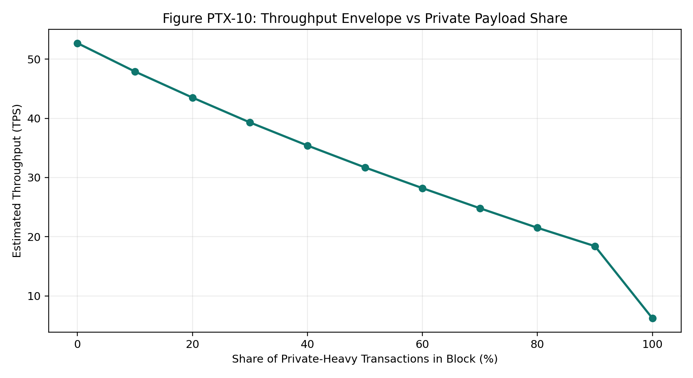
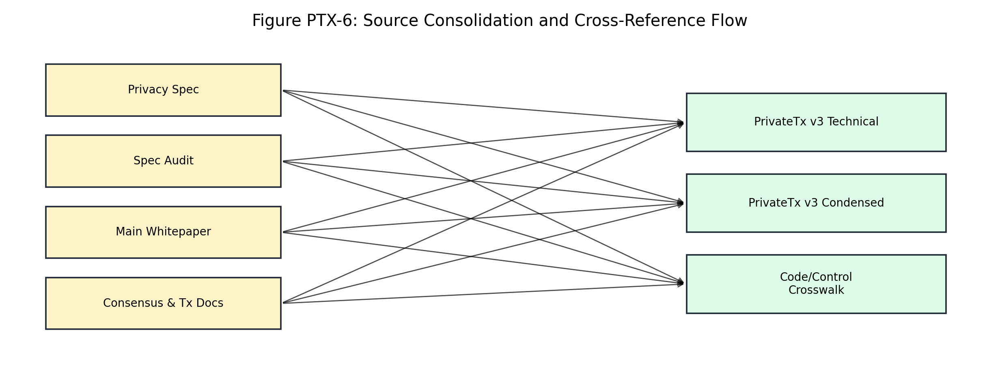

# PrivateTx v3 Condensed

High-Level Whitepaper for Investors, Partners, and Non-Technical Stakeholders

Date: 2026-04-10
Scope: condensed narrative aligned to the full technical PrivateTx v3 whitepaper

## Table of Contents

- [1. Executive Overview](#1-executive-overview)
- [2. What PrivateTx v3 Solves](#2-what-privatetx-v3-solves)
- [3. How the System Works (High Level)](#3-how-the-system-works-high-level)
- [4. Security and Trust Model](#4-security-and-trust-model)
- [5. Economics and Supply Interpretation](#5-economics-and-supply-interpretation)
- [6. Performance and User Expectations](#6-performance-and-user-expectations)
- [7. Product and Adoption Narrative](#7-product-and-adoption-narrative)
- [8. Governance and Operational Discipline](#8-governance-and-operational-discipline)
- [9. Investor Checklist](#9-investor-checklist)
- [10. Source and Cross-Reference Map](#10-source-and-cross-reference-map)
- [11. FAQ](#11-faq)

## 1. Executive Overview

PrivateTx v3 is the privacy layer of the Atho network. It is designed to give users stronger transaction privacy while preserving consensus-grade accounting and deterministic validation. The condensed whitepaper explains the same system as the technical paper, but with less implementation detail and more emphasis on decision relevance for investors, partners, and product evaluators.

The key point is that PrivateTx v3 is not a bolt-on feature disconnected from consensus. It is integrated into transaction validation, miner assembly, and block acceptance logic. That design supports a credible privacy narrative: privacy behavior is validated by the same deterministic consensus path that validates the rest of the chain. For non-technical readers, this means privacy claims are anchored to enforceable system rules, not only to wallet UX features.

From a strategic perspective, PrivateTx v3 positions Atho as a post-quantum-oriented UTXO chain with practical privacy capabilities and explicit runtime controls. The product value is not only privacy; it is privacy with governance, observability, and operational discipline. Investors should read this as infrastructure maturity: features are accompanied by bounded resource policy, test strategy, and deployment controls.

## 2. What PrivateTx v3 Solves

On transparent UTXO chains, transaction graphs can reveal patterns about who pays whom and how much is transferred. PrivateTx v3 addresses that exposure by introducing private note commitments, one-time nullifiers, anchor-based membership checks, and encrypted payload delivery. These mechanics reduce direct linkage and amount exposure while preserving deterministic chain validation.

The practical value for market participants is twofold. First, users and businesses can transact with lower metadata leakage risk. Second, networks and applications can position themselves for enterprise and institutional contexts where transactional privacy controls are expected. Importantly, this is achieved without abandoning auditable consensus rules. System integrity still depends on deterministic verification gates, and those gates remain observable to operators.

For speculative participants, the important nuance is that privacy functionality can broaden utility without implying uncontrolled monetary policy changes. PrivateTx v3 affects transaction composition, resource costs, and fee dynamics, but not hard-cap rules. This distinction matters when evaluating long-run token economics and risk.

## 3. How the System Works (High Level)

At a high level, a private transfer follows this flow: a wallet constructs a private note for a recipient bundle, the transaction passes admission checks, a miner assembles a candidate block and prepares proof data, and validators verify private constraints before accepting the block. If proof or policy checks fail, the block is rejected. This fail-closed behavior is central to trust.

Recipients recover incoming private notes through deterministic wallet scanning and key derivation logic. Nullifiers prevent double-spend replay, anchors bind spends to valid historical note roots, and block-level proof gates preserve consistency constraints. For non-technical readers, the takeaway is that PrivateTx v3 is designed as a full lifecycle system, not just encrypted messaging around transactions.

The system also incorporates operational controls around proving/verifying runtime binaries and timeout behavior. This ensures that cryptographic capability is delivered as stable operations rather than as fragile experimental integration.

## 4. Security and Trust Model

PrivateTx v3 follows a layered trust model. Cryptographic mechanisms protect private transaction properties, deterministic parser and validator gates protect consensus behavior, and runtime controls protect deployment integrity. All three layers matter. Strong cryptography without deterministic validation can still fail operationally, and deterministic validation without runtime integrity controls can still drift across environments.

The trust model is designed for auditability. Teams can inspect constants, code paths, and operational controls in a cross-referenced way. This is important for institutional confidence because it allows independent reviewers to validate claims rather than relying on marketing language. When failures occur, the system is intended to fail closed and produce enough diagnostics for deterministic incident analysis.

## 5. Economics and Supply Interpretation

PrivateTx v3 does not change Atho's fixed monetary boundaries. Hard cap, base target, tail issuance structure, fee burn logic, and supply floor behavior remain governed by the same consensus constants. This is critical for investors: privacy functionality affects utility and cost structure, not the fundamental cap math.

What PrivateTx does change is transaction composition. Private transfers are byte-heavier and compute-heavier than standard public transfers. As private usage increases, throughput and fee dynamics can shift. That can be positive for network fee generation but requires realistic capacity expectations. The network's economic story therefore combines bounded issuance with variable utilization economics.

Current production values remain explicit: fee floor `350 atoms/vB`, minimum tx fee `100000 atoms`, private confirmations `10`, and post-tail fee-pool routing `55`%. These fixed values provide a concrete baseline for evaluating economic sensitivity in different adoption scenarios.

## 6. Performance and User Expectations

Throughput on a blockchain is shaped by transaction mix. Private-heavy blocks carry more payload and witness material, so they process fewer transactions per block than public-only mixes. This is expected and should be presented clearly to users and partners. A credible network strategy explains this tradeoff up front rather than hiding it behind single-number TPS claims.

For user experience, the right framing is predictable behavior under known constraints. With explicit fee floors, confirmation policy, and payload bounds, users can plan around cost and timing. For businesses, this predictability is often more valuable than raw theoretical throughput. PrivateTx v3 is therefore positioned as reliability-focused privacy infrastructure, not as unconstrained high-throughput privacy mode.

## 7. Product and Adoption Narrative

From a product viewpoint, PrivateTx v3 improves Atho's relevance for users who care about privacy-preserving payments, business confidentiality, and metadata-risk reduction. It also strengthens ecosystem positioning by combining privacy with post-quantum-aligned components and deterministic operational controls.

Adoption should be evaluated across three lanes: user trust (does it protect meaningful privacy properties?), operator trust (can it be run safely and diagnosed under stress?), and reviewer trust (can third parties verify claims against code and controls?). PrivateTx v3 is designed to score well across all three lanes, which is why documentation structure and cross-references matter as much as cryptographic components.

## 8. Governance and Operational Discipline

Sustainable privacy infrastructure requires governance discipline. PrivateTx v3 assumes phase-based releases, synchronized updates across constants/code/docs, and strict test gating before production changes. Operationally, pinned binaries and fail-closed runtime behavior reduce environment drift and improve reproducibility. Strategically, this reduces execution risk and improves confidence for long-term participants.

For stakeholders, the governance message is simple: the team treats private consensus behavior as critical infrastructure. That means no silent policy drift, no convenience overrides in consensus paths, and no ambiguous acceptance behavior when proofs or constraints fail.

## 9. Investor Checklist

When evaluating PrivateTx v3, investors and strategic partners should review these checkpoints:
- Are privacy claims mapped to deterministic consensus validation?
- Are runtime controls (binary pinning, bounds, fail-closed paths) active in production profiles?
- Are economics communicated with clear distinction between utilization dynamics and hard-cap policy?
- Are test and release governance practices explicit and repeatable?
- Is documentation cross-referenced enough for independent technical diligence?

A positive answer across these points indicates that PrivateTx v3 is being treated as production infrastructure rather than as a speculative feature set.

## 10. Source and Cross-Reference Map

The condensed paper is synchronized with the full technical paper (`Docs/PrivateTx_v3.md`), private architecture docs, audit notes, and the main Atho whitepaper. The purpose of this map is to ensure readers can move from summary claims to implementation details without ambiguity.

### Adoption Scenario: Retail Privacy Acceleration

Retail adoption often starts with a simple narrative: users do not want transaction metadata to expose behavior patterns. In this scenario, private usage grows in steady phases rather than all at once. The network should expect a mixed traffic profile where public and private transactions coexist for long periods. Product success in this phase depends on reliable wallet behavior, understandable fee estimation, and confirmation expectations that match policy constants. Investors should view this scenario as a utility expansion path where trust and consistency matter more than short-term throughput headlines.

### Adoption Scenario: Merchant and Treasury Confidentiality

Merchant-facing adoption has a different driver: confidentiality of supplier payments, operational flows, and treasury movement. PrivateTx v3 supports this by reducing direct linkage between business identities and transfer amounts on-chain while preserving deterministic validation. In this scenario, enterprise-style uptime, clear operational runbooks, and stable API contracts become primary differentiators. The strategic value is that confidential settlement can be delivered without abandoning auditability or introducing hidden policy behavior that would undermine commercial confidence.

### Adoption Scenario: Institutional Diligence and Compliance Interfaces

Institutional evaluators usually run layered diligence: protocol review, runtime integrity review, and operational governance review. PrivateTx v3 is designed to meet that style of evaluation by combining cryptographic controls with explicit deployment discipline. Pinning, bounded payload/proof policy, and fail-closed acceptance behavior are not just technical details; they are confidence signals for counterparties and governance teams. In this scenario, the project's ability to produce reproducible evidence of deterministic behavior matters as much as feature completeness.

### Product Scenario: Integrator Platform Fit

Ecosystem integrators need predictable interfaces and clear invariants. A privacy feature that changes behavior across environments is expensive to support and hard to trust. PrivateTx v3 addresses this by documenting field bounds, validation outcomes, and release governance with explicit cross-references. Integrators can build wallet tooling, payment adapters, and operational dashboards with fewer hidden assumptions. Over time, that reduces ecosystem friction and can improve platform stickiness, which is one of the strongest long-run drivers of network utility.

### Market Scenario: Infrastructure-Led Narrative Strength

Many projects describe privacy in abstract terms, but infrastructure buyers evaluate repeatability, not slogans. PrivateTx v3 provides an infrastructure-led narrative: deterministic validation, explicit policy constants, and auditable runtime controls. This narrative is easier to defend in technical due diligence and easier to communicate to strategic partners. For investors, the key signal is execution discipline. A network that documents and enforces its controls clearly is generally better positioned to scale partnerships than one that depends on unclear assumptions.

### Product Scenario: Multi-Role User Base Expansion

Atho serves multiple user roles: operators, integrators, and end users. PrivateTx v3 increases relevance across those roles by offering privacy features that remain anchored to deterministic consensus behavior. End users gain confidentiality benefits, operators gain bounded and diagnosable runtime behavior, and integrators gain stable interfaces. This role-balanced value proposition reduces dependence on a single user segment and improves resilience of adoption narratives over market cycles.

### Capital-Market Scenario: Utility Versus Token Narrative

PrivateTx v3 should be evaluated as infrastructure utility, not as a shortcut to token speculation. The feature strengthens transactional use cases, but it does not change hard monetary boundaries or remove throughput tradeoffs. This distinction helps investors avoid thesis errors. A strong utility thesis emphasizes operational reliability, policy clarity, and sustained ecosystem integration. If those signals continue to improve, market narratives tend to become more durable and less dependent on short-lived momentum cycles.

### Operational Scenario: Scaling Without Policy Drift

As usage increases, projects often face pressure to relax rules for short-term convenience. PrivateTx v3's design resists that pressure by emphasizing deterministic gates and release governance. In practice, this means policy changes should be deliberate, tested, and documented before deployment. Investors and partners should view this as a positive constraint: disciplined systems usually scale with fewer unforced incidents than systems that patch behavior reactively in production.

### Ecosystem Scenario: Documentation as a Trust Surface

For infrastructure projects, documentation quality is part of product quality. A clear technical paper plus a clear condensed paper helps different stakeholders verify the same truth set from different entry points. PrivateTx v3's two-document model supports that requirement by linking high-level narratives to code and operational controls. This improves communication efficiency during diligence and lowers the risk that strategic decisions are made from stale or mismatched assumptions.

### Long-Horizon Scenario: Privacy as a Default Capability

Over longer horizons, privacy features can shift from optional differentiation to baseline expectation in digital transaction systems. PrivateTx v3 positions Atho for that shift by embedding privacy inside deterministic validation rather than treating it as optional overlay logic. The strategic implication is durability: when expectations evolve, networks with integrated and governable privacy architecture are better positioned to retain relevance across user segments and market environments.

### Investor Deep Note: Revenue Quality Versus Volume

A frequent mistake in blockchain investment analysis is to treat any increase in transaction count as equal value. PrivateTx v3 encourages a better lens: revenue quality and utility quality. When private usage rises in a deterministic and policy-bounded environment, fee behavior can reflect genuine utility rather than short-lived spam. The important question is whether usage is supported by reliable operations, bounded policy, and durable integration pathways. If those conditions hold, growth in private transaction mix can be interpreted as higher-quality network demand rather than transient activity.

For investors, this note matters because it connects technical discipline to market interpretation. Strong controls reduce the probability that apparent growth is masking brittle infrastructure behavior.

### Investor Deep Note: Integration Friction as a Valuation Input

Integration friction has direct economic impact. Networks that are difficult to integrate safely tend to lose potential ecosystem partners, delay product launches, and accumulate support overhead. PrivateTx v3's deterministic contracts and documentation reduce that friction by clarifying expected behavior and failure modes. This improves planning confidence for wallet teams, payment processors, and enterprise integrators.

In valuation terms, lower integration friction can improve adoption efficiency. Stakeholders can commit resources with a clearer understanding of technical constraints and operational obligations, which reduces execution uncertainty at the ecosystem layer.

### Investor Deep Note: Reliability Signaling in Competitive Markets

Privacy features are increasingly common in narrative terms, but market participants still differentiate strongly on reliability. PrivateTx v3's emphasis on fail-closed validation, bounded payload/proof policy, and binary integrity controls functions as a reliability signal. In competitive contexts, reliable execution often outperforms broader but less governable feature sets.

This is especially relevant during stress periods. Systems with explicit controls and deterministic rejection behavior tend to preserve trust better than systems that degrade into ambiguous behavior under load. Investors should treat this reliability delta as a strategic moat indicator.

### Investor Deep Note: Governance Discipline and Downside Protection

Governance discipline does not only support upside; it also protects downside. In privacy infrastructure, poorly managed upgrades can produce confidence shocks that persist beyond the immediate incident window. PrivateTx v3's phase-gated release posture and synchronization expectations across code, constants, and docs are designed to reduce that class of downside event.

For long-horizon participants, downside protection matters as much as feature acceleration. A system that changes more slowly but predictably can be easier to underwrite than a system that ships quickly with weak control evidence.

### Investor Deep Note: User Trust, Support Cost, and Retention

User trust has both reputational and operational consequences. When private transaction behavior is predictable and recoverable, support burden decreases and retention tends to improve. PrivateTx v3's deterministic lifecycle handling and explicit failure boundaries support that outcome. This is not just a technical win; it can influence ecosystem economics through reduced churn and lower support-cost intensity.

Investors evaluating sustainable growth should track these second-order effects, because they can materially influence long-term adoption quality.

### Investor Deep Note: Strategic Optionality from Documentation Quality

Strategic optionality increases when documentation quality is high. Clear documentation allows new partners, auditors, and integrators to engage quickly, which expands the set of viable strategic moves over time. PrivateTx v3's two-document model (technical + condensed) is designed to preserve this optionality by serving both deep technical review and broader stakeholder understanding.

In practical terms, better documentation can reduce time-to-diligence, improve partner conversion velocity, and lower communication risk during roadmap transitions.

### Investor Deep Note: Capacity Planning as a Trust Promise

Capacity planning is a trust promise to the market. If a network communicates realistic private-usage throughput behavior and enforces resource bounds, stakeholders can plan with fewer surprises. PrivateTx v3 explicitly frames private throughput tradeoffs rather than hiding them, which supports more credible ecosystem planning.

This credibility can become a competitive advantage. Partners and users often prefer predictable constraints over optimistic but unstable performance claims, especially in infrastructure contexts where service continuity matters.

### Investor Deep Note: Long-Run Positioning and Narrative Durability

Narrative durability comes from alignment between claims and observed behavior over time. PrivateTx v3's architecture, controls, and documentation are intended to keep that alignment stable as adoption evolves. If the project continues to maintain policy clarity, test discipline, and operational transparency, the privacy narrative can remain credible through multiple market cycles.

For investors and strategic partners, this is the central long-run question: can the system sustain trust while scaling utility? The structure presented in this condensed whitepaper is designed to support a positive answer.

### Investor Deep Note: Operational Transparency and Board-Level Reporting

Institutional boards and risk committees prefer systems with clear, repeatable reporting signals. PrivateTx v3 supports that expectation through deterministic controls, explicit constants, and clear operational boundaries. This allows executive-level stakeholders to review risk posture using objective evidence rather than relying on informal technical interpretation.

From an investment standpoint, operational transparency reduces surprise risk. When teams can explain incidents and performance changes in policy-aligned terms, confidence is easier to preserve during stressed conditions.

### Investor Deep Note: Vendor and Integration Dependency Management

Dependency management is a major determinant of infrastructure resilience. PrivateTx v3's runtime model acknowledges this by combining binary provenance controls with explicit deployment expectations. That structure helps teams evaluate upstream and downstream dependencies without treating private proving infrastructure as a black box.

For strategic partners, this reduces integration uncertainty. A documented dependency posture is easier to audit, negotiate, and maintain over long product cycles.

### Investor Deep Note: Upgrade Communication as a Competitive Edge

Technical quality alone is not enough if upgrade communication is weak. PrivateTx v3 emphasizes synchronized documentation and release governance so changes can be explained clearly to technical and non-technical stakeholders. This makes roadmap execution more understandable and reduces avoidable market confusion.

In competitive terms, clearer upgrade communication can become a trust advantage. Partners and users are more likely to stay engaged when they can understand what changed and why it matters.

### Investor Deep Note: Ecosystem Cost of Ambiguity

Ambiguity has direct ecosystem cost. When policy boundaries or runtime behavior are unclear, partner integrations slow down, support overhead rises, and reputation risk increases. PrivateTx v3's structured documentation and deterministic controls are designed to reduce that ambiguity burden.

For investors, this matters because lower ambiguity can improve capital efficiency at the ecosystem layer. Teams can deploy integration effort with fewer rework cycles and fewer hidden assumptions.

### Investor Deep Note: Stress-Period Performance Interpretation

During stress periods, the wrong metric focus can lead to incorrect conclusions. PrivateTx v3 should be evaluated using stability and predictability metrics alongside throughput and fee data. Systems that remain deterministic under load often deliver better long-run outcomes than systems that briefly maximize throughput but degrade unpredictably.

This lens helps investors distinguish durable infrastructure from short-lived performance narratives.

### Investor Deep Note: Supportability and Time-to-Recovery Economics

Supportability is an economic variable, not only an engineering variable. PrivateTx v3's explicit failure boundaries and operational controls can reduce mean-time-to-diagnosis and mean-time-to-recovery when incidents occur. Faster, clearer recovery reduces user churn risk and protects partner confidence.

Over long horizons, reduced recovery cost can materially improve the sustainability profile of ecosystem operations.

### Investor Deep Note: Strategic Partner Onboarding Velocity

Partner onboarding velocity depends on technical clarity and process predictability. PrivateTx v3's condensed and technical papers together provide a layered onboarding path that supports both business and engineering stakeholders. This can reduce negotiation friction and accelerate technical readiness work.

A faster onboarding cycle can translate into more consistent ecosystem expansion, which is often a key signal for long-run network value formation.

### Investor Deep Note: Regulatory and Policy Conversation Readiness

Even when a network is not directly regulated like a centralized service, policy conversations still shape partnership feasibility. PrivateTx v3 benefits from having explicit controls and documented operational behavior that can be explained in policy discussions without speculative claims.

For investors, policy-conversation readiness reduces one category of strategic uncertainty. Clarity in how privacy and accountability coexist can improve enterprise adoption prospects.

### Investor Deep Note: Quality of Demand Versus Volatility of Attention

Attention can be volatile, but demand quality is more durable. PrivateTx v3's value proposition is strongest when measured by sustained use-case adoption, integration continuity, and operational confidence rather than short-term headline momentum. This quality-of-demand lens supports more grounded investment decisions.

A network that can retain utility under varying market sentiment usually has a stronger long-term strategic profile.

### Investor Deep Note: Product-Market Iteration Without Consensus Instability

Healthy iteration is necessary, but iteration that destabilizes consensus behavior is destructive. PrivateTx v3's governance framing aims to preserve product iteration while protecting deterministic validation boundaries. This balance is critical for teams that want to evolve features without compromising trust.

Investors should view this as a structural advantage when executed consistently: iteration speed with control discipline is generally superior to either rigidity or uncontrolled change.

### Investor Deep Note: Capital Allocation and Engineering Focus

Capital allocation decisions are stronger when engineering priorities are explicit. PrivateTx v3 highlights where effort should concentrate: deterministic validation, runtime integrity, operational tooling, and integration clarity. This helps external stakeholders assess whether engineering spend aligns with long-term value creation.

Clear alignment between capital use and reliability outcomes can improve confidence in execution quality over time.

### Investor Deep Note: Measuring Credibility Through Consistency

Credibility in infrastructure markets is built through repeated consistency. PrivateTx v3's framework is designed to produce that consistency by linking product claims, runtime controls, and documentation updates. The most useful investor question is whether this consistency continues across multiple release cycles.

If consistency remains strong, strategic optionality and ecosystem trust are likely to compound, supporting more durable long-term value.

### Investor Deep Note: Competitive Benchmarking Discipline

Benchmarking against peer networks is useful only when comparisons are normalized for policy assumptions, payload costs, and operational controls. PrivateTx v3 should be compared on deterministic reliability and transparency of constraints, not just on headline throughput claims. This avoids distorted conclusions caused by mismatched assumptions.

A disciplined benchmark framework allows investors to evaluate relative execution quality with less noise and better long-run decision value.

### Investor Deep Note: Documentation Debt as Hidden Liability

Documentation debt behaves like technical debt in strategic planning. When documentation lags implementation, partner onboarding slows, support burden rises, and governance discussions become less efficient. PrivateTx v3 reduces this liability by maintaining a structured technical paper and a synchronized condensed paper.

Treating documentation as a first-class deliverable helps protect execution credibility over long release cycles.

### Investor Deep Note: Ecosystem Incentive Alignment

Ecosystem growth is more durable when incentives align across users, operators, and integrators. PrivateTx v3 contributes to alignment by making private functionality deterministic and auditable, so each stakeholder group can plan around known constraints rather than assumptions. Predictable rules reduce coordination friction.

Investors should monitor whether ecosystem participants continue to build against these stable contracts, because sustained alignment is often a leading indicator of durable network value.

### Investor Deep Note: Incident Learning Velocity

The quality of an infrastructure team is often visible in how quickly it learns from incidents. PrivateTx v3's emphasis on deterministic diagnostics and explicit control boundaries is designed to improve learning velocity after failures. Faster learning means fewer repeated failure classes and lower cumulative operational risk.

Over time, improved learning velocity can strengthen both partner confidence and internal execution efficiency.

### Investor Deep Note: Product Positioning Clarity

Positioning clarity matters when multiple audiences evaluate the same system. PrivateTx v3 benefits from a consistent message: privacy with deterministic validation and operational discipline. This clarity helps prevent narrative fragmentation between technical and non-technical audiences.

A coherent positioning model reduces communication risk and can improve decision quality across investor, partner, and community channels.

### Investor Deep Note: Portfolio Construction Relevance

For portfolio builders, infrastructure assets are often evaluated on durability, governance quality, and integration potential. PrivateTx v3's structure addresses all three dimensions by combining bounded policy controls with ecosystem-oriented documentation and predictable interfaces.

This can make the asset easier to model in long-horizon theses that prioritize execution discipline over short-lived volatility narratives.

### Investor Deep Note: Execution Optionality Under Uncertainty

Market and policy conditions can change quickly. Systems with explicit controls and clear operating models usually preserve more execution optionality under uncertainty. PrivateTx v3 is designed to keep optionality through deterministic governance and auditable release behavior.

In uncertain environments, preserved optionality can be a strategic advantage for both project teams and long-term participants.

### Investor Deep Note: Closing Synthesis for Non-Technical Stakeholders

For non-technical readers, the core synthesis is straightforward: PrivateTx v3 aims to deliver meaningful privacy utility without sacrificing deterministic trust. That combination depends on controls, documentation quality, and disciplined operations rather than on one feature alone.

When those elements remain aligned over time, stakeholders can evaluate progress with higher confidence and lower narrative risk.

### Investor Deep Note: Capital Efficiency of Predictable Operations

Predictable operations can improve capital efficiency because teams spend less time on ambiguous incident handling and emergency integration rewrites. PrivateTx v3's deterministic boundaries and documentation discipline reduce that inefficiency by making expected behavior explicit before deployment.

For strategic investors, this translates into a clearer relationship between engineering investment and durable infrastructure outcomes.

### Investor Deep Note: Partner Retention and Confidence Compounding

Partner acquisition is important, but partner retention is where long-term value compounds. Retention is more likely when integrations remain stable across upgrades and when incidents are handled transparently. PrivateTx v3's control posture is designed to support that retention dynamic.

A network that retains partners through multiple release cycles generally builds a stronger and more defensible ecosystem base.

### Investor Deep Note: Measurable Governance Outcomes

Governance quality should be judged by measurable outcomes: fewer surprise regressions, faster incident closure, clearer release communication, and stronger cross-team coordination. PrivateTx v3 is structured to produce those outcomes by linking policy controls to operational practice.

This outcome-based governance view helps stakeholders evaluate progress with less narrative bias and more evidence-based confidence.

### Investor Deep Note: Durable Value Through Controlled Expansion

Controlled expansion is often a better long-term strategy than unbounded feature velocity. PrivateTx v3's model favors controlled expansion: add capability, preserve deterministic guarantees, and maintain auditable communication. This approach is designed to protect trust while utility grows.

For long-horizon participants, controlled expansion supports a more durable value trajectory than short-term feature bursts without governance depth.

### Investor Deep Note: Evidence Cadence and Market Confidence

Confidence compounds when evidence is published consistently. PrivateTx v3 benefits from a cadence model where technical claims, policy values, and operational outcomes are documented together across releases. This gives stakeholders a stable way to verify progress over time.

A predictable evidence cadence can reduce narrative volatility and support stronger long-run market confidence.

### Investor Deep Note: Execution Resilience Across Cycles

Infrastructure projects are tested across multiple market cycles, not only during favorable periods. PrivateTx v3's deterministic controls and explicit governance patterns are intended to preserve execution quality through both expansion and contraction phases.

For long-term investors, resilience across cycles is a core quality filter, and this document structure is designed to make that resilience assessable.

### Investor Deep Note: Closing Evaluation Framework

A practical evaluation framework for PrivateTx v3 is simple: verify deterministic behavior, verify governance discipline, verify integration clarity, and verify consistency over time. When those checks remain positive, the network's privacy narrative is supported by operational reality.

That is the central investor takeaway from this condensed paper.

### Investor Deep Note: Final Strategic Summary

PrivateTx v3 should be understood as an infrastructure program that combines privacy utility with deterministic controls and operational discipline. The investment case is strongest when all three remain aligned: users receive meaningful privacy capability, operators retain predictable and diagnosable behavior, and partners can integrate against stable contracts.

Across this condensed paper, each section points to the same conclusion. Long-term value depends less on short-lived feature excitement and more on consistent execution quality. If the project keeps policy, implementation, and documentation aligned through successive releases, confidence can build on evidence rather than narrative alone. That evidence-driven trajectory is the strongest indicator of durable strategic fit for investors, partners, and non-technical stakeholders evaluating PrivateTx v3.

### Final Perspective: Decision Quality

For non-technical decision makers, the most useful summary is this: PrivateTx v3 is strongest when evaluated as controlled infrastructure, not as an unconstrained feature sprint. Deterministic behavior, explicit policy values, and disciplined releases improve decision quality across investor, partner, and operator groups.

### Final Perspective: Execution Evidence

Execution evidence should remain the core evaluation standard. If future revisions keep constants, code paths, and documentation synchronized, confidence can compound over time and reduce narrative volatility.

### Final Perspective: Strategic Fit

Strategic fit improves when a privacy layer supports both user confidentiality and operator reliability. PrivateTx v3 is intentionally positioned at that intersection.

## 11. FAQ

**Q1: Is this condensed paper replacing the technical whitepaper?**
No. It is a companion summary. The technical paper remains the source for full implementation and audit depth.

**Q2: Does PrivateTx v3 make Atho a privacy-only chain?**
No. Atho remains a mixed public/private UTXO system. PrivateTx is an integrated optional lane, not the only transaction mode.

**Q3: Does privacy change the hard cap or emissions cap logic?**
No. Monetary boundaries remain governed by core consensus constants.

**Q4: Why are private transactions more expensive/heavier?**
They include encrypted payloads and additional validation/proof-related work. This is expected and budgeted in policy.

**Q5: What gives confidence this is production-grade?**
Deterministic validation gates, fail-closed proof policy, strict bounds, pinned runtime binaries, and test-governed releases.

**Q6: Who should read the full technical paper?**
Engineers, auditors, node operators, and any stakeholder doing deep technical diligence.

**Q7: Who should read this condensed paper?**
Investors, partners, non-technical community members, and strategy teams comparing infrastructure narratives.
