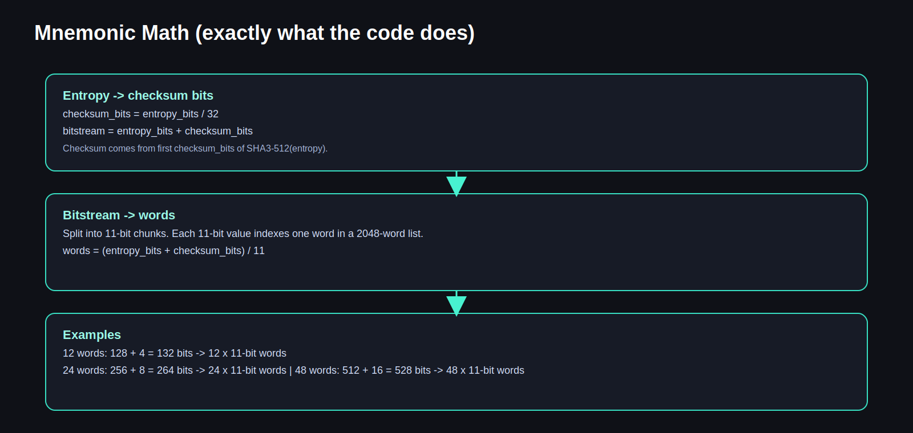
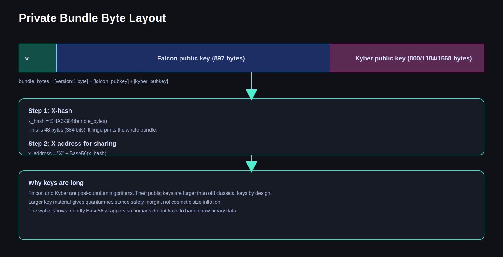
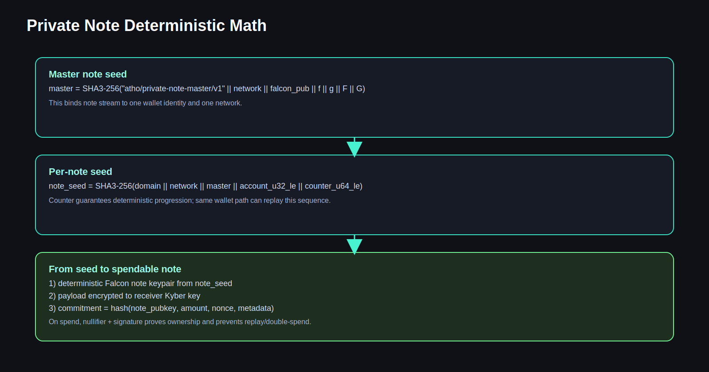
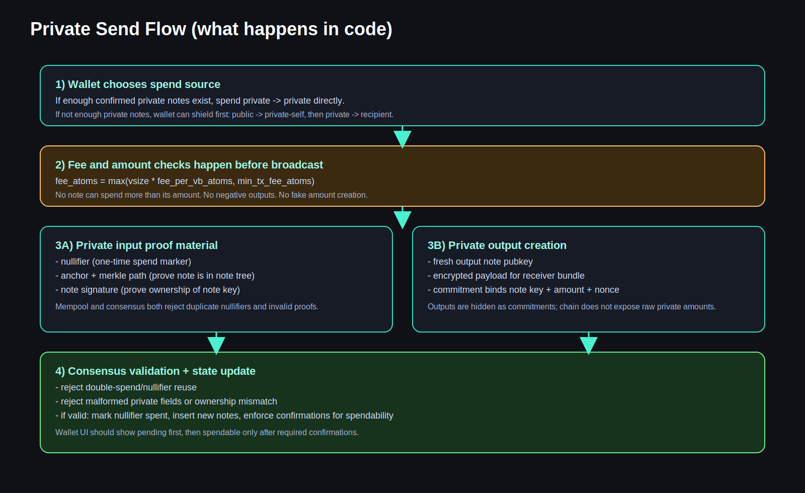

# Atho Wallet Hierarchy Visual Guide (Beginner + Deep Technical)

Date: 2026-04-08

Audience:
- Beginner users who want a simple mental model.
- Operators and developers who need exact code-level math and derivation behavior.

Goal:
- Explain from step 1 how mnemonic, seed, Falcon, Kyber, addresses, private bundles, and private notes work together.
- Explain recovery rules and what is and is not recoverable.
- Explain why keys are long and why that is expected in a post-quantum design.

---

## 0) Explain Like I Am 5 (the toy-box version)

Think of your wallet like a big toy factory with one master recipe card.

- Your **mnemonic words** are that recipe card.
- The wallet uses the recipe card to make one giant secret dough called the **seed**.
- From that seed, the wallet bakes two different toy families:
  - **Falcon toys**: used to prove "this is really me" (signatures).
  - **Kyber toys**: used to lock and unlock secret messages (private payload encryption).
- Then the wallet makes addresses from those toys:
  - normal address (public receive/spend),
  - bond address,
  - stake address,
  - private bundle identity (X-address).

If you keep the recipe card (mnemonic) and the same options (passphrase, account/index/role path), the factory can rebuild the same toy family again.

That is deterministic recovery.

---

## 1) Big Picture Diagram


What this means:
- One mnemonic root can deterministically rebuild both public identity (Falcon path) and private receive identity (Kyber/bundle path).
- Role separation is intentional. Regular, bond, and stake are domain-separated identities, even if they come from one root.

---

## 2) Core Terms (plain language + jargon)

- **Entropy**: random bytes the wallet generates first.
- **Checksum bits**: short hash-derived bits added to entropy to catch typing mistakes.
- **Mnemonic**: human-readable word list encoding entropy + checksum.
- **Seed**: 64-byte root secret derived from mnemonic using PBKDF2.
- **PBKDF2**: password-based key derivation function. Slows down brute-force attacks.
- **HKDF**: key expansion method with context labels so different branches are separated.
- **Falcon**: post-quantum signature scheme (identity + signing).
- **Kyber**: post-quantum KEM/encryption key agreement (private payload lock/unlock).
- **HPK**: hashed public key digest (role/network-domain hashed Falcon pubkey).
- **Base56**: human-oriented encoding alphabet with typo-resistant rules.
- **Private bundle**: binary package that contains Falcon public key + Kyber public key.
- **X-hash / X-address**: hash-based identifier for private bundle sharing.
- **Note**: private spendable object (private UTXO-like record).
- **Nullifier**: one-time spend marker that prevents private double-spend.
- **Anchor/Merkle path**: proof that a note exists in the private note tree.

---

## 3) Exact Mnemonic Math (from code)

Source behavior: `Src/Accounts/mnemonic.py`.

### 3.1 Supported mnemonic lengths

The code maps word-count to entropy bytes:
- 12 words -> 16 bytes entropy (128 bits)
- 24 words -> 32 bytes entropy (256 bits)
- 48 words -> 64 bytes entropy (512 bits)

### 3.2 Checksum formula

```text
checksum_bits = entropy_bits / 32
```

Checksum bits are taken from the start of `SHA3-512(entropy)`.

### 3.3 Word conversion formula

```text
bitstream = entropy_bits + checksum_bits
words = bitstream / 11
```

Each 11-bit chunk indexes one word in a 2048-word list.

Examples:
- 12 words: 128 + 4 = 132 bits -> 132 / 11 = 12
- 24 words: 256 + 8 = 264 bits -> 264 / 11 = 24
- 48 words: 512 + 16 = 528 bits -> 528 / 11 = 48

### 3.4 Visual mnemonic math



---

## 4) Seed Derivation (PBKDF2 details)

Source behavior: `Src/Accounts/mnemonic.py`.

Mnemonic is normalized (NFKD). Passphrase is normalized (NFKD).

The code derives seed exactly as:

```text
seed = PBKDF2-HMAC-SHA3-512(
  password = normalized_mnemonic,
  salt     = "atho-mnemonic-v1" + normalized_passphrase,
  iterations = 600000,
  dklen = 64
)
```

Important:
- A minimum of 100000 iterations is enforced by code guard.
- Current default in code is 600000.
- Output is 64 bytes.

Why this matters:
- Same mnemonic + same passphrase + same scheme -> same seed.
- Different passphrase -> different seed (completely different wallet tree).

---

## 5) Hierarchical Derivation into Falcon and Kyber

### 5.1 Falcon branch

Code uses domain-separated HKDF context:

```text
context = "ATHO-HD-FALCON-V1"
info    = "atho-mnemonic-v1|<network>|<account>|<role>|<index>"
falcon_seed_64 = HKDF-SHA3-512(seed, context, info, 64)
```

This deterministic Falcon seed goes to deterministic Falcon keygen.

### 5.2 Kyber branch

Code uses another independent context:

```text
context = "ATHO-HD-KYBER-V1"
info    = "atho-mnemonic-v1|<network>|<account>|<role>|<index>|kyber=<level>"
kyber_seed_64 = HKDF-SHA3-512(seed, context, info, 64)
```

Then Kyber deterministic keypair is generated.

### 5.3 Why separate contexts are critical

If Falcon and Kyber reused one derivation domain, cross-protocol key coupling risk increases.

Domain separation means:
- Falcon material cannot accidentally become Kyber material.
- Changing one branch policy does not silently break the other.

---

## 6) Address Math (role/domain separated)

Role hash digest uses SHA3-384 with domain tags and network tags.

At a high level:

```text
role_digest = SHA3-384(role_domain || 0x00 || network_domain || 0x00 || falcon_pubkey_bytes)
```

Then Base56 address formatting uses:

```text
body = role_prefix + Base56(role_digest)
checksum_raw = SHA3-256(body_utf8)[0:4]
checksum_b56 = Base56(checksum_raw), fixed to 6 chars
address = body + checksum_b56
```

From code:
- Base56 alphabet excludes ambiguous chars.
- Checksum bytes = 4.
- Checksum printed length = 6 Base56 chars.

So addresses are:
- human-shareable wrapper,
- with typo-detection checksum,
- while cryptographic identity still comes from hashed key bytes.

---

## 7) Private Bundle Format and Why Keys Are Long

### 7.1 Visual layout



### 7.2 Exact binary structure

From `Src/Utility/private_bundle.py`:

```text
bundle_bytes = [version:1 byte] || [falcon_pubkey] || [kyber_pubkey]
```

Typical lengths:
- Falcon public key: 897 bytes.
- Kyber public key: 800, 1184, or 1568 bytes (level-dependent).

### 7.3 Bundle identity math

```text
x_hash = SHA3-384(bundle_bytes)
x_address = "X" + Base56(x_hash)
```

### 7.4 "Why are private keys and public keys so long?"

Short answer: because this is post-quantum crypto.

Long answer:
- Falcon and Kyber use lattices and structures that require larger key/signature/ciphertext sizes than legacy ECC.
- Bigger payloads are expected engineering tradeoffs for quantum-resistance.
- This is not accidental bloat. It is the design cost for future safety.

---

## 8) Private Note Derivation and Spend Safety

### 8.1 Visual note math



### 8.2 Master note seed

From `key_manager.py` logic:

```text
note_master = SHA3-256(
  "atho/private-note-master/v1" || network || falcon_pub || f || g || F || G
)
```

### 8.3 Per-note deterministic seed

From `deterministic_keygen.py` path:

```text
note_seed = SHA3-256(
  domain || network || note_master || account_u32_le || counter_u64_le
)
```

Counter gives deterministic stream progression.

### 8.4 Spend prevention logic (concept)

For private spends, consensus/mempool expect valid proof material:
- nullifier must be unique (no replay/double-spend),
- anchor/path must prove membership in note tree,
- note signature must match expected note key and spend digest,
- amount relations must be valid (no mint from thin air),
- malformed inputs get rejected.

---

## 9) Private Transaction Flow (easy view + technical view)



### 9.1 Fee math

System policy (current constants):
- `fee_per_vb_atoms = 350`
- `min_tx_fee_atoms = 100000`

General formula:

```text
required_fee_atoms = max(vsize * fee_per_vb_atoms, min_tx_fee_atoms)
```

With `1 ATHO = 1,000,000,000 atoms`, this means:
- 350 atoms/vB = 3.5e-7 ATHO/vB.

### 9.2 Confirmation policy (current constants)

- regular tx confirmations required: 10
- private tx confirmations required: 10
- coinbase maturity blocks: 150

So private notes should be tracked as pending first, then move to spendable when confirmation requirement is met.

---

## 10) Recovery Process (exact behavior)


Recovery has two layers:

### 10.1 Deterministic identity reconstruction

Given same:
- mnemonic,
- passphrase,
- account/index/role derivation path,
- network,

the wallet can recreate:
- Falcon identity,
- role addresses,
- deterministic Kyber/bundle identity.

### 10.2 Chain-state reconstruction

After identity is rebuilt, node must fully sync/rescan chain to recover:
- confirmed public UTXOs,
- confirmed private notes and spend states,
- matured/spendable vs pending classification.

### 10.3 What mnemonic does NOT restore by itself

Mnemonic alone does not magically restore purely local transient state, for example:
- only-local mempool pending metadata not yet finalized on-chain,
- ephemeral UI-only cache artifacts.

Canonical truth is confirmed chain state after scan.

---

## 11) Why deterministic design was chosen

1. Reproducible recovery.
- If path inputs match, key outputs match.

2. Operational resilience.
- Device loss can be recovered from mnemonic + chain rescan.

3. Auditable derivation.
- Deterministic formulas make behavior predictable and testable.

4. Separation of duties.
- Falcon branch and Kyber branch are domain-separated.

5. Reduced accidental identity drift.
- The same wallet path does not produce random new identity each restart.

---

## 12) Important security boundaries

- Mnemonic is the crown jewel.
- Passphrase is a second lock. Without correct passphrase, same words produce a different wallet tree.
- Key files can still contain additional local state and metadata; backup policy still matters.
- Confirmed chain state is the source of truth for balances.
- Mempool-only state is temporary.

---

## 13) Jargon decoder (mini dictionary)

- **NFKD normalization**: standard way to normalize unicode text so same phrase bytes are reproducible.
- **Domain separation**: adding fixed tags/contexts so one hash/derivation use cannot be confused with another.
- **Nullifier**: one-time marker created when spending a private note. Reusing it means replay attempt.
- **Anchor**: snapshot root (or root-linked value) the proof references.
- **Merkle path**: sibling hash path proving note exists under an anchor root.
- **Commitment**: cryptographic binding to note data without exposing raw data.
- **Spend digest**: canonical hashed message that signatures are checked against.

---

## 14) Step-by-step example (toy numbers for intuition)

This is conceptual, not real key material.

1. User creates 24-word mnemonic.
2. Wallet builds 256-bit entropy + 8 checksum bits.
3. PBKDF2 generates 64-byte seed.
4. Falcon branch derives deterministic seed and keypair.
5. Role hashes produce regular/bond/stake addresses.
6. Kyber branch derives deterministic seed and keypair.
7. Bundle is assembled and hashed to X-address.
8. Wallet receives private outputs targeted to that bundle.
9. On restore with same mnemonic/passphrase/path:
   - addresses match,
   - bundle identity matches,
   - full scan restores confirmed balances.

---

## 15) FAQ (high detail)

### Q1) Is mnemonic generated from seed?
No. In this implementation, entropy is generated first, mnemonic is encoded from entropy+checksum, then seed is derived from mnemonic.

### Q2) Why can two wallets with same words look different?
Common reasons:
- different passphrase,
- different account/index/role path,
- different network.

### Q3) Why are Falcon and Kyber both needed?
Falcon signs ownership and spend intent. Kyber encrypts private payload exchange for note delivery/decode.

### Q4) Why not one key type for everything?
Separation reduces cross-protocol risk and keeps concerns cleaner: signing vs encapsulation.

### Q5) Is address checksum optional?
No. It is integral for typo detection and safe sharing.

### Q6) Why Base56 instead of hex everywhere?
Base56 is shorter, more human-friendly, and avoids visually ambiguous characters.

### Q7) If I lose local key JSON, can mnemonic recover me?
Yes for deterministic key identity and confirmed on-chain state, after full sync/rescan.

### Q8) Will pending mempool items always recover?
Not guaranteed as local transient state. They are resolved by eventual chain inclusion or drop.

### Q9) Why does private send sometimes require shielding first?
If you do not have enough confirmed private note balance, wallet may need public -> private-self first.

### Q10) Does private sending hide everything?
Private outputs are hidden as commitments, but flow design still matters. Public legs are public by definition.

### Q11) Why is role separation important?
It prevents one role identity from being accidentally reused as another role in policy-sensitive logic.

### Q12) Can deterministic keys still be secure?
Yes, if root seed is secret and derivation is domain-separated and cryptographically strong.

### Q13) What if attacker sees my public address?
Public address alone does not reveal private key. It is derived from hashed pubkey and protected by signature hardness assumptions.

### Q14) What if attacker sees my X-address?
X-address is an identifier from bundle hash, not your private secret itself.

### Q15) Why are some private tx payload fields large?
Because they include proof-related data, encrypted payloads, commitments, and post-quantum key material.

### Q16) What prevents private double-spend?
Nullifier uniqueness checks plus proof/signature validation in mempool and block validation paths.

### Q17) What prevents fake note minting?
Amount/commit/proof validation and consensus rules. Inputs and outputs must satisfy protocol constraints.

### Q18) Is wallet UI balance always authoritative?
UI is a view. Consensus-confirmed chain state is authoritative.

### Q19) Why do notes move pending -> spendable?
Confirmation policy exists to avoid spendability on unstable/unconfirmed state.

### Q20) Why does passphrase matter so much?
Passphrase changes PBKDF2 salt input. Same words + different passphrase = completely different seed and keys.

### Q21) Can I share mnemonic to support staff?
Never. Mnemonic + passphrase controls your entire deterministic wallet tree.

### Q22) Why store notes in a separate notes JSON too?
Operational/audit clarity and faster reconciliation workflows, while canonical spend truth remains consensus.

### Q23) If chain is wiped and restarted, should old spendable notes still show?
No. Proper rescan/reconciliation should self-heal against current chain state.

### Q24) Why does code enforce integer atoms?
Integer atoms avoid floating-point rounding errors in monetary accounting.

### Q25) What is the single most important backup set?
Mnemonic phrase, passphrase (if used), and derivation path metadata. Then run full node sync/rescan.

---

## 16) Current protocol policy snapshot (from constants)

These values are currently hard-coded in `Src/Utility/const.py` policy tuning and invariants:

- Atoms per coin: `1,000,000,000`
- Fee floor: `350 atoms/vB` (`3.5e-7 ATHO/vB`)
- Min transaction fee: `100,000 atoms`
- Dust limit: `250 atoms`
- Tx confirmations required: `10`
- Private tx confirmations required: `10`
- Coinbase maturity: `150`
- Min stake: `20 ATHO`
- Max stake per address: `500 ATHO`
- Max network staked total: `25,000,000 ATHO`
- Max new stake rolling 30d: `25,000 ATHO`
- Stake rolling window blocks: `21,600`
- Stake unbonding delay blocks: `129,600`
- Min mining bond: `25 ATHO`
- Max bond per address: `30 ATHO`
- Bond unbonding delay blocks: `10,080`
- Fee pool post-tail buckets: miner `25%`, stake `30%` (remaining share can be burn path per emissions/pool routing logic)

---

## 17) Final takeaway

If you remember only five things:

1. Mnemonic + passphrase + path is your deterministic root identity.
2. Falcon and Kyber are separate branches on purpose.
3. Long key sizes are expected in post-quantum cryptography.
4. Private spends depend on note proofs/nullifiers, not just a simple signature.
5. Recovery means deterministic key rebuild plus full chain rescan for confirmed state.

That is the wallet hierarchy in both kid-simple language and code-accurate math.
