# Atho Technical Whitepaper v3

Document ID: `ATHO-WP-V3-TECH`
Version: `3.0`
Date: `2026-04-10`
Status: Technical publication draft for protocol, operations, and security review
Audience: protocol engineers, security reviewers, operators, integrators, institutional technical diligence teams

---

## Abstract

Atho is a post-quantum-oriented UTXO blockchain built around deterministic consensus behavior, explicit policy constants, and production-aware runtime controls. The protocol combines Falcon-512 signatures, SHA3-384 identity and hashing surfaces, compact binary transaction transport, integer-atom accounting, and an integrated private transaction subsystem (Platinum Shield) that introduces commitment/nullifier/anchor mechanics with block-level proof gating. The design goal is not to maximize any single headline metric; it is to maximize coherence between policy, code, operational controls, and economic modeling.[^1][^2]

This whitepaper provides a full technical account of current Atho design and implementation posture. It explains deterministic key and address derivation, transaction serialization and validation, block acceptance and BPoW-state coupling, fee routing and post-tail burn behavior, storage and reorg semantics, binary pinning/runtime guard controls, API permissions and operator hardening, and attack-surface outcomes from sandbox audit harnesses. The paper also maps policy claims to code surfaces and generated artifacts so reviewers can verify claims through repository evidence rather than narrative assertions alone.[^3][^4]

The key thesis is that trust in a blockchain system should be evaluated as an engineering output, not a marketing posture. In practical terms, this requires strict integer accounting, replay boundaries, lifecycle-structured lockup state machines, deterministic serialization, and reproducible economics. Atho’s v3 technical baseline is organized around those constraints.

---

## Table of Contents

1. [Introduction and Scope](#1-introduction-and-scope)
2. [Design Principles and System Objectives](#2-design-principles-and-system-objectives)
3. [Protocol Snapshot and Parameter Baseline](#3-protocol-snapshot-and-parameter-baseline)
4. [Architecture Overview](#4-architecture-overview)
5. [Cryptographic Stack and Identity Surfaces](#5-cryptographic-stack-and-identity-surfaces)
6. [Wallet Hierarchy and Deterministic Recovery Model](#6-wallet-hierarchy-and-deterministic-recovery-model)
7. [Transaction Data Model and Wire Encoding](#7-transaction-data-model-and-wire-encoding)
8. [Validation Pipeline and Consensus Admission](#8-validation-pipeline-and-consensus-admission)
9. [Block Construction, Verification, and Reorg Semantics](#9-block-construction-verification-and-reorg-semantics)
10. [Platinum Shield Private Transaction Layer](#10-platinum-shield-private-transaction-layer)
11. [Bonded Proof of Work and Wallet Staking](#11-bonded-proof-of-work-and-wallet-staking)
12. [Monetary Policy and Emissions Corridor](#12-monetary-policy-and-emissions-corridor)
13. [Fee Market, Pool Routing, and Burn Logic](#13-fee-market-pool-routing-and-burn-logic)
14. [Capacity, Throughput, and Workload Modeling](#14-capacity-throughput-and-workload-modeling)
15. [Storage Architecture and State Integrity](#15-storage-architecture-and-state-integrity)
16. [Networking, API Security, and Control Plane](#16-networking-api-security-and-control-plane)
17. [Runtime Integrity, Native Binary Governance, and Release Discipline](#17-runtime-integrity-native-binary-governance-and-release-discipline)
18. [Threat Model, Attack Surface, and Mitigation Strategy](#18-threat-model-attack-surface-and-mitigation-strategy)
19. [Audit Evidence, Harness Results, and Interpretation](#19-audit-evidence-harness-results-and-interpretation)
20. [Operator Runbooks and Production Deployment Guidance](#20-operator-runbooks-and-production-deployment-guidance)
21. [Implementation Cross-Reference Matrix (Code-to-Policy)](#21-implementation-cross-reference-matrix-code-to-policy)
22. [Known Constraints, Open Risks, and Hardening Priorities](#22-known-constraints-open-risks-and-hardening-priorities)
23. [Roadmap and Upgrade Governance](#23-roadmap-and-upgrade-governance)
24. [Footnotes and Source Annotations](#24-footnotes-and-source-annotations)
25. [FAQ](#25-faq)

---

## 1. Introduction and Scope

Atho is engineered as a deterministic ledger system where consensus, serialization, and accounting semantics are explicit and auditable. In this document, “deterministic” means two independently operated nodes with the same canonical history and protocol version must converge on the same acceptance and state outcomes for transactions, blocks, lockup transitions, and monetary accounting. This requirement applies not only to core chain state but also to private-layer state transitions, pool-routing math, and payout accounting surfaces.

This paper is scoped to the current v3 implementation posture represented by repository documentation and policy constants as of 2026-04-10. It emphasizes technical behavior that is either consensus-critical or operationally consequential for production deployments. It deliberately avoids aspirational claims that are not tied to active code paths, active constants, or validated runbooks.

### 1.1 What This Paper Covers

This whitepaper covers:

- Consensus policy constants and their lifecycle impact.
- Transaction encoding (`ATX2`, `ATX1` decode compatibility), `vsize` accounting, and fee floor enforcement.
- Falcon-512 and SHA3-384 usage in signing, identity, and runtime integrity controls.
- Deterministic mnemonic-based derivation for Falcon and Kyber branches.
- Private transaction model (Platinum Shield), including notes, nullifiers, anchors, and proof gating.
- BPoW and stake lockup state machines and payout routing architecture.
- Monetary policy, hard cap clipping, supply floor clipping, and utilization-dependent net issuance.
- LMDB store classification, reorg handling, and state safety boundaries.
- API/auth, runtime guard controls, pinning, release discipline, and threat mitigation posture.

### 1.2 What This Paper Does Not Claim

This whitepaper does not claim:

- Formal proof of cryptographic “unbreakability.”
- Absence of all implementation defects.
- Guaranteed throughput independent of workload composition.
- Guaranteed economic outcomes independent of real network utilization.

Instead, this paper claims that Atho’s implementation strategy is explicit enough for independent verification: policy is codified in constants, enforcement paths are identifiable, and quantitative modeling is reproducible from repository artifacts.[^5]

### 1.3 Why v3 Requires a Full Technical Framing

Earlier blockchain documentation patterns often split protocol narrative from runtime reality. Atho v3 intentionally collapses that gap. A value statement such as “post-tail net supply can be deflationary” is only meaningful when linked to exact fee floor values, routed fee fractions, burn clipping rules, and block-capacity assumptions. A security statement such as “binary integrity is enforced” is only meaningful when linked to pin registries, strict mode flags, and startup/runtime guard behavior.

The v3 objective is therefore alignment across five dimensions:

1. Consensus constants.
2. Validator and block-verifier behavior.
3. Runtime integrity controls.
4. Economic model artifacts.
5. Operational runbooks.

This paper is organized to make that alignment testable section by section.

---

## 2. Design Principles and System Objectives

Atho’s design is built around principled constraints rather than feature accumulation. The following objectives determine architecture and policy decisions.

### 2.1 Determinism as a Security Primitive

Consensus safety is treated as a deterministic execution problem. Determinism reduces the probability that logically equivalent transactions or blocks are interpreted differently across nodes due to parser ambiguity, non-canonical encodings, floating-point drift, or hidden compatibility branches.

Atho applies determinism through:

- Integer-only atom accounting in consensus-critical value math.
- Canonical no-witness signing digest reconstruction.
- Bounded signature/public-key byte policy checks.
- Network domain checks in tx/network admission.
- Deterministic role-derived address semantics.
- Deterministic lockup state transition checks.

In this model, “policy clarity” is not documentation polish; it is a correctness requirement.

### 2.2 Explicit Policy Over Implicit Behavior

Protocol constants are treated as hard-coded consensus policy with runtime invariants. Changes are by definition consensus changes and therefore governance events. This framing reduces discretionary ambiguity, especially in monetary and lockup logic.

Key explicit policy categories include:

- Block cadence, retarget windows, and maturity thresholds.
- Fee floor and minimum fee constants.
- Block/base/weight caps and transaction policy size.
- Reward schedule and tail reward.
- Hard max supply and floor clipping rules.
- BPoW activation, bond thresholds, slash values, and finalization windows.

### 2.3 Separation of Roles and Domains

Atho separates domains at cryptographic and economic layers:

- Signing identity (Falcon) and encryption/encapsulation identity (Kyber) use separated derivation contexts.
- Regular, bond, and stake role addresses derive from distinct domain tags.
- Mining eligibility (bonded PoW) and capital participation (staking) are separate state machines.

This reduces cross-context confusion and constrains replay surfaces.

### 2.4 Operational Realism

Atho assumes many failures occur in deployment and runtime governance, not only in abstract consensus logic. The stack therefore includes binary pinning, strict canonical binary paths, runtime guard modes, and release manifest verification controls. This operational lens is a core system property, not an optional appendix.

### 2.5 Transparent Tradeoff Disclosure

Atho intentionally discloses non-zero costs where relevant:

- Private transaction payloads are materially larger than public sends.
- Throughput depends on workload mix, not a single static TPS number.
- Security hardening can increase reject surfaces for legacy or malformed flows.
- Post-tail net issuance behavior depends on utilization.

This disclosure posture supports technical diligence and reduces interpretation risk.

---

## 3. Protocol Snapshot and Parameter Baseline

This section summarizes active policy constants and their first-order implications.

### 3.1 Core Chain and Transaction Parameters

- Block target interval: `120` seconds.
- Difficulty retarget interval: `180` blocks.
- Transaction confirmations required: `10`.
- Private transaction confirmations required: `10`.
- Coinbase maturity: `150` blocks.
- Max block base size: `3,500,000` bytes.
- Max block weight: `14,000,000`.
- Max transaction policy size: `250,000 vB`.
- Fee floor: `350 atoms/vB`.
- Minimum transaction fee: `100,000 atoms`.
- Dust threshold: `250 atoms`.

These values define pacing, settlement confidence, and anti-spam boundaries.[^6][^7]

### 3.2 Monetary Constants

- Unit denomination: `1 ATHO = 1,000,000,000 atoms`.
- Pre-tail base supply target: `100,000,000 ATHO`.
- Hard max emitted supply cap: `150,000,000 ATHO`.
- Supply floor guardrail: `21,000,000 ATHO`.
- Bootstrap allocation: `390,625 ATHO` at block `1`.
- Tail start: height `8,000,000`.
- Tail reward: `0.1953125 ATHO/block`.

### 3.3 BPoW and Staking Constants

- BPoW enforcement height: `10,000`.
- Bond requirement: `25 ATHO`.
- Bond activation confirmations: `25`.
- Bond unbond delay: `10,080` blocks.
- Slash penalty: `2.5 ATHO`.
- Epoch length: `720` blocks.
- Finalization buffer: `3,600` blocks.

Staking policy constants:

- Minimum stake: `20 ATHO`.
- Maximum stake per address: `500 ATHO`.
- Maximum new stake entering rolling 30-day window (network-wide): `25,000 ATHO`.
- Maximum total staked network-wide: `25,000,000 ATHO`.
- Stake unbond delay: `129,600` blocks (`180 days`).
- Reward accrual stops when unstake request is filed.

### 3.4 Parameter Topology Map

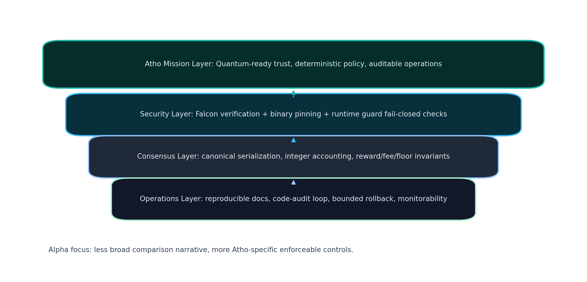

The topology view above is useful for diligence because it visually separates constants that primarily affect liveness, economics, and adversarial resistance.

### 3.5 Protocol Constraint Interpretation

Atho’s parameter regime is built around moderate cadence with deterministic maturity and bounded capacity:

- A `120` second cadence reduces extreme orphan-pressure relative to very short block intervals while retaining practical settlement progression.
- `10` confirmation policy reflects a balance between user UX and finality confidence under expected reorg distributions.
- `150` block coinbase maturity restricts immediate spendability of newly mined outputs, reducing short-cycle manipulation surfaces.
- The `350 atoms/vB` floor and `100,000` atom absolute minimum fee provide a two-layer anti-spam filter.

### 3.6 Engineering Implication

Policy constants are not independent knobs. In Atho, a change in fee floor or block cap alters:

- mempool admission behavior,
- miner packing economics,
- burn path capacity,
- post-tail utilization threshold,
- and potentially wallet fee estimator assumptions.

Therefore policy changes must be treated as coordinated consensus+operations events.

---

## 4. Architecture Overview

Atho uses a layered architecture that keeps orchestration and operator ergonomics in Python while relocating performance-critical loops and specialized cryptographic operations into native binaries.

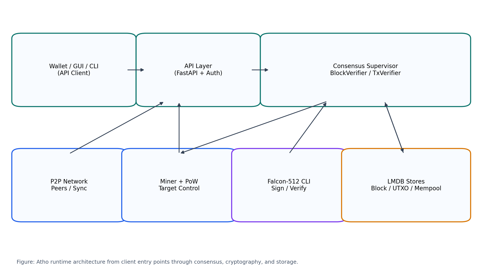

### 4.1 Layer 0: Binary Runtime and Pinning

Native binaries are expected in canonical per-platform directories under `Binaries/<platform-tag>/`, with SHA3-384 metadata tracked in pin registries. Strict mode can require canonical path and hash matches before runtime loading proceeds. This control limits accidental runtime drift and supply-chain substitution risk in production-like environments.[^8]

### 4.2 Layer 1: Cryptography Runtime

Falcon keygen/sign/verify operations are exposed through CLI wrappers and optional in-process verify acceleration where configured. This layer is bounded by explicit byte policies and hash-pin checks. The objective is cryptographic determinism across environments, not ad hoc library resolution.

### 4.3 Layer 2: Transaction Encoding and Accounting

Transport is binary-first (`ATX2`, with `ATX1` decode compatibility). Internal accounting remains integer-atom only. Witness is represented as byte payloads in consensus paths. This separation permits stable API display layers while preserving byte-exact validation semantics.

### 4.4 Layer 3: Validation and Consensus

Transaction verification, block verification, BPoW eligibility checks, and fee/pool accounting execute in deterministic verifier paths. Optional accelerators (for example, batch UTXO checks) do not alter acceptance semantics; they alter execution efficiency only.

### 4.5 Layer 4: Mining Engines

CPU and GPU miners are execution backends on one consensus rule path. Engine choice should not change block validity semantics. This is an important property: performance heterogeneity without consensus heterogeneity.

### 4.6 Layer 5: API/GUI Control Plane

FastAPI endpoints, authorization scopes, and GUI workflows provide operator control. These surfaces are designed to mutate node behavior through validated interfaces rather than direct state mutation.

### 4.7 Architecture Flowchart

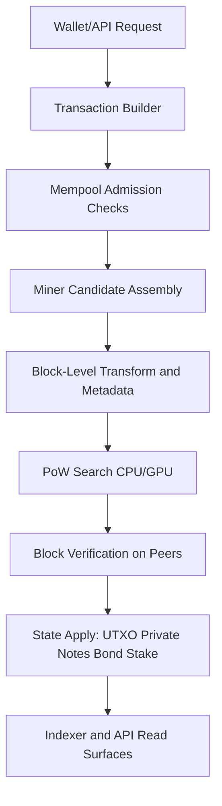
```mermaid
flowchart TD
    A[Wallet/API Request] --> B[Transaction Builder]
    B --> C[Mempool Admission Checks]
    C --> D[Miner Candidate Assembly]
    D --> E[Block-Level Transform and Metadata]
    E --> F[PoW Search CPU/GPU]
    F --> G[Block Verification on Peers]
    G --> H[State Apply: UTXO Private Notes Bond Stake]
    H --> I[Indexer and API Read Surfaces]
```

### 4.8 Why This Split Matters

The architecture split limits blast radius:

- UI/API faults should not directly mutate consensus state.
- Native binary faults are bounded by pinning and loading policy checks.
- Accounting correctness is centralized in verifier paths, not client UIs.
- Miner performance optimizations do not rewrite consensus semantics.

This is essential for maintaining coherence as complexity grows.

---

## 5. Cryptographic Stack and Identity Surfaces

Atho’s cryptographic profile is composed of Falcon-512 (signature/ownership), Kyber (private payload encapsulation), and SHA3 family hashing for identity and domain-separated commitments.

### 5.1 Falcon-512 Integration

Falcon is used for transaction ownership and spend authorization paths. Current policy enforces signature and pubkey byte ranges before verification to constrain malformed input surfaces:

- Canonical pubkey size: `897 bytes`.
- Legacy pubkey compatibility size: `1024 bytes` (disabled by default).
- Signature acceptance window: `600..690 bytes`.
- Compressed signature target: ~`666 bytes`.

This bounded-byte strategy hardens parser and verifier boundaries and reduces malformed witness ambiguity.[^9]

### 5.2 SHA3-384 as Integrity Primitive

SHA3-384 is used for:

- HPK (hashed public key) derivation from Falcon public keys.
- Transaction digesting roles (`txid` no-witness identity, signing digest construction).
- Domain-separated role address derivation.
- Binary pinning digest metadata surfaces.

The 48-byte digest width supports consistent identity surfaces and stronger collision-resistance margin than shorter digest choices for consensus-adjacent identities.[^10]

### 5.3 Addressing and Base56 Representation

Atho separates internal and external address surfaces:

- Internal canonical identity: HPK bytes.
- User-facing representation: Base56 encoded strings with role/network prefixes and checksum behavior.

This decoupling allows ergonomic display without weakening canonical identity semantics.

### 5.4 Domain Separation Model

Domain separation is used in multiple critical contexts:

- Role address derivation (`ATHO_ADDR_V1`, `ATHO_BOND_V1`, `ATHO_STAKE_V1`).
- Protocol pool address derivation domains by network.
- Private note and nullifier derivation domains.
- Signing preimage domains for private spends.

Domain separation reduces replay and cross-context confusion. It should be preserved whenever adding new cryptographic contexts.

### 5.5 Cryptography Decision Matrix

| Function | Primitive | Rationale | Failure if Misused |
| --- | --- | --- | --- |
| Ownership signatures | Falcon-512 | Post-quantum signature direction + deterministic policy envelope | Unauthorized spend acceptance or availability failures |
| Hash identity surfaces | SHA3-384 | Consistent 48-byte identities across tx/block/runtime | Identity drift, replay ambiguity |
| Checksum/short helper uses | SHA3-256 | Efficient shorter digests for non-consensus-critical helper roles | Increased typo/replay surface in edge checks |
| Private payload encapsulation | Kyber | PQC-oriented recipient encapsulation | Private note recovery failures |

### 5.6 Cryptographic Lifecycle Constraints

Three lifecycle constraints matter operationally:

1. Binary provenance and pin updates must be part of release discipline.
2. Compatibility windows (for legacy pubkey sizes) must be explicit and time-bounded.
3. Test harnesses must include malformed-byte and boundary cases for witness and cryptographic payload fields.

### 5.7 Cryptographic Verification Path (Flowchart)

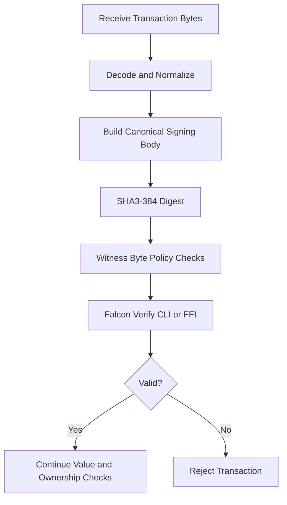
```mermaid
flowchart TD
    A[Receive Transaction Bytes] --> B[Decode and Normalize]
    B --> C[Build Canonical Signing Body]
    C --> D[SHA3-384 Digest]
    D --> E[Witness Byte Policy Checks]
    E --> F[Falcon Verify CLI or FFI]
    F --> G{Valid?}
    G -->|Yes| H[Continue Value and Ownership Checks]
    G -->|No| I[Reject Transaction]
```

### 5.8 Quantum Transition Framing

Atho’s PQC framing is practical rather than absolutist. Falcon and Kyber adoption is positioned as long-horizon hardening, not a guarantee against all future cryptanalytic developments. The correct claim is “post-quantum-oriented and policy-enforced today,” not “forever unbreakable.”

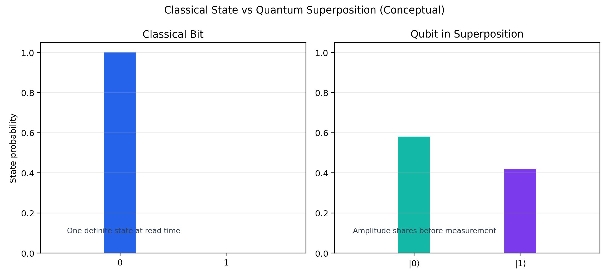

### 5.9 Cryptographic Engineering Posture

A strong cryptography layer still depends on:

- deterministic serialization,
- strict parser constraints,
- robust key lifecycle handling,
- secure runtime binary governance,
- and disciplined operational deployment.

In Atho, cryptography is not treated as isolated math; it is integrated into system engineering boundaries.

---

## 6. Wallet Hierarchy and Deterministic Recovery Model

Wallet determinism is foundational in Atho because operational recovery must be reproducible under disaster and migration scenarios.

### 6.1 Mnemonic and Seed Pipeline

Atho mnemonic flow is:

1. entropy generation,
2. checksum embedding,
3. mnemonic word encoding,
4. PBKDF2-HMAC-SHA3-512 seed derivation (`dklen=64`).

Default derivation uses `600,000` iterations with enforced minimum guardrails. Mnemonic and passphrase are normalized (NFKD) before derivation.

### 6.2 Hierarchical Branch Separation

From the seed root:

- Falcon branch derives signing identity material.
- Kyber branch derives recipient encapsulation identity material.

Branch separation is context-tagged, minimizing cross-protocol coupling risk.

### 6.3 Falcon Branch Determinism

Falcon derivation includes network/account/role/index context. Same inputs reproduce same keypair and role-address set. This enables deterministic public identity restoration across machines.

### 6.4 Kyber Branch Determinism and Bundle Identity

Private receive bundles include:

- version byte,
- Falcon public key,
- Kyber public key.

Bundle hash is `SHA3-384(bundle_bytes)` and X-address is derived from that hash in Base56 wrapper form. Deterministic seed-source selection (`mnemonic_v1` path when available, deterministic fallback where required) supports reproducible private receive identities for modern wallet records.

### 6.5 Note Seed Stream Determinism

Outgoing private notes use deterministic per-wallet stream progression:

- note master seed derivation,
- counter-based note seed derivation,
- counter persistence in wallet state.

This architecture improves recoverability and auditability relative to ad hoc random-only note key generation.

### 6.6 Recovery Semantics: What Restores and What Does Not

Restores deterministically (with same mnemonic/passphrase/path/network):

- Falcon identity and role addresses,
- deterministic bundle identities under current deterministic paths,
- on-chain public UTXOs and private notes after full scan and reconciliation.

Not restored by mnemonic alone:

- arbitrary local UI state,
- ephemeral pending metadata not finalized on-chain,
- legacy random-era private identities unless preserved artifacts exist.

### 6.7 Wallet Hierarchy Diagram

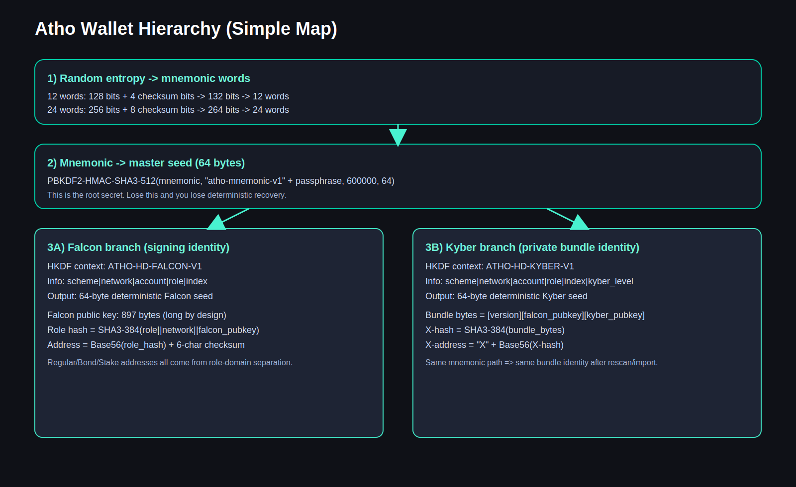

### 6.8 Recovery Flow Diagram

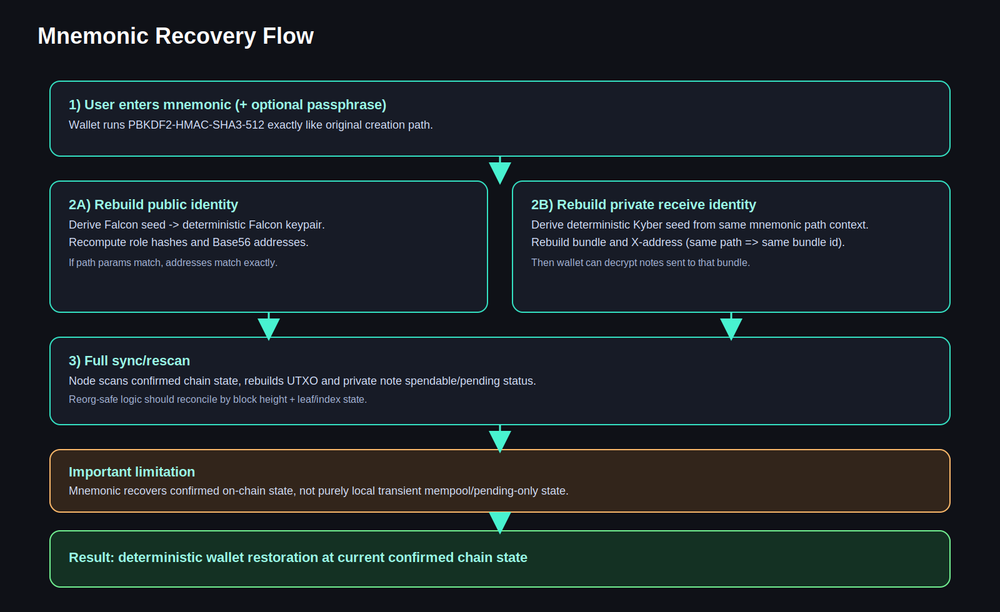

### 6.9 Deterministic Recovery Procedure (Technical)

1. Import mnemonic with explicit network/account/role/index context.
2. Apply passphrase and iteration settings exactly as originally used.
3. Regenerate Falcon and role addresses.
4. Regenerate private bundle identities where deterministic path metadata exists.
5. Complete full chain sync.
6. Run private receive scanning and note reconciliation.
7. Recompute maturity states for spendability classification.

### 6.10 Recovery Risk Controls

Recommended controls for production operators:

- Preserve mnemonic + passphrase + derivation metadata.
- Preserve encrypted backups for compatibility with older random-era records.
- Keep key files encrypted at rest with lockbox policies where available.
- Verify restored address and bundle hashes against prior audit snapshots before large-value operations.

---

## 7. Transaction Data Model and Wire Encoding

Atho transaction design targets deterministic encoding, predictable fee accounting, and explicit witness handling.

### 7.1 Canonical Policy Metric

Atho uses SegWit-style metric definitions:

- `weight = base_bytes * 3 + total_bytes`
- `vsize = ceil(weight / 4)`

`vsize` drives fee floor checks, mempool admission, miner packing, and policy size enforcement.

### 7.2 Active Transport Codec

Canonical serializer emits `ATX2`. Decoder accepts both `ATX2` and `ATX1` compatibility envelopes. Internal consensus paths decode to canonical structures and avoid permissive fallback behaviors that can produce identity ambiguity.

### 7.3 Field Strategy

Inputs include outpoint references and compact sequence handling. Outputs encode integer amounts and destination binding digests. Witness carries signature/public key byte material. Display adapters may expose text-safe encodings, but consensus checks always operate on byte representations.

### 7.4 Signature Reference Tokens

Input script fields are compact references in modern flow (`SR:<token>`-style behavior) rather than full detached signature blobs. This supports compact transport while preserving deterministic signing-body semantics.

### 7.5 Integer Accounting Discipline

Consensus-critical amounts remain atoms end-to-end. Decimal forms are presentation-only and must not enter consensus arithmetic. This prevents floating-point or mixed-decimal drift in fee and conservation checks.

### 7.6 Transaction Shape and Size Variability

Atho rejects static “one tx size” assumptions. Size depends on input/output counts, private vector presence, witness lengths, and metadata.

Representative measured profile:

- Public `1 in / 1 out`: `500 vB`.
- Public `1 in / 2 out`: `553 vB`.
- Public `2 in / 2 out`: `602 vB`.
- Public `3 in / 2 out`: `651 vB`.
- Public -> private: `2471 vB`.
- Private -> public: `2708 vB`.
- Private -> private: `4673 vB`.

### 7.7 Measured Size Chart

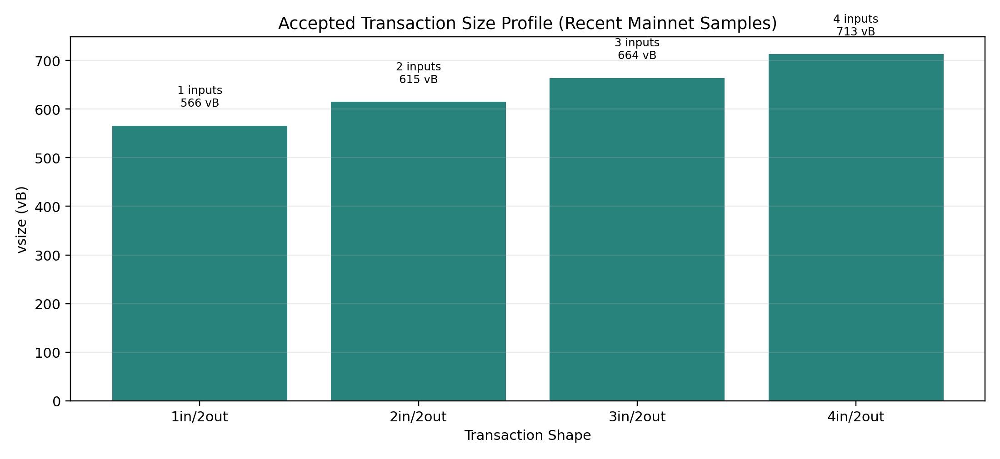

### 7.8 UTXO Spend Flowchart

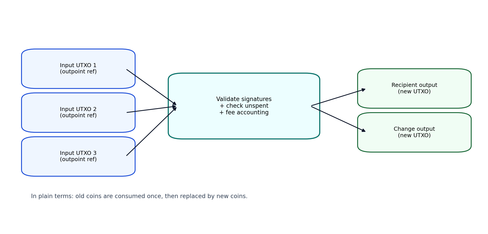

### 7.9 Anti-Malleability Surfaces

Atho reduces malleability/rebind risk through:

- canonical no-witness identity hashing for `txid`,
- witness-separated identity surfaces where applicable,
- strict signature/public-key byte checks before cryptographic verification,
- canonical txid re-derivation in private block-mode transforms.

### 7.10 Policy Validation Layers

Transaction admission checks include:

- structural validity,
- network identity consistency,
- signature correctness,
- input existence and unspent status,
- duplicate-spend prevention,
- atom conservation,
- fee floor and min fee requirements.

Private vectors add nullifier/anchor/note checks in dedicated gates.

---

## 8. Validation Pipeline and Consensus Admission

Atho validation is staged to fail early on malformed or invalid conditions and reserve expensive checks for candidates that pass foundational constraints.

### 8.1 Admission Stages

1. Decode and canonical normalization.
2. Version/network policy gating.
3. Structural and byte-policy checks.
4. Signature and ownership checks.
5. Value and fee invariants.
6. Role-lockup semantics (bond/stake flows).
7. Private-layer state/proof checks (if present).

### 8.2 Mempool and Consensus Boundaries

Mempool admission is a pre-consensus gate with strict policy checks. Consensus acceptance still re-verifies in block context. This two-layer design reduces propagation of low-quality payloads while preserving full safety at block acceptance.

### 8.3 Duplicate Spend Controls

Public path controls:

- duplicate outpoint rejection in tx-level validation,
- mempool reservation and conflict checks,
- UTXO spent-status checks at verification.

Private path controls:

- nullifier uniqueness checks (pending + confirmed),
- duplicate private input/output commit conflict checks,
- block overlay collision checks.

### 8.4 Network Replay Boundaries

Transaction network fields are normalized and checked. Unknown network tags or mismatch against local network context are rejected. This constrains malformed cross-network replay attempts.

### 8.5 Canonical Identity Binding

Post-decode canonical tx identity is recomputed. Mismatch between envelope identity and canonical identity can be rejected when binding flags are enabled. Optional roundtrip decode/normalize/serialize checks can harden non-canonical drift detection.

### 8.6 Signature Verification Discipline

Verification reconstructs canonical signing body then hashes and verifies. Witness shape alone cannot authorize spends if canonical body reconstruction does not match the signed intent.

### 8.7 Validation Pipeline Diagram

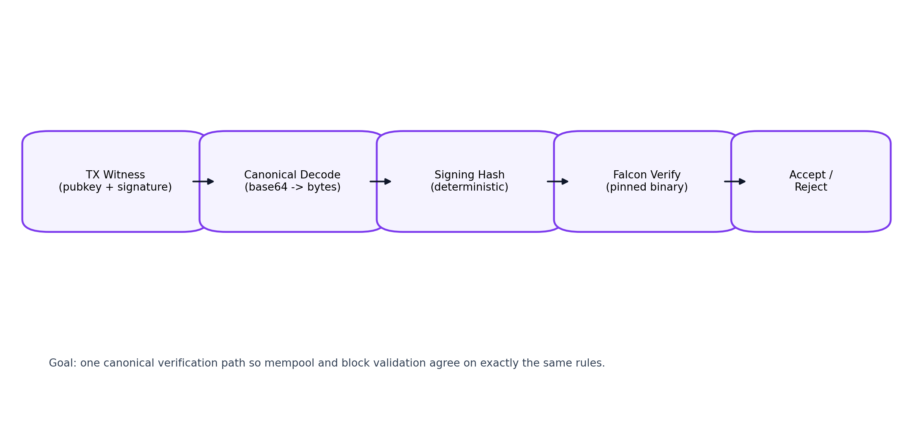

### 8.8 Consensus Determinism Requirements

Atho consensus expects:

- deterministic parser behavior,
- stable canonical serialization,
- deterministic rule schedule activation,
- strict integer monetary invariants,
- and deterministic state transition conditions.

Nodes diverging on any of these areas risk acceptance drift. For this reason, policy constants and parser behavior are treated as consensus assets.

### 8.9 Error Taxonomy and Operational Use

Rejections are valuable when they are specific. Atho’s operational posture encourages clear reject categorization (fee policy failures, network mismatch, signature mismatch, nullifier conflicts, anchor expiry, etc.) so operators can distinguish attack noise from configuration drift.

### 8.10 Verification Philosophy

The protocol follows a “reject by default unless explicitly valid” stance. Optional compatibility paths should be bounded, explicit, and removed once migration windows close.

---

## 9. Block Construction, Verification, and Reorg Semantics

Block safety depends on both local miner assembly correctness and peer verifier determinism.

### 9.1 Block Construction Pipeline

Miner-side flow:

1. Select eligible mempool transactions by policy and fee logic.
2. Apply any required block-mode transaction transforms.
3. Recompute canonical txids where transform semantics change identity inputs.
4. Build Merkle commitments.
5. Populate coinbase and fee accounting fields.
6. Produce PoW solution.

### 9.2 Private Transform Txid Rebinding

In private output block-mode transforms where mempool-form (`amount_plain`) becomes block-form (`amount_commit`), canonical txid must be rederived from transformed content to avoid merkle drift and block rejection.

### 9.3 Block Verifier Responsibilities

Verifier checks include:

- parent linkage,
- index continuity,
- PoW bounds and target validity,
- merkle commitments,
- block size/weight caps,
- coinbase invariants,
- transaction-level validity under active rules,
- BPoW miner metadata and bond eligibility,
- private-root/proof gate checks where required.

### 9.4 Slashable vs Non-Slashable Invalidity

Atho distinguishes slashable invalidity from non-slashable race conditions:

Slashable class:

- PoW-valid block that fails deterministic consensus validity (for example, invalid miner proof, invalid tx set, payout violation).

Non-slashable class:

- stale/orphan valid block,
- reorged-out valid block,
- late relay of otherwise valid block.

This distinction reduces incentives for adversarial misclassification.

### 9.5 Reorg Semantics

Reorg handling must:

- roll back branch-specific state updates,
- apply competing branch updates deterministically,
- reconcile private-note state and lockup states,
- respect bounded rollback policies.

State rebuild and invariant checks are essential after branch switches, especially for private-layer roots and lockup payout journals.

### 9.6 Block Relay and Payload Discipline

Lean relay payload strategies can improve propagation efficiency, but they must preserve all consensus-required fields. Export-only fields can be omitted from relay without affecting validation.

### 9.7 Block and Consensus Pipeline Diagram

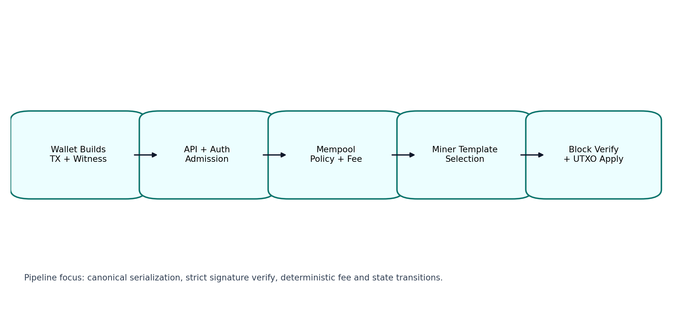

### 9.8 Finalization Windows and Safety

Epoch/finalization windows (`720` / `3600`) contribute to payout scheduling and rollback assumptions. They should be reviewed jointly with checkpoint/reorg depth policy to avoid unintended censorship or rollback-risk imbalances.

### 9.9 Block-Level Fee Decomposition

Blocks carry auditable fee decomposition fields (`fees_total_atoms`, `fees_miner_atoms`, `fees_burned_atoms`, `fees_pool_atoms`, `cumulative_burned_atoms`). These fields are vital for independent economic verification and operator observability.

### 9.10 Reorg Safety Flowchart

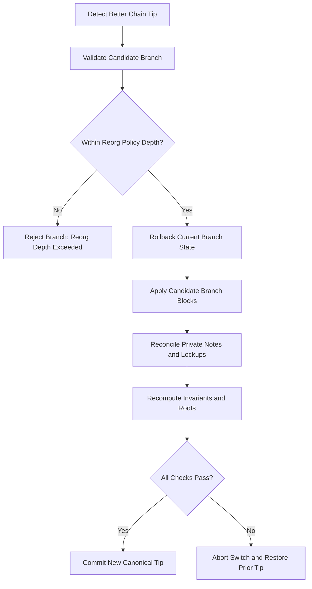
```mermaid
flowchart TD
    A[Detect Better Chain Tip] --> B[Validate Candidate Branch]
    B --> C{Within Reorg Policy Depth?}
    C -->|No| D[Reject Branch: Reorg Depth Exceeded]
    C -->|Yes| E[Rollback Current Branch State]
    E --> F[Apply Candidate Branch Blocks]
    F --> G[Reconcile Private Notes and Lockups]
    G --> H[Recompute Invariants and Roots]
    H --> I{All Checks Pass?}
    I -->|Yes| J[Commit New Canonical Tip]
    I -->|No| K[Abort Switch and Restore Prior Tip]
```

---

## 10. Platinum Shield Private Transaction Layer

Platinum Shield is Atho’s private transaction subsystem. It is designed as a consensus-aware extension to the base UTXO model, not a detached sidecar.

### 10.1 Design Intent

The private layer aims to:

- hide private transfer amounts and recipient linkage details on-chain,
- preserve deterministic validation,
- prevent replay and double-spend through nullifier semantics,
- and remain reorg-safe under canonical state transitions.

### 10.2 Core Private Structures

Private transaction vectors include `private_inputs` and `private_outputs` with fields such as:

- `commit`,
- `nullifier`,
- `anchor`,
- `merkle_path`,
- `note_pk`,
- `signature`,
- `amount_plain` (mempool form),
- `amount_commit` (block form),
- `enc_payload`.

### 10.3 Note Lifecycle

Typical lifecycle:

1. Recipient publishes/communicates bundle identity.
2. Sender builds private output with encapsulated payload.
3. Transaction enters mempool under private policy checks.
4. Miner converts applicable fields for block mode and creates proof material.
5. Block verifier checks private metadata/proof gates.
6. Recipient scanner decapsulates and stores notes locally.
7. Spends produce nullifiers; note state moves to spent status.

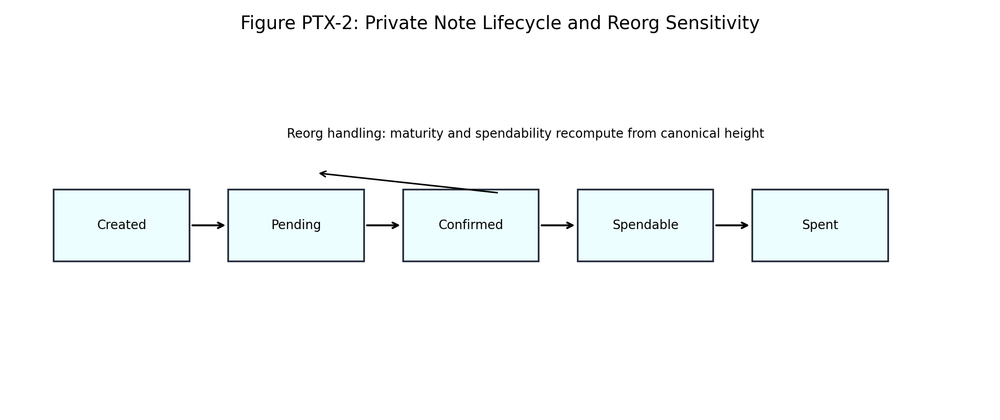

### 10.4 Nullifier and Replay Protections

Private replay prevention depends on:

- confirmed nullifier sets,
- pending nullifier reservations,
- in-transaction duplicate checks,
- block-overlay duplicate defenses.

These controls close both obvious and race-condition replay classes.

### 10.5 Anchor and Merkle Proof Validation

Private spends reference anchored roots and provide Merkle paths proving note inclusion. Unknown, expired, or invalid anchors and invalid paths are rejected. This binds spend claims to canonical private state history.

### 10.6 Block-Level Proof Gating

Where active policy requires proof enforcement, private-activity blocks are fail-closed if proof requirements are unmet or invalid. This ensures private amount semantics are not treated as optional metadata.

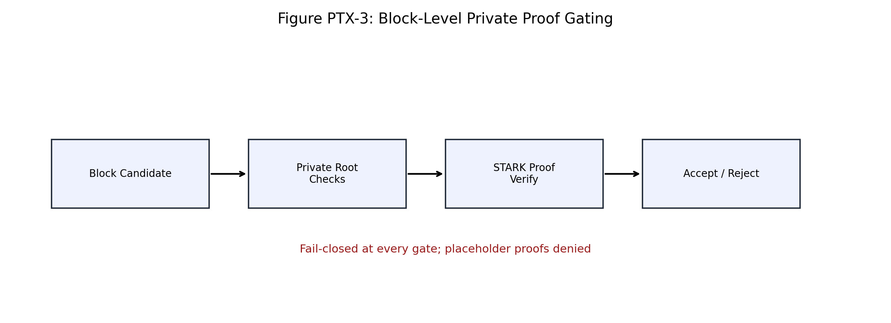

### 10.7 Hidden Supply Accumulator Framing

Private flow integrates hidden-supply accumulator semantics in block-level checks and proof statements. Operationally, accumulator transitions should be deterministic and reorg-safe. Whether represented directly in headers or as derived state in validated context, the invariant objective remains deterministic convergence.

### 10.8 Recipient Binding Safety

Recipient bundle hash and X-address binding checks prevent mismatched payload routing and reduce misdelivery/manipulation surfaces. API and parser paths should reject mismatched explicit bindings.

### 10.9 Private Flow Diagram

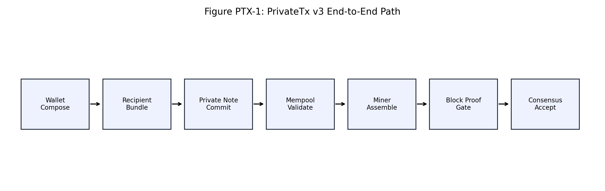

### 10.10 Private Layer Threat-Control Matrix

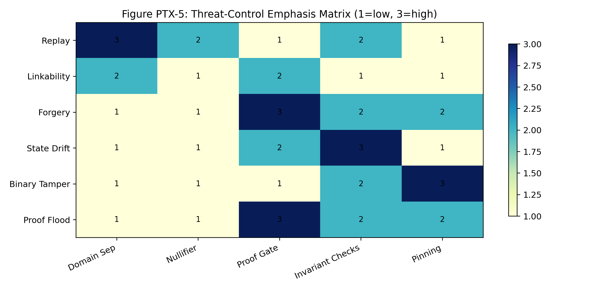

The matrix representation is useful because it keeps each threat linked to a concrete control instead of generic “private by design” claims.

---

## 11. Bonded Proof of Work and Wallet Staking

Atho separates block production accountability from capital participation. This section formalizes that split and the mechanics behind it.

### 11.1 Why BPoW Exists Alongside Wallet Staking

Traditional PoW secures block production through computational work and energy cost, but it does not inherently enforce capital lockup from miners. Atho introduces BPoW so miner participation is conditioned on maintaining an active bond state. In parallel, staking exists as a separate participation role for reward share and lockup economics, not as a direct replacement for mining.

This separation is deliberate:

- Miners are accountable for block validity and should carry explicit slashable stake in that role.
- Stakers can participate in network economics without inheriting full block production authority.
- Network can tune miner and staker incentives independently in fee-routing and epoch settlement.

### 11.2 Deterministic Role Derivation

Role derivation uses domain-separated digests from Falcon public key bytes:

- regular: `SHA3-384("ATHO_ADDR_V1" || network || pubkey)`
- bond: `SHA3-384("ATHO_BOND_V1" || network || pubkey)`
- stake: `SHA3-384("ATHO_STAKE_V1" || network || pubkey)`

Role string prefixes are for display ergonomics. Consensus logic should validate deterministic role derivation and network domain alignment rather than trusting display prefix alone.

### 11.3 Bond State Machine

Bond lifecycle states:

- `pending`
- `active`
- `exiting`
- `unlockable`
- `withdrawn`

Transition gates:

1. Deposit to deterministic bond destination creates `pending` state.
2. At required confirmations (`25`), bond can transition to `active`.
3. Explicit exit request moves to `exiting`.
4. After unbond delay (`10,080` blocks), state becomes `unlockable`.
5. Withdrawal finalizes `withdrawn`.

Any missing precondition blocks transition. This reduces state drift from partial or out-of-order events.

### 11.4 Stake State Machine

Stake lifecycle mirrors deterministic lockup handling:

- `pending`
- `active`
- `exiting`
- `unlockable`
- `withdrawn`

Stake policy also enforces network-wide and per-address bounds. The rolling 30-day inflow cap and total staked cap provide bounded growth on participation side, avoiding abrupt lockup concentration dynamics.

### 11.5 Slashability Semantics

Atho classifies slashability to avoid punishing honest races:

Slashable:

- PoW-valid block that fails deterministic consensus validity due to miner-controlled invalidity (invalid miner proof, ineligible bond state, payout violations, malformed tx admission in block, etc.).

Non-slashable:

- stale/orphan valid block,
- reorged-out valid block,
- late propagation of valid work.

This separation is essential for miner fairness and predictable risk pricing.

### 11.6 BPoW Enforcement Timeline

- Height `0`: genesis context.
- Height `1`: bootstrap allocation and normal emission/state tracking.
- Height `10,000`: BPoW miner eligibility enforcement on by default.

The staged activation provides deterministic onboarding runway before strict bond gating.

### 11.7 Epoch and Finalization Accounting

Epoch settlement and finalization windows exist to:

- buffer short-term chain turbulence,
- avoid instant reallocation churn,
- produce deterministic payout calculation windows,
- and make operator accounting auditable.

With `720` block epochs and `3600` finalization buffer, payout calculations can be treated as structured settlement intervals rather than continuously mutating per-block payouts for all lockup roles.

### 11.8 Fee Pool Destination Governance

Consensus-managed pool addresses are deterministic and network-separated. This prevents arbitrary user-key control over protocol-managed pool routes and provides predictable sink identity for auditing.

### 11.9 BPoW and Staking Flowchart

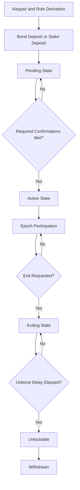
```mermaid
flowchart TD
    A[Keypair and Role Derivation] --> B[Bond Deposit or Stake Deposit]
    B --> C[Pending State]
    C --> D{Required Confirmations Met?}
    D -->|No| C
    D -->|Yes| E[Active State]
    E --> F[Epoch Participation]
    F --> G{Exit Requested?}
    G -->|No| F
    G -->|Yes| H[Exiting State]
    H --> I{Unbond Delay Elapsed?}
    I -->|No| H
    I -->|Yes| J[Unlockable]
    J --> K[Withdrawn]
```

### 11.10 Economic Intent of Role Separation

Role separation provides several economic safety properties:

- Mining cannot be performed by stake-only participants without bond eligibility.
- Staking returns can be tuned without forcing consensus security to rely solely on staker behavior.
- Fee pool splits can support both miner liveness and staker participation without conflating control and capital.
- Slash penalties apply where block validity responsibility exists.

### 11.11 Top-Up and Eligibility Recovery

A miner bond falling below threshold after slashing becomes ineligible until topped up and reconfirmed. This gives clear operational remediation path and avoids indefinite partial eligibility ambiguity.

### 11.12 BPoW Data Stores and Operational Consistency

Bond and stake state is persisted in dedicated LMDB stores. Payout journals support deterministic idempotency and replay-safe processing under restart and reorg conditions. This is critical because economic correctness is not only a formula; it is a state-machine persistence problem.

### 11.13 BPoW Governance Considerations

Any change to bond minimums, slashing amounts, activation heights, or epoch windows is consensus-significant. Governance should treat such changes as explicit hard-fork schedule items with synchronized documentation and tooling updates.

---

## 12. Monetary Policy and Emissions Corridor

Atho’s emissions model is a bounded corridor model: structured base issuance, hard maximum cap, and protected floor. This section details the quantitative mechanics.

### 12.1 Denomination and Integer Accounting

- `1 ATHO = 1,000,000,000 atoms`.
- Consensus value math executes in integer atoms only.

This avoids floating-point rounding drift and supports exact replay/audit arithmetic.

### 12.2 Era-Based Reward Schedule

Pre-tail eras each span `1,000,000` blocks:

- Era 1: `50 ATHO/block`
- Era 2: `25 ATHO/block`
- Era 3: `12.5 ATHO/block`
- Era 4: `6.25 ATHO/block`
- Era 5: `3.125 ATHO/block`
- Era 6: `1.5625 ATHO/block`
- Era 7: `0.78125 ATHO/block`
- Era 8: `0.390625 ATHO/block`

Tail reward after height `8,000,000`: `0.1953125 ATHO/block`.

### 12.3 Bootstrap and Base Supply

- Bootstrap allocation: `390,625 ATHO` at block `1`.
- Pre-tail subsidy path total: `99,609,375 ATHO`.
- Combined pre-tail base target: `100,000,000 ATHO`.

This preserves explicit launch allocation while maintaining deterministic long-horizon issuance math.

### 12.4 Cap and Clipping Rule

Hard maximum emitted supply cap: `150,000,000 ATHO`.

Clipping behavior:

- Subsidy is clipped by remaining cap headroom at coinbase accounting path.
- Once headroom reaches zero, subsidy becomes zero for all subsequent heights.
- Fee routing logic remains active and independent from subsidy clipping.

This structure bounds long-run mint expansion without disabling fee-market mechanics.

### 12.5 Supply Floor and Burn Headroom

Protected floor: `21,000,000 ATHO`.

Burn clipping concept:

- desired burn from routed fee share is constrained by available burn headroom above floor.
- if burn headroom is exhausted, burn is clipped and non-burned routed value follows defined fallback accounting paths.

This prevents protocol-level over-burn from pushing effective circulating supply below floor guardrail.

### 12.6 Emissions Schedule Chart

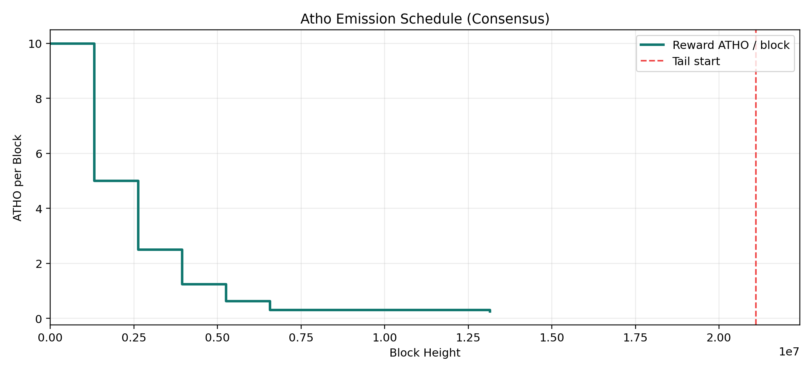

### 12.7 Annual Net Supply Formula (Tail Regime)

At full utilization assumptions under active floor and routing constants:

- Tail issuance per year: `51,328.125 ATHO`.
- Burn-path fee capacity per year at full utilization: `144,868.5 ATHO`.

Net change formula:

`Delta_supply = 51,328.125 - (144,868.5 * utilization)`

Neutral threshold:

`utilization ~= 51,328.125 / 144,868.5 ~= 0.3543` (`35.43%`).

Interpretation:

- below threshold: net inflationary,
- at threshold: neutral,
- above threshold: net deflationary until floor clipping binds.

### 12.8 Utilization-Sensitivity Charts

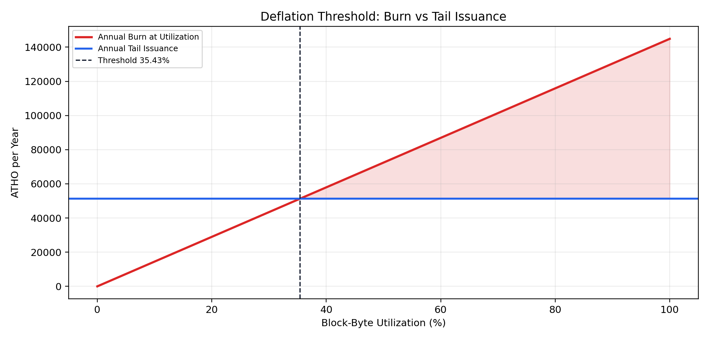

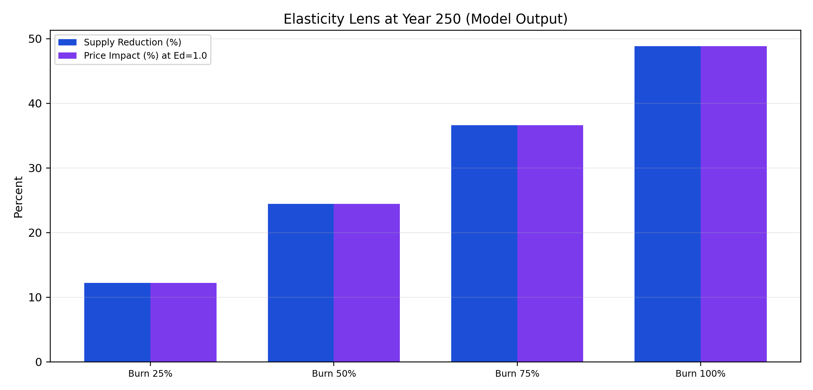

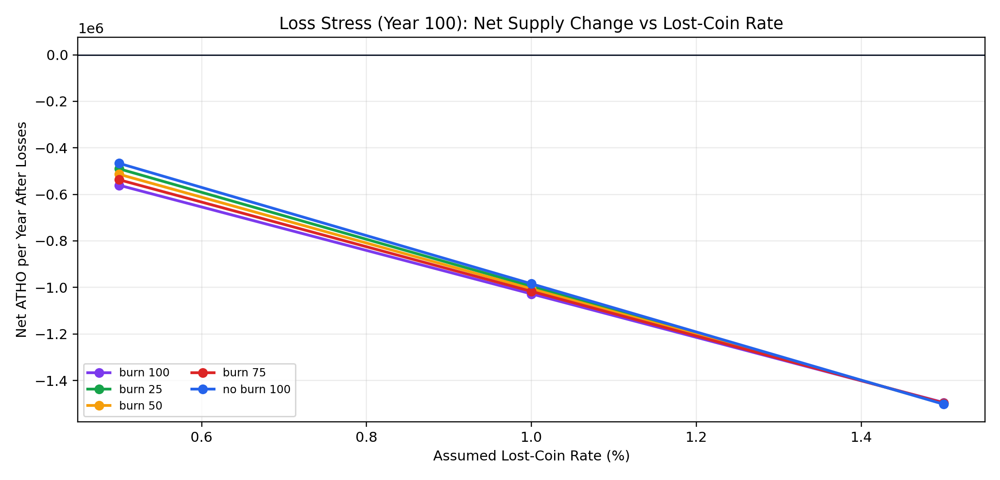

### 12.9 Why the Corridor Model Matters

Cap-only models constrain inflation but can still leave unknown deflation path behavior. Tail-only perpetual models preserve ongoing issuance but may not provide hard upper bound. Atho’s three-anchor corridor (base path, max cap, floor) is intended to bound both extremes with deterministic rules.

### 12.10 Emissions Reproducibility

Economic reports are generated from active constants and scenario files in the emissions modeling package. This reproducibility makes economic claims auditable by external reviewers with local regeneration capability.

### 12.11 Monetary Invariant Checklist

Consensus invariants include:

- `coinbase_outputs_sum_atoms == subsidy_atoms + fees_miner_atoms`
- emitted supply never exceeds hard cap,
- burn never pushes effective supply below floor,
- fee decomposition fields remain coherent per block.

### 12.12 Long-Horizon Planning Implications

Institutional and operator planning should model at least:

- utilization scenarios,
- fee floor sensitivity,
- adoption mix (public vs private payload share),
- and timing to subsidy clipping under long-term assumptions.

This is necessary because post-tail dynamics are utilization-coupled, not static.

---

## 13. Fee Market, Pool Routing, and Burn Logic

Fee routing is both an anti-spam and economic steering mechanism in Atho.

### 13.1 Active Fee Policy Baseline

- Fee floor: `350 atoms/vB`.
- Minimum transaction fee: `100,000 atoms`.
- Dust threshold: `250 atoms`.

### 13.2 Routing Splits by Regime

Pre-tail:

- `40%` of fees to consensus-managed pool,
- `60%` non-pool path.

Post-tail:

- `55%` of fees to consensus-managed pool,
- `45%` non-pool path.

Pool sub-splits vary by era and role buckets.

### 13.3 Routing Intent

Routing design attempts to maintain:

- miner-side support for block production continuity,
- stake-side participation economics,
- burn-path pressure for supply discipline,
- deterministic accounting readability.

### 13.4 Burn Flow Diagram

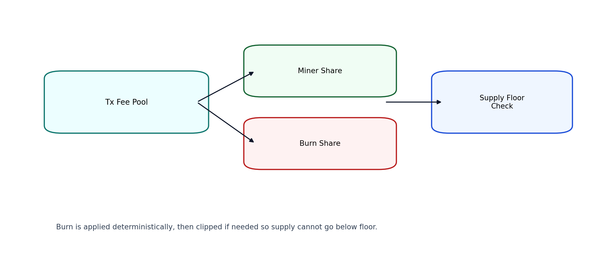

### 13.5 Fee Heatmap and Sensitivity

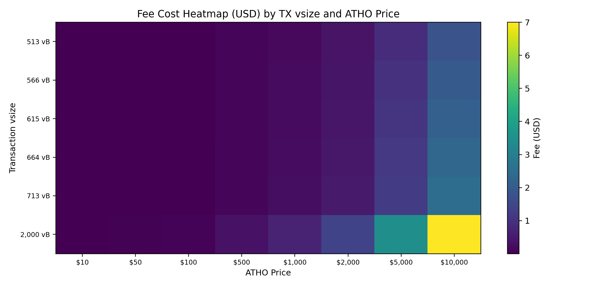

### 13.6 Fee to USD Operational Chart

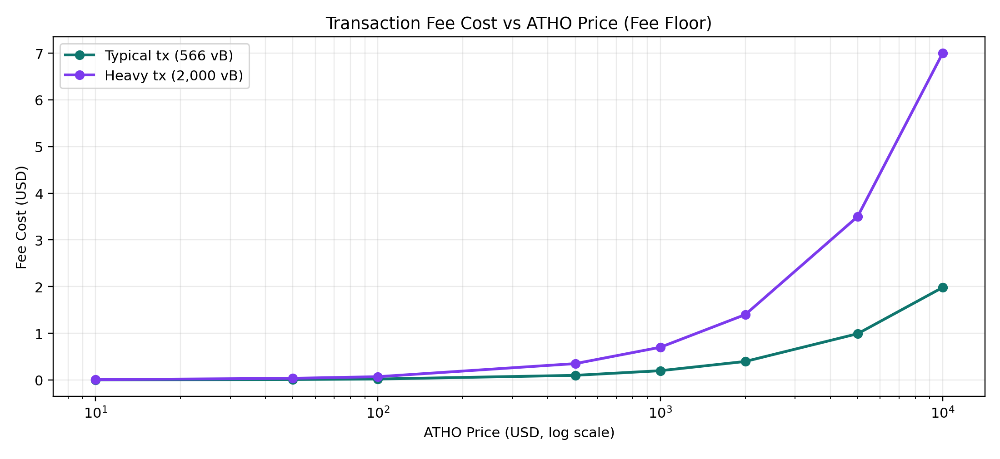

### 13.7 Practical Fee Estimation Logic

Wallet and API estimators should account for:

- actual `vsize` of selected transaction shape,
- min fee floor by `vsize`,
- absolute minimum fee floor,
- replacement policy thresholds where applicable,
- and private payload premium where private vectors are used.

### 13.8 Adversarial Fee Surfaces

Potential abuse classes include low-fee spam, replacement griefing, and malformed-fee payload floods. Strong admission checks and bounded mempool policies reduce this risk. Operational tuning is still required for extreme traffic conditions.

### 13.9 Fee Routing and Coinbase Closure

Coinbase closure requires miner payout equals subsidy plus miner-assigned fee share for that block under active routing policy. This is consensus-critical and not discretionary.

### 13.10 Fee Policy as Security Policy

Fee policy should be treated as security policy because it determines admission pressure under attack conditions. Underpriced floors can increase DoS surface; aggressive floors can harm usability. Atho’s explicit floor enables measurable tuning and analysis.

---

## 14. Capacity, Throughput, and Workload Modeling

Throughput claims in Atho are tied to measured size profiles and policy constants, not abstract maximums.

### 14.1 Capacity Envelope

Given:

- block capacity: `3,500,000 vB`,
- block target: `120s`,

Throughput estimate:

`TPS = block_vbytes / (block_time * average_vsize)`

### 14.2 Measured Profiles and Ideal TPS

Representative model outcomes:

- public `1 in / 2 out` (`553 vB`): ~`52.74 TPS` ideal,
- public -> private (`2471 vB`): ~`11.80 TPS` ideal,
- private -> public (`2708 vB`): ~`10.77 TPS` ideal,
- private -> private (`4673 vB`): ~`6.24 TPS` ideal.

Practical packing factor often modeled at ~95% to reflect non-ideal block packing.

### 14.3 Why Private Flows Cost More

Private flows carry extra cryptographic payload:

- commitment-related fields,
- encapsulated encrypted payloads,
- note metadata and proofs,
- additional witness complexity.

These payload costs are intentional privacy tradeoffs, not accidental overhead.

### 14.4 TPS Capacity Chart

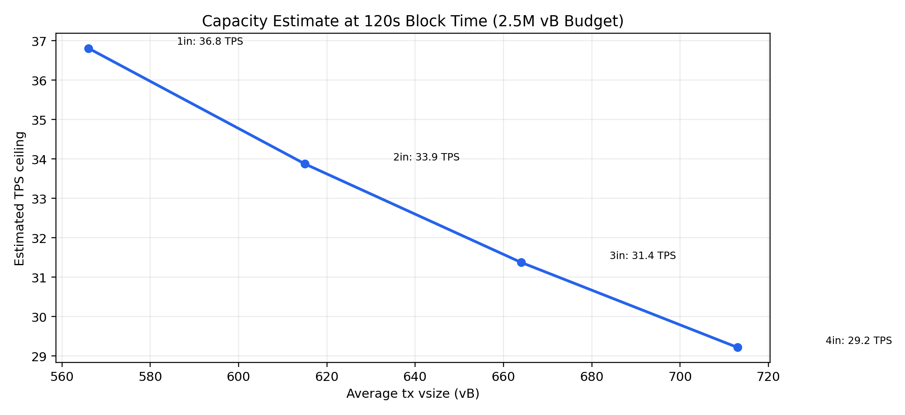

### 14.5 Block Relay Considerations

Larger payloads influence propagation latency and orphan pressure. Lean relay encoding and network-level tuning become more important as private share increases.

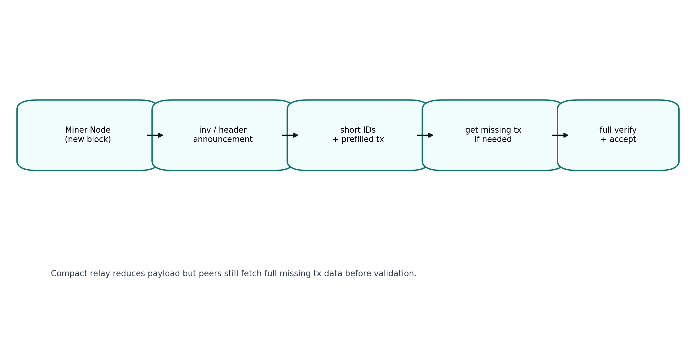

### 14.6 Workload Mix Modeling

Teams should model at least three classes:

1. Public-dominant retail payment mix.
2. Mixed public/private treasury operations.
3. Privacy-heavy settlement batches.

Each class should evaluate throughput, confirmation latency, and fee behavior under realistic packing assumptions.

### 14.7 Capacity and Economics Coupling

Capacity is economically relevant because higher utilization drives fee volume, which then drives burn-path pressure in post-tail regime. Throughput planning and monetary modeling are therefore coupled.

### 14.8 Capacity Planning Checklist

- Measure rolling average `vsize` by tx class.
- Track private vector share by block.
- Track packing factor and orphan rate under load.
- Track effective fee pressure under utilization spikes.
- Validate estimator behavior for edge-case payloads.

### 14.9 Throughput Misinterpretation Risks

Common errors:

- quoting single “max TPS” ignoring private workload share,
- using static tx size assumptions after serializer changes,
- ignoring minimum fee floor and replacement policy effects,
- ignoring relay bottlenecks in distributed topology.

Atho documentation posture discourages these simplifications.

### 14.10 Capacity Reporting Guidance

Operational reporting should publish:

- achieved TPS by class,
- median and p95 confirmation latency,
- average fee per class,
- share of private vs public transactions,
- and block utilization distribution.

This enables meaningful external evaluation.

---

## 15. Storage Architecture and State Integrity

Atho uses LMDB-backed stores with explicit classification between consensus-critical and runtime-propagation state.

### 15.1 Storage Root and Network Separation

Storage root follows `blockchain_storage/<network>/` with per-network database separation. Network isolation is essential for replay boundary hygiene and operational clarity.

### 15.2 Consensus-Critical Stores

Key stores include:

- block storage (`full_block_chain*.lmdb`),
- UTXO set (`utxo*.lmdb`),
- private notes/nullifiers/anchors (`private_notes*.lmdb`),
- bond state (`bond*.lmdb`),
- stake state (`stake*.lmdb`),
- payout journal (`payout_journal*.lmdb`).

These stores directly affect validation or deterministic replay outcomes.

### 15.3 Runtime/Propagation Stores

Non-canonical operational stores include:

- mempool staging (`mempool*.lmdb`),
- orphan branch staging (`orphan_blocks*.lmdb`).

These stores are operationally important but not chain truth by themselves.

### 15.4 Storage Layer Diagram

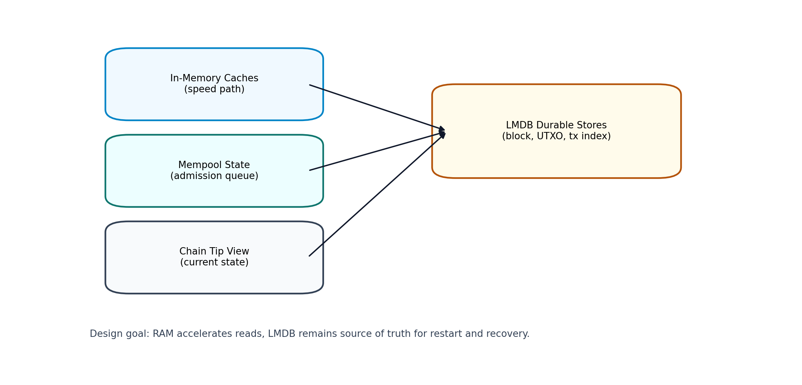

### 15.5 Map Growth and Pressure Handling

LMDB map-size pressure is handled with bounded growth behavior where enabled. Operators must monitor map utilization and size ceilings. Page reuse does not imply file shrinkage; compaction and archival strategies remain operational requirements.

### 15.6 Crash and Recovery Semantics

Consensus-critical stores should fail closed when corruption or missing state is detected. Recovery actions should not silently bypass critical checks. Deterministic replay from canonical blocks is the source of truth for state reconstruction.

### 15.7 Reorg and State Journaling

Reorg handling requires reversible state application with deterministic ordering. Payout journals and private-state reconciliation are central to preventing duplicate or missing transitions under rollback.

### 15.8 Backup and Snapshot Discipline

Operational baseline:

- avoid copying live LMDB state without safe snapshot procedure,
- use controlled copy methods or writer quiescence,
- backup correlated store sets together (block, UTXO, private, bond, stake, payout journal).

Partial snapshots can produce incoherent replay context.

### 15.9 Integrity Auditing

Recommended periodic checks:

- store health checks,
- chain re-derivation spot checks,
- fee decomposition reconciliation,
- lockup state transition audits,
- private root continuity checks.

### 15.10 Storage and Policy Coupling

Storage docs should stay synchronized with policy constants (confirmations, maturity, lockup delays, routing behavior). Drift between documentation and active constants creates operator mistakes even when consensus code is correct.

---

## 16. Networking, API Security, and Control Plane

Atho’s control plane is API-centric with scoped permissions and optional request integrity controls.

### 16.1 API Authentication Model

Core request headers:

- `X-API-Key`,
- `X-User`,
- `X-Pass`.

Optional HMAC mode adds timestamp and signature headers to protect request integrity/freshness for exposed deployments.

### 16.2 Permission Scopes

Representative scopes:

- `read`,
- `explorer`,
- `send_tx`,
- `mining`,
- `wallet_admin`,
- `node_admin`.

Least-privilege key management is strongly recommended. Read-only keys should not possess transaction broadcast or node mutation rights.

### 16.3 Wallet and Node Administrative APIs

Administrative surfaces include key management, default switching, import/export flows, and node/network/storage operations. Sensitive operations should require explicit authorization and production deployments should keep admin scopes segregated.

### 16.4 Idempotent Send Safety

`intent_id` idempotency in send paths reduces duplicate-payment risk from client retries or transient network faults. This is an operationally significant safety feature for real payment workflows.

### 16.5 Telemetry and Observability APIs

Network hashrate, peer-count, and state endpoints support monitoring and diagnostics. Operators should understand these are observational surfaces, not consensus truth by themselves.

### 16.6 Network and P2P Resilience Controls

Runtime tuning surfaces (timeouts, worker counts, reconnect backoff, probe limits) support large-topology stability. Poor tuning can increase churn or dial storms under stress.

### 16.7 API Security Threats and Controls

Primary API threat classes:

- credential replay,
- scope over-provisioning,
- missing TLS when exposed,
- brute-force auth attempts,
- unsafe secret handling in logs/env.

Control posture should include strong passwords, HMAC/TLS where exposed, key rotation, and log redaction.

### 16.8 Control Plane Flowchart

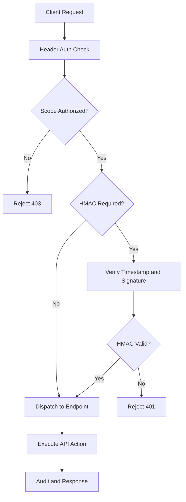
```mermaid
flowchart TD
    A[Client Request] --> B[Header Auth Check]
    B --> C{Scope Authorized?}
    C -->|No| D[Reject 403]
    C -->|Yes| E{HMAC Required?}
    E -->|Yes| F[Verify Timestamp and Signature]
    E -->|No| G[Dispatch to Endpoint]
    F --> H{HMAC Valid?}
    H -->|No| I[Reject 401]
    H -->|Yes| G
    G --> J[Execute API Action]
    J --> K[Audit and Response]
```

### 16.9 Network Hygiene Baseline

Production-like baseline recommendations:

- bind APIs to localhost unless intentionally exposed,
- front exposed APIs with TLS and access controls,
- isolate node process identities,
- maintain peer diversity and avoid single bootstrap dependence,
- monitor reconnect churn and request failure rates.

### 16.10 Control Plane as Consensus Adjacent Risk

API and networking are not consensus rules, but misconfiguration at this layer can cause major operational incidents (incorrect sends, unauthorized actions, liveness failures). Therefore control-plane hardening is a first-class engineering concern.

---

## 17. Runtime Integrity, Native Binary Governance, and Release Discipline

Atho treats runtime integrity as part of protocol trust, not just deployment hygiene.

### 17.1 Binary Pinning Model

Native binaries are hash-pinned with SHA3-384 metadata in registry files. Strict mode can enforce canonical-path and digest validation before execution. This reduces exposure to silent binary substitution and stale artifact drift.

### 17.2 Runtime Guard Modes

Runtime guard framework supports:

- audit mode: log violations,
- enforce mode: fail closed on critical drift/manifest failures.

Production-like deployments should evaluate enforce mode as baseline once release packaging is mature.

### 17.3 Manifest Verification

Release manifests and optional signatures can be validated at runtime. This ties deployed artifact verification to explicit release governance.

### 17.4 Native Build and Pin Refresh Lifecycle

Secure lifecycle for native changes:

1. Build artifacts in controlled environment.
2. Generate fresh digest metadata.
3. Review and commit metadata updates with code changes.
4. Run regression and smoke tests.
5. Publish release artifacts and corresponding integrity references.

### 17.5 Runtime Guard Upgrade Flow

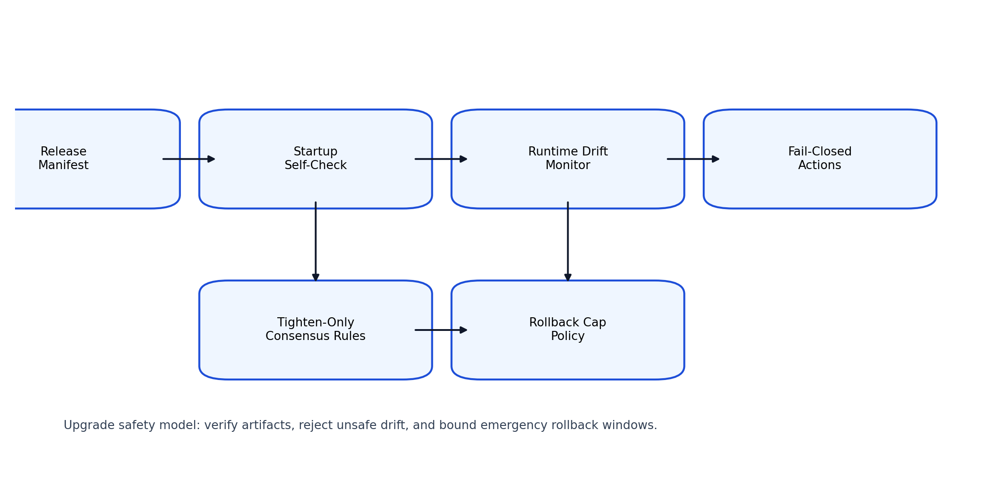

### 17.6 Failure Domains

Without strict integrity discipline, risks include:

- inconsistent verification behavior across nodes,
- hidden dependency drift,
- accidental fallback to untrusted paths,
- supply-chain compromise windows.

Pinning and guard modes materially reduce these risks.

### 17.7 Environment Controls and Operational Policy

Environment toggles that alter integrity posture should be governed with explicit policy. Production configurations should minimize permissive bypass flags and keep configuration provenance auditable.

### 17.8 Logging and Security Evidence

Security and runtime logs should be permissioned and rotated. Integrity violations should be observable and ideally integrated with alerting pipelines.

### 17.9 Release Governance and Documentation Coupling

A release should be considered incomplete if:

- constants changed without doc updates,
- binaries changed without pin updates,
- economic claims changed without regenerated artifacts,
- major behavior changes shipped without updated troubleshooting guidance.

The governance objective is synchronization, not just code merge.

### 17.10 Runtime Integrity as Economic Infrastructure

For institutional users, runtime integrity is inseparable from economic trust. A mathematically sound token model is insufficient if runtime artifacts are not governed with deterministic integrity controls.

---

## 18. Threat Model, Attack Surface, and Mitigation Strategy

Security posture in Atho is layered: cryptographic soundness, deterministic parsing/validation, storage integrity, network controls, runtime binary governance, and operator discipline. This section frames the threat model by attacker class and control surface.

### 18.1 Threat Actor Categories

Atho’s practical threat model includes:

1. Opportunistic external attacker targeting exposed API or weak operational defaults.
2. Resource attacker attempting mempool or parser-driven denial-of-service.
3. Advanced attacker attempting crafted consensus-invalid payload injection.
4. Supply-chain attacker attempting binary substitution or runtime drift.
5. Insider or operator-error scenario creating unsafe deployment posture.

Each class demands different controls. No single control layer is sufficient.

### 18.2 Cryptographic and Key-Management Risks

Primary cryptographic deployment risks are usually implementation and lifecycle errors rather than primitive break events. Key concerns include:

- plaintext key artifacts retained on disk,
- weak key-file permissions,
- stale or mismatched Falcon/Kyber binary artifacts,
- broad compatibility windows for legacy key shapes,
- and high-verbosity logs leaking key-adjacent metadata.

Mitigations include lockbox encryption, stricter permissions, compatibility-window governance, and redaction-focused logging profiles.

### 18.3 Transaction and Mempool Abuse Surfaces

Primary transaction-path threats:

- duplicate input collisions,
- malformed outpoint and witness payloads,
- replay attempts via nullifier reuse,
- anchor and Merkle-path tampering,
- malformed private vectors aimed at parser edge-case bypasses,
- replacement/policy abuse for mempool eviction pressure.

Deterministic parser validation and layered conflict checks are core mitigations.

### 18.4 Consensus and Block-Level Attack Surfaces

Block-level threats include:

- invalid merkle commitments,
- malformed or manipulated block-private metadata,
- incorrect block-mode transforms causing txid drift,
- payout mismatch and routing field manipulation,
- invalid miner proof metadata under BPoW,
- deep reorg pressure and rollback-boundary abuse.

Consensus verifier hard gates plus bounded rollback policy are key controls.

### 18.5 Runtime and Supply-Chain Surfaces

Native binaries are high-value targets. Attack classes include:

- binary replacement in non-strict load mode,
- stale binary reuse after consensus-critical updates,
- unmanaged fallback paths,
- unsigned or unverified release artifact usage.

Pin registry governance, strict mode, manifest verification, and release process discipline reduce this risk substantially.

### 18.6 Networking and API Surfaces

Networking and API risks include:

- credential replay,
- missing request integrity protections when exposed,
- broad-scope key misuse,
- brute-force attempts,
- and traffic flood patterns designed to saturate CPU/IO pathways.

Mitigation stack should include least-privilege scopes, HMAC/TLS posture, per-client throttles, and operational alerting.

### 18.7 Storage and State-Integrity Risks

Storage-specific risks include:

- map-size exhaustion,
- corrupted store artifacts,
- partial backup/restore leading to incoherent state,
- and reorg replay inconsistencies when journals are incomplete.

Consensus-critical stores should fail closed under corruption indicators and operators should maintain full correlated backup sets.

### 18.8 Economic and Governance Risks

Economic security risks include:

- stale economic assumptions after constant updates,
- policy drift between code and investor/operator docs,
- abrupt parameter changes without coordinated upgrade process,
- and poor visibility into real utilization vs modeled assumptions.

Mitigation depends on synchronized documentation, artifact regeneration, and explicit governance checkpoints.

### 18.9 Threat-to-Control Matrix

| Threat Class | Example Vector | Primary Control | Secondary Control |
| --- | --- | --- | --- |
| Public double spend | duplicate outpoints | tx-level duplicate check | mempool reservation check |
| Private replay | nullifier reuse | confirmed/pending nullifier gates | block overlay collision checks |
| Anchor spoofing | invalid anchor root | anchor freshness + root checks | Merkle path validation |
| Witness tampering | malformed signature/pubkey bytes | strict byte policy bounds | canonical signing-body reconstruction |
| Cross-network replay | mismatched network tags | network normalization/reject | domain-separated hashes |
| Mempool flood | low-fee payload storm | fee floor + min fee | mempool policy/eviction tuning |
| Binary substitution | tampered native artifact | SHA3 pin enforcement | strict canonical path mode |
| API credential replay | stolen headers | optional HMAC freshness checks | TLS/proxy and key rotation |
| Reorg abuse | deep rollback pressure | bounded reorg policy | checkpoint/finalization strategy |
| Lockup state desync | stale bond/stake transitions | deterministic state machine checks | journaled settlement windows |

### 18.10 Problem-Solution Map

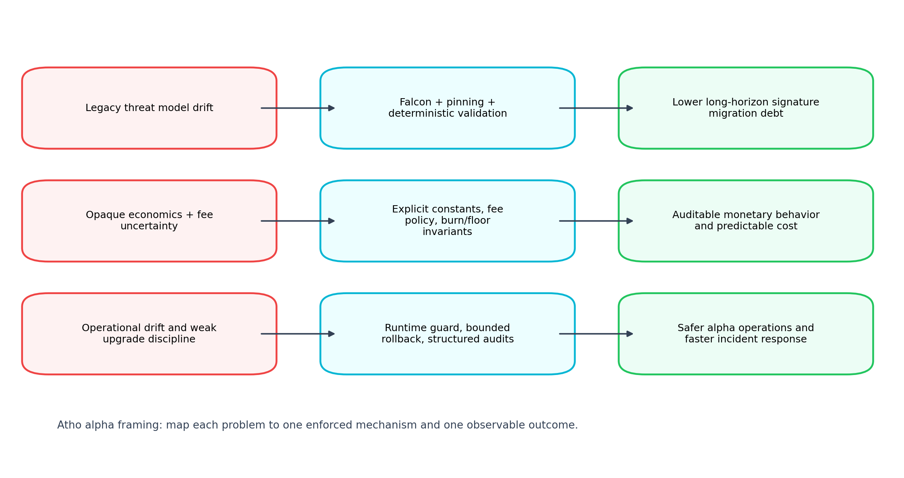

### 18.11 Attack-Focused Validation Philosophy

Atho’s validation posture assumes malicious input is normal. Parser, policy, and verifier layers are designed to reject malformed or adversarial payloads quickly and deterministically. The objective is not only correctness but predictable failure.

### 18.12 Residual Risk Acknowledgement

Residual risks remain even with strong controls:

- unknown implementation defects,
- ecosystem dependency vulnerabilities,
- operational misconfiguration,
- and future cryptanalytic advances.

The credible posture is continuous hardening and measurable control verification, not static certainty claims.

### 18.13 Security Program Priorities

Priority ordering for hardening effort:

1. Keep consensus-critical parser/validator paths strict and deterministic.
2. Maintain runtime pinning and guard discipline in release process.
3. Improve API/rate-limit/tls hardening for exposed environments.
4. Expand fuzz/adversarial regression coverage.
5. Reduce sensitive logging and improve secret-handling hygiene.

### 18.14 Security Engineering Outcome

The security model is strongest when code, configuration defaults, and operator runbooks converge. Atho v3 makes that convergence explicit and therefore auditable.

---

## 19. Audit Evidence, Harness Results, and Interpretation

Atho’s security posture should be judged on measurable adversarial testing outcomes in addition to static design review.

### 19.1 Audit Harness Categories

Recent sandbox harness categories include:

- private transaction attack audit,
- consensus attack audit,
- crypto attack audit,
- fuzz/mutation differential audit,
- advanced edge-case audit,
- full integrated attack audit,
- BPoW flow audit.

Each harness stresses different subsystems and failure classes.

### 19.2 High-Volume Private Attack Coverage

Documented private audit runs include large attack-point sweeps and focused strict runs. Reported outcomes indicate full pass in high-volume private nullifier/anchor/path/signature and malformed-field scenarios under the audited harness profiles.

### 19.3 Interpreting Mixed Suite Failures

Not all strict-suite failures imply successful exploit bypass. Some failures represent harness expectation drift (for example outdated fee assumptions, stale bond assumptions, malformed fixture construction under newer strict metadata requirements). This distinction matters for correct risk interpretation.

### 19.4 Coverage Areas Validated

Private flow coverage includes vectors such as:

- duplicate nullifier in tx,
- nullifier pending and confirmed conflicts,
- missing note and spent note cases,
- note key mismatch,
- unknown or expired anchor,
- invalid Merkle path,
- invalid signature,
- invalid field lengths,
- private vectors on disallowed version,
- reserve conflict behavior.

This vector breadth is meaningful because it spans parser, state, and cryptographic boundary checks.

### 19.5 Consensus and Economic Harness Alignment

Consensus harnesses should be continuously updated with active constants. A stale harness that rejects for wrong reasons can mask regressions in deeper checks. Atho’s testing program should therefore include policy-synchronized fixture generation.

### 19.6 Audit Roadmap Chart

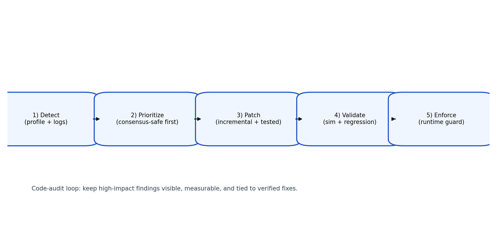

### 19.7 Quantitative Evidence Interpretation Framework

Recommended interpretation framework:

1. Check whether failures are accepted-invalid bypasses or expected early rejections.
2. Separate harness drift failures from code-path vulnerabilities.
3. Validate whether failed predicates map to consensus-critical acceptance paths.
4. Confirm remediation landed in code + tests.
5. Re-run with updated fixtures and compare deltas.

### 19.8 Regression Discipline

Strong assurance requires regression discipline:

- unit and integration tests for patched vectors,
- full-suite reruns after consensus-affecting changes,
- retained report artifacts for traceability,
- and CI gates for critical security regressions.

### 19.9 Attack Simulation Scope Expansion

Future expansion should include:

- heavier peer-flood and network-churn scenarios,
- prolonged reorg simulations with private-state stress,
- hardware diversity for native binary execution drift testing,
- and long-duration mixed-workload soak tests.

### 19.10 Audit Program Limitations

Audit harnesses are necessarily finite approximations. Passing adversarial suites improves confidence but does not eliminate unknown risk. This is why v3 emphasizes explicit residual-risk treatment and continuous review.

### 19.11 Evidence and Governance

Technical governance should require audit evidence updates as part of release approval when consensus, private-layer, or economic constants change materially.

### 19.12 Evidence-Driven Security Messaging

Public security messaging should distinguish:

- proven-by-test behaviors,
- inferred-by-design expectations,
- and roadmap hardening targets.

This prevents overclaiming and supports credible communication with sophisticated stakeholders.

---

## 20. Operator Runbooks and Production Deployment Guidance

Security and correctness depend heavily on operational execution quality. This section provides deployment-oriented guidance.

### 20.1 Baseline Environment Preparation

Recommended baseline:

- dedicated node user and isolated runtime directory,
- explicit configuration management for env vars and key files,
- monitored storage volume capacity,
- network/firewall posture with intentional API exposure policy,
- reproducible build or trusted release artifact verification.

### 20.2 Startup Integrity Checklist

Before node startup:

1. Verify expected network and bootstrap configuration.
2. Validate key-file accessibility and lockbox status.
3. Verify binary pin metadata and strict mode policy.
4. Confirm API auth configuration and least-privilege key provisioning.
5. Confirm log directories and rotation strategy.

### 20.3 Key Management Operational Controls

- Use encrypted lockbox mode where possible.
- Enforce strict filesystem permissions on key and API credential files.
- Avoid plaintext key previews in logs and support tooling.
- Maintain offline encrypted backup routines and periodic restore drills.

### 20.4 Node Lifecycle Operations

Operationally safe lifecycle includes:

- explicit stop/start tooling,
- process-state verification before role switches,
- network switch safeguards when nodes are stopped,
- storage-root mutation only under controlled downtime.

### 20.5 Mempool and Throughput Operations

Operators should monitor:

- mempool depth,
- admission rejection causes,
- fee-rate distributions,
- replacement traffic patterns,
- average vsize composition,
- private/public mix by block.

This data informs policy and tuning decisions.

### 20.6 LMDB Operations

LMDB-specific runbook items:

- alert before map-size pressure threshold,
- perform safe snapshots,
- avoid partial store copies,
- keep backup retention with restore validation tests,
- investigate corruption indicators immediately and fail closed.

### 20.7 Mining Operations

For miner reliability:

- ensure miner role keys and bond states are active and valid,
- monitor stale/orphan behavior and propagation latency,
- tune worker counts to host capacity,
- verify consistent runtime binary artifacts across mining fleet.

### 20.8 Network Stability Tuning

Key tuning domains:

- probe concurrency,
- reconnect/backoff strategy,
- request timeout windows,
- max message sizes,
- per-connection work limits.

The goal is stable liveness under churn without allowing trivial flood amplification.

### 20.9 Private Layer Operations

For private operations:

- monitor private root consistency,
- monitor nullifier conflict rates,
- validate proof-gate status in block verification logs,
- ensure wallet scan pipelines and note reconciliation stay healthy,
- rehearse restore flow including private note continuity checks.

### 20.10 Incident Response Playbook (Technical)

Suggested sequence for severe consensus or runtime incident:

1. Freeze risky administrative mutations.
2. Capture logs and state snapshots for forensic continuity.
3. Verify runtime guard and pin integrity status.
4. Isolate whether incident is local config drift, artifact drift, or consensus-level anomaly.
5. If required, stop affected nodes and recover from known-good artifacts.
6. Rejoin only after deterministic checks pass.

### 20.11 Troubleshooting Escalation Ladder

- Level 1: configuration and auth mismatches.
- Level 2: runtime artifact/pin mismatches.
- Level 3: state-store pressure/corruption indicators.
- Level 4: consensus anomaly requiring forensic review.

Structured escalation reduces downtime and prevents destructive ad hoc responses.

### 20.12 Deployment Profiles

Recommended profiles:

- Local development profile: relaxed operational constraints, localhost-only API, synthetic workloads.
- Staging profile: strict artifact controls, representative topology, audit harness integration.
- Production-like profile: enforce-mode runtime controls, strict auth/tls posture, observability and incident playbooks.

### 20.13 Operator Governance

Production controls should be codified as policy documents and change-managed. Security-critical configuration changes should require dual review.

### 20.14 Operational Maturity Objective

Atho’s long-term reliability depends on operators treating protocol deployment as disciplined infrastructure engineering rather than ad hoc script execution.

---

## 21. Implementation Cross-Reference Matrix (Code-to-Policy)

This section maps policy statements to representative code surfaces and expected invariants. It is not exhaustive, but it is intended to make review and audit workflows concrete.

### 21.1 Core Constants and Policy Surfaces

| Policy Domain | Representative Files | Key Invariant | Failure Class if Drift |
| --- | --- | --- | --- |
| chain constants | `Src/Utility/const.py` | one authoritative constant source | doc/runtime mismatch, harness drift |
| fee floor | `Src/Utility/const.py`, `Src/Main/txveri.py` | fee >= floor and min fee | spam acceptance or false reject |
| reward schedule | `Src/Utility/const.py`, `Src/Main/emission.py` | deterministic subsidy path | emission accounting drift |
| cap clipping | `Src/Utility/const.py`, coinbase checks | subsidy clipped by headroom | over-mint risk |
| floor clipping | burn split path + cumulative burn accounting | no over-burn below floor | supply-floor violation |

### 21.2 Transaction Serialization and Validation Surfaces

| Domain | Representative Files | Invariant | Drift Risk |
| --- | --- | --- | --- |
| binary codec | `Src/Transactions/txbinary.py` | canonical decode/encode behavior | txid mismatch, parser ambiguity |
| sizing metrics | `Src/SigWit/sigwit.py` | deterministic weight/vsize | fee-policy divergence |
| tx structure checks | `Src/Transactions/txvalidation.py` | reject malformed fields | malformed payload acceptance |
| signature checks | `Src/Transactions/txvalidation.py`, `Src/Accounts/falconcli.py` | canonical digest + byte policy | unauthorized spend or false reject |
| no-witness digest | `Src/Utility/txdhash.py` | stable signing identity | malleability and verify drift |

### 21.3 Private Layer Surfaces

| Domain | Representative Files | Invariant | Drift Risk |
| --- | --- | --- | --- |
| private parser | `Src/Transactions/private_layer.py` | strict required fields and bounds | malformed-private acceptance |
| nullifier checks | `Src/Main/txveri.py`, private store | one-time private spend identity | replay/double-spend |
| anchor/path checks | verifier + private notes store | note membership proof validity | fake-note spend |
| block proof gates | `Src/Main/blockveri.py`, STARK bridge/runtime | fail closed when required | hidden-amount inconsistency |
| bundle helpers | `Src/Utility/private_bundle.py` | x-address and bundle hash binding | recipient-mismatch risks |

### 21.4 Wallet and Key Management Surfaces

| Domain | Representative Files | Invariant | Drift Risk |
| --- | --- | --- | --- |
| mnemonic derivation | `Src/Accounts/mnemonic.py` | deterministic seed from phrase/passphrase/path | restore mismatch |
| key material storage | `Src/Accounts/key_manager.py` | atomic writes and schema validity | key corruption or silent drift |
| lockbox encryption | key manager security metadata | encrypted-at-rest secrets when enabled | key exfiltration risk |
| private scan pipeline | `Src/Wallet/private_receive.py` | consistent note recovery + state updates | invisible/unspendable notes |
| private spend builder | `Src/Wallet/private_spend.py` | deterministic private output assembly | privacy/linkage or invalid spend |

### 21.5 Consensus and Block Surfaces

| Domain | Representative Files | Invariant | Drift Risk |
| --- | --- | --- | --- |
| block verification | `Src/Main/blockveri.py` | strict block acceptance gates | consensus split risk |
| consensus supervisor | `Src/Main/consensus.py` | coherent mempool/block/state transitions | state desync |
| miner assembly | `Src/Miner/miner.py` | canonical txid/merkle construction | invalid block production |
| reorg manager | `Src/Blockchain/orphreorgs.py` | deterministic rollback/apply | ledger divergence |

### 21.6 Storage Surfaces

| Domain | Representative Files | Invariant | Drift Risk |
| --- | --- | --- | --- |
| block storage | `Src/Storage/blockstorage.py` | canonical chain persistence/indexing | chain-read inconsistency |
| UTXO store | `Src/Storage/utxostorage.py` | spend/unspend correctness | double-spend acceptance |
| private notes store | `Src/Storage/private_notes_store.py` | notes/nullifiers/roots coherence | private replay or false reject |
| bond/stake stores | `Src/Storage/bondstake.py` | deterministic lockup state transitions | payout and eligibility errors |
| mempool store | `Src/Storage/mempool.py` | pending tx indexing and conflict tracking | propagation instability |

### 21.7 API and Auth Surfaces

| Domain | Representative Files | Invariant | Drift Risk |
| --- | --- | --- | --- |
| auth and scopes | `Src/Api/auth.py` | header auth + permission enforcement | unauthorized mutation |
| API orchestration | `Src/Api/apis.py` | safe endpoint behavior and normalization | inconsistent behavior |
| key config store | `Src/Config/Api_Keys.json` | valid key/scope metadata | accidental lockout or overexposure |
| send idempotency | send-intent db path in API | duplicate-send protection | duplicate payments |

### 21.8 Runtime Integrity Surfaces

| Domain | Representative Files | Invariant | Drift Risk |
| --- | --- | --- | --- |
| binary pinning | `Src/Utility/binarypin.py`, pin registries | digest/path integrity | supply-chain substitution |
| runtime guard | `Src/Utility/versioning.py` and entrypoints | drift detection and enforcement | silent config or code drift |
| release manifests | `Src/Config/security_manifest.json` and verifier paths | artifact provenance checks | compromised release trust |

### 21.9 Operational and Testing Surfaces

| Domain | Representative Files | Invariant | Drift Risk |
| --- | --- | --- | --- |
| audit harnesses | `scripts/sandbox_*` | adversarial regression coverage | undetected regression |
| test suites | `tests/` modules | deterministic behavior validation | patch regressions |
| troubleshooting runbooks | `Docs/Troubleshooting.md` | operator recovery guidance | prolonged outages |

### 21.10 Review Workflow Recommendation

For each material change:

1. inspect constants and invariant impacts,
2. inspect affected validation/store paths,
3. run targeted and broad regression suites,
4. update docs and model artifacts,
5. record evidence in release notes.

This minimizes policy-code-document drift and keeps technical claims defensible.

### 21.11 Cross-Reference Strategy for External Reviewers

External reviewers should use this matrix to navigate quickly from claim to evidence path:

- start with claim category,
- open corresponding source files,
- verify invariant checks,
- cross-check with generated docs/models,
- validate with tests/harness evidence.

This is substantially more reliable than narrative-only review.

### 21.12 Matrix Maintenance Requirement

The matrix should be maintained with each consensus-affecting release. If it is stale, it loses operational value and can mislead reviewers.
- Private transaction condensed companion: [PrivateTx_v3_Condensed.md](PrivateTx_v3_Condensed.md) / `Docs/PrivateTx_v3_Condensed.pdf`
