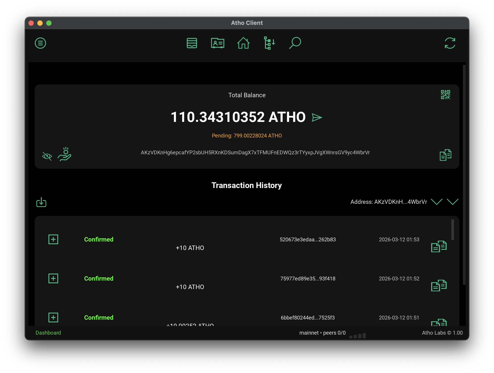
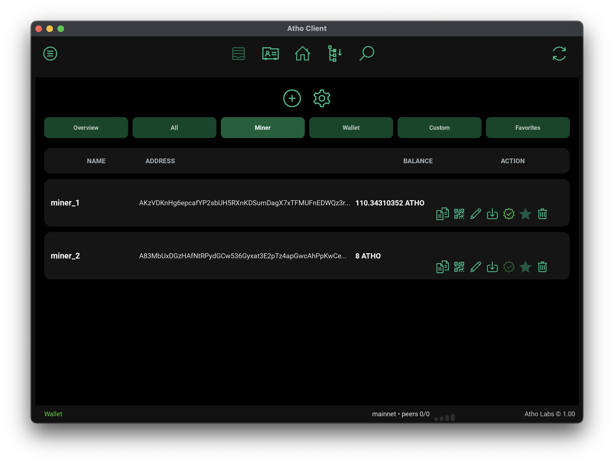
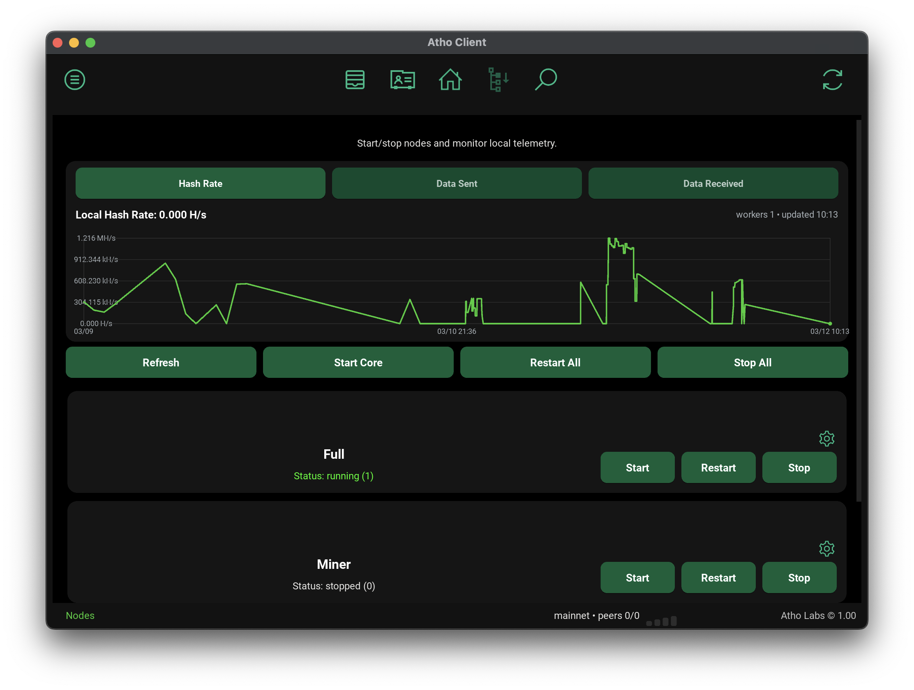
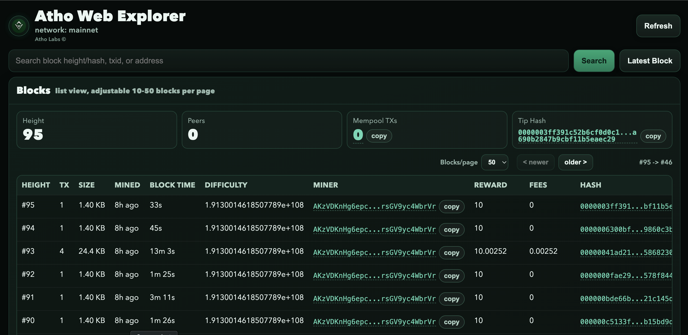
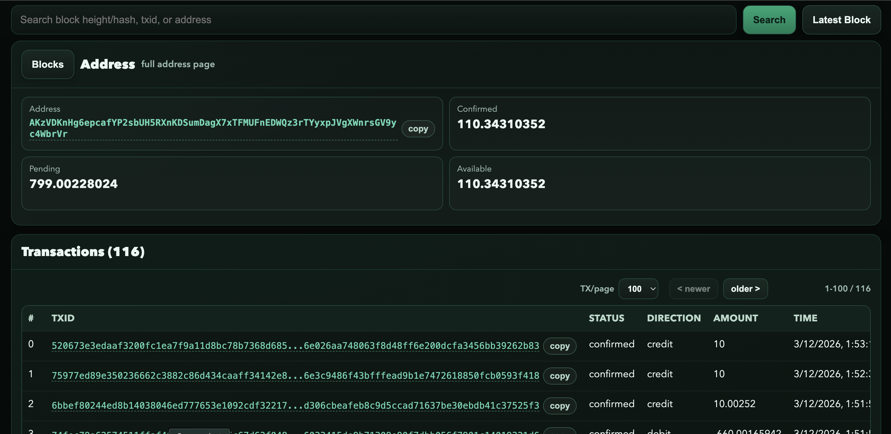
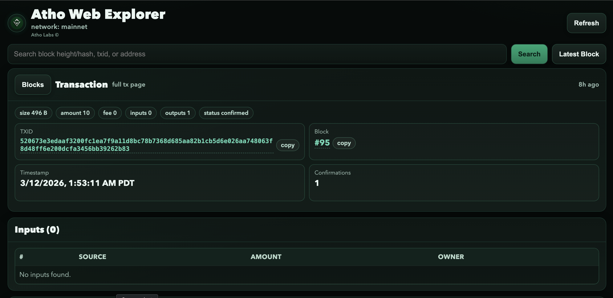

# Atho GUI Guide

Status: Alpha documentation snapshot (2026-03-12).

Last refresh: 2026-03-12.

This document covers the desktop client (`Src/GUI/gui.py`) and the integrated Web Explorer served from `Src/GUI/web_explorer.html`.

## Run the GUI
- From project root:
  - `source .venv/bin/activate`
  - `./.venv/bin/python Src/GUI/gui.py`
- Keep a local API/full node reachable (GUI calls API routes for wallet, chain, tx, and node state).

## Main areas
- **Dashboard**: balance, pending, transaction history, send/receive actions, copy controls.
- **Wallet**: address list + rename/delete/default actions, balance fill, import/export/create flows.
- **Contacts**: add/edit/delete/favorite contacts with quick copy.
- **Nodes**: start/stop/restart per role and all-node controls.
- **Explorer button**: opens a local browser explorer popup/URL.

## Web Explorer (current behavior)
- The GUI starts a local bridge server on `127.0.0.1` (random free port) and opens the browser explorer.
- UI source: `Src/GUI/web_explorer.html`.
- Bridge/API proxy lives in `ExternalExplorerBridge` in `Src/GUI/gui.py`.
- Search accepts:
  - block height/hash
  - txid
  - address (Base56 or HPK)
- Addresses shown in explorer output are normalized to Base56 for display.

## Explorer pages and navigation
- **Blocks page**:
  - list view with `Blocks/page` selector (`10, 20, 30, 40, 50`)
  - newer/older controls at top and bottom
  - quick stats: height, peers, mempool tx count, tip hash
- **Block page**:
  - hash, previous hash, difficulty, timestamp, miner, reward/fees
  - tx list with `TX/page` selector (`20, 40, 60, 80, 100`)
  - newer/older controls at top and bottom of tx section
  - **View full JSON** modal for raw block payload inspection
- **Transaction page**:
  - summary + inputs/outputs + metadata + raw JSON section
- **Address page**:
  - confirmed/pending/available balances
  - tx table with `TX/page` selector (`20, 40, 60, 80, 100`)
  - UTXO table + raw payload panel
- **Mempool page**:
  - full pending tx list with paging and drill-down to tx details

## Copy and audit UX
- Clickable hashes/txids/addresses include compact copy buttons.
- Top/bottom pagers are present on list-heavy sections to support fast auditing.
- Block raw JSON is available via modal (copy supported).

## Explorer bridge endpoints
Served locally by GUI bridge:
- `GET /api/chain/info`
- `GET /api/mempool/info`
- `GET /api/mempool/list`
- `GET /api/mempool/tx/{txid}`
- `GET /api/block/{height_or_hash}`
- `GET /api/tx/{txid}`
- `GET /api/address/{address_or_hpk}`
- `GET /api/search?q=...`
- `GET /api/network/node_count?active_window_seconds=&sample_limit=`

## Send safety + wallet behavior
- GUI send flow uses per-submit `intent_id` to avoid duplicate payment creation on retries.
- `intent_in_progress` responses are polled until completion.
- Wallet balances use `balance_batch` first, then fallback per-row calls when needed.
- Local tx history writes are debounced (`ATHO_GUI_HISTORY_WRITE_DEBOUNCE_SEC`) and flushed at shutdown.

## Notes
- Embedded explorer UI still exists in code paths, but default user flow is browser-based Web Explorer from the GUI.
- To regenerate bundled default explorer HTML from code template, set:
  - `ATHO_GUI_WEB_EXPLORER_OVERWRITE=1`

## Latest GUI + HTML Screenshots
Captured from current alpha client/web explorer flow (2026-03-12):

